---
## Front matter
lang: ru-RU
title: Структура научной презентации
subtitle: Простейший шаблон
author: Поляков Г. С.
institute: Российский университет дружбы народов, Москва, Россия
date: 2023-02-18

## i18n babel
babel-lang: russian
babel-otherlangs: english

## Formatting pdf
toc: false
toc-title: Содержание
slide_level: 2
aspectratio: 169
section-titles: true
theme: metropolis
header-includes:
 - \metroset{progressbar=frametitle,sectionpage=progressbar,numbering=fraction}
 - '\makeatletter'
 - '\beamer@ignorenonframefalse'
 - '\makeatother'
---

# Информация

## Докладчик

:::::::::::::: {.columns align=center}
::: {.column width="70%"}

  Поляков Глеб Сергеевич
  
  НПИбд-02-22
  
  РУДН, Москва, Россия

:::
::: {.column width="30%"}

:::
::::::::::::::

## Загрузка образа ОС

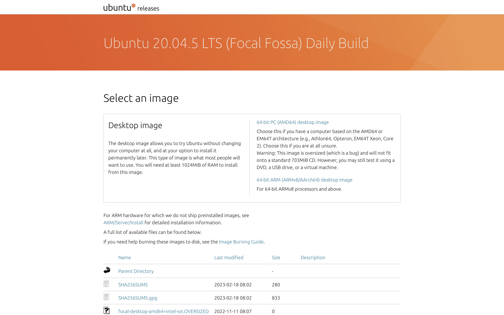{#fig:001 width=70%}

## Установка образа в виртуальную машину

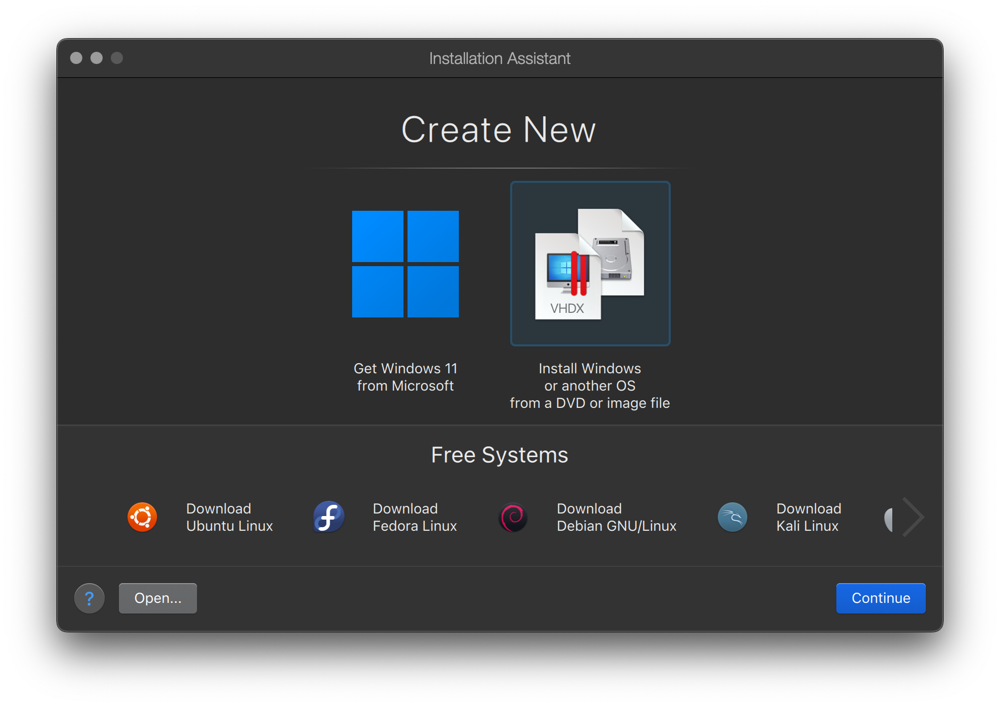{#fig:002 width=70%}

## Запуск ОС

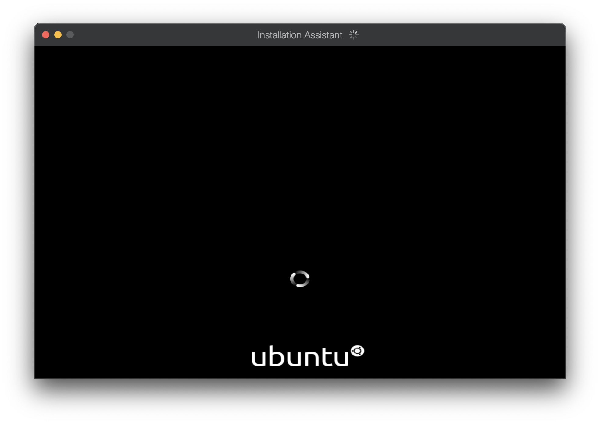{#fig:003 width=70%}

## Настройка ОС

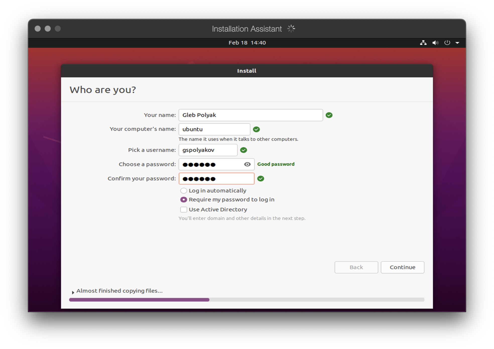{#fig:004 width=70%}

## Установка Tmux

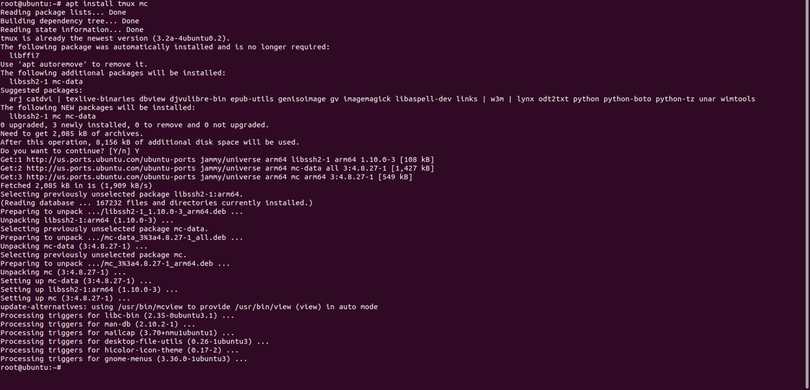{#fig:005 width=70%}

## Установка Pandoc

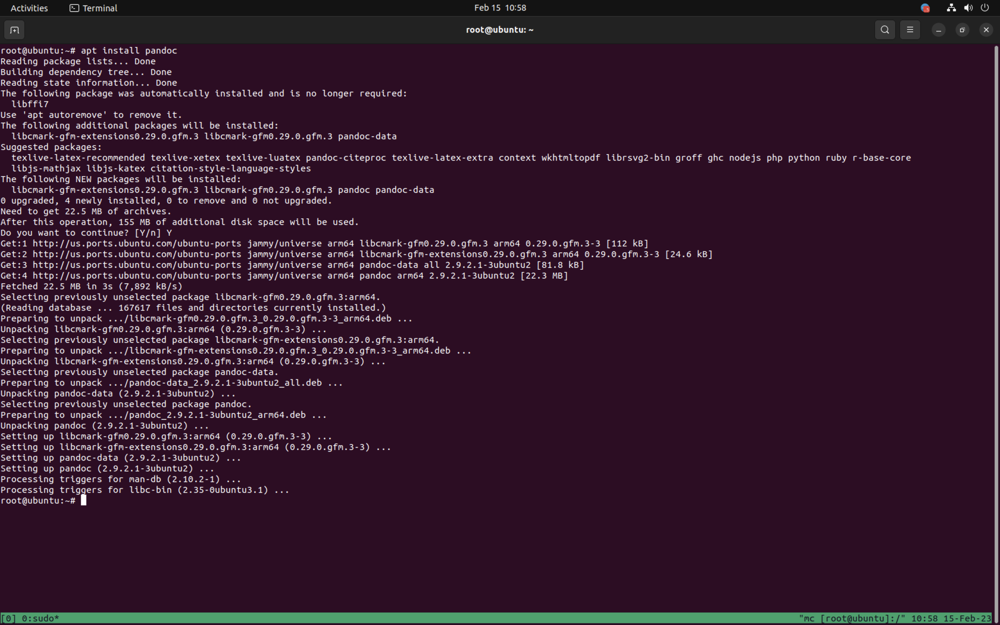{#fig:006 width=70%}

## Установка дополнений Pandoc

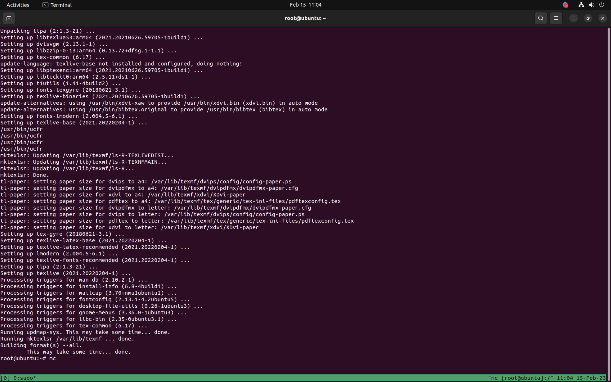{#fig:007 width=70%}

## Установка TexLive

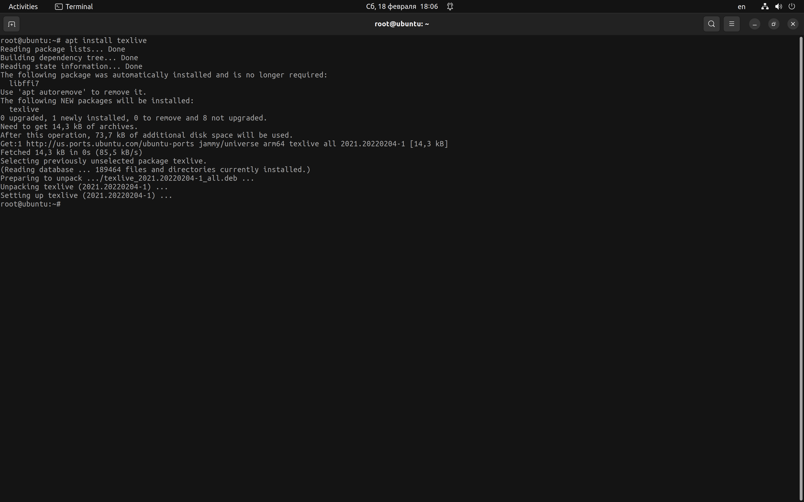{#fig:008 width=70%}

## Выполнение домашнего задания

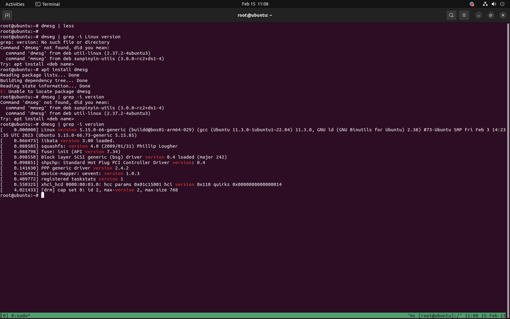{#fig:009 width=30%}
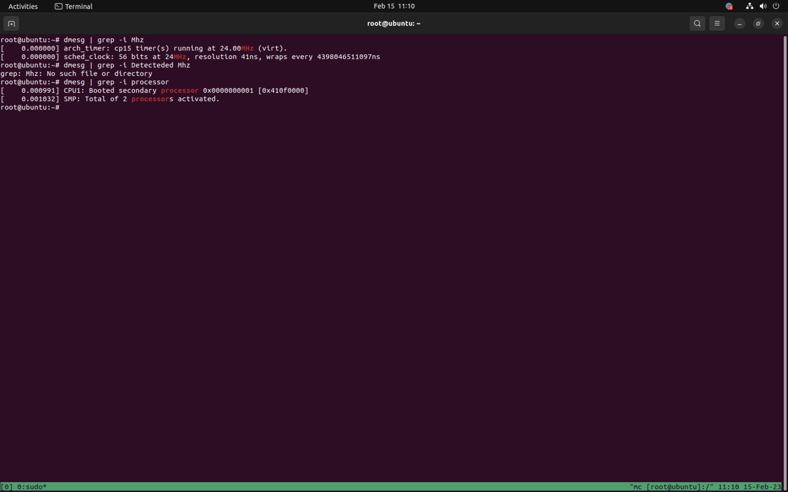{#fig:010 width=30%}
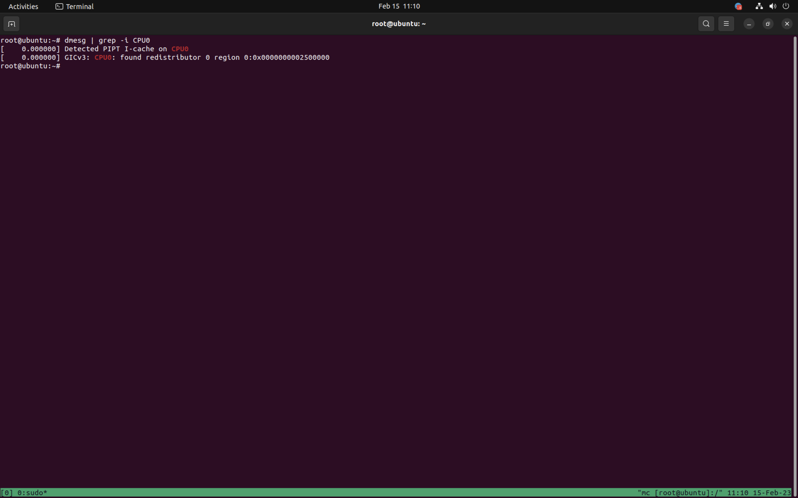{#fig:011 width=30%}

## Вывод

Выполняя данную лабораторную работу, я приобрел практические навыки установки операционной системы на виртуальную машину и настройки мини- мально необходимых для дальнейшей работы сервисов.