---
## Front matter
title: "Лабораторная работа № 1"
subtitle: "Установка ОС Linux"
author: "Поляков Глеб Сергеевич"

## Generic otions
lang: ru-RU
toc-title: "Содержание"

## Bibliography
bibliography: bib/cite.bib
csl: pandoc/csl/gost-r-7-0-5-2008-numeric.csl

## Pdf output format
toc: true # Table of contents
toc-depth: 2
lof: true # List of figures
lot: true # List of tables
fontsize: 12pt
linestretch: 1.5
papersize: a4
documentclass: scrreprt
## I18n polyglossia
polyglossia-lang:
  name: russian
  options:
	- spelling=modern
	- babelshorthands=true
polyglossia-otherlangs:
  name: english
## I18n babel
babel-lang: russian
babel-otherlangs: english
## Fonts
mainfont: PT Serif
romanfont: PT Serif
sansfont: PT Sans
monofont: PT Mono
mainfontoptions: Ligatures=TeX
romanfontoptions: Ligatures=TeX
sansfontoptions: Ligatures=TeX,Scale=MatchLowercase
monofontoptions: Scale=MatchLowercase,Scale=0.9
## Biblatex
biblatex: true
biblio-style: "gost-numeric"
biblatexoptions:
  - parentracker=true
  - backend=biber
  - hyperref=auto
  - language=auto
  - autolang=other*
  - citestyle=gost-numeric
## Pandoc-crossref LaTeX customization
figureTitle: "Рис."
tableTitle: "Таблица"
listingTitle: "Листинг"
lofTitle: "Список иллюстраций"
lotTitle: "Список таблиц"
lolTitle: "Листинги"
## Misc options
indent: true
header-includes:
  - \usepackage{indentfirst}
  - \usepackage{float} # keep figures where there are in the text
  - \floatplacement{figure}{H} # keep figures where there are in the text
---

# Цель работы

Целью данной работы является приобретение практических навыков установки операционной системы на виртуальную машину, настройки минимально необходимых для дальнейшей работы сервисов.

# Задание

Здесь приводится описание задания в соответствии с рекомендациями
методического пособия и выданным вариантом.

# Теоретическое введение
## Введение в GNU Linux
Операционная система (ОС) — это комплекс взаимосвязанных программ, предназначенных для управления ресурсами компьютера и организации взаимодействия с пользователем. Сегодня наиболее известными операционными системами являются ОС семейства Microsoft Windows и UNIX-подобные системы.

GNU Linux — семейство переносимых, многозадачных и многопользовательских операционных систем, на базе ядра Linux, включающих тот или иной набор утилит и программ проекта GNU, и, возможно, другие компоненты. Как и ядро Linux, системы на его основе, как правило, создаются и распространяются в соответствии с моделью разработки свободного и открытого программного обеспечения (Open-Source Software). Linux-системы распространяются в основном бесплатно в виде различных дистрибутивов.

Дистрибутив GNU Linux — общее определение ОС, использующих ядро Linux и набор библиотек и утилит, выпускаемых в рамках проекта GNU, а также графическую оконную подсистему X Window System. Дистрибутив готов для конечной установки на пользовательское оборудование. Кроме ядра и, собственно, операционной системы дистрибутивы обычно содержат широкий набор приложений, таких как редакторы документов и таблиц, мультимедийные проигрыватели, системы для работы с базами данных и т.д. Существуют дистрибутивы, разрабатываемые как при коммерческой поддержке (Red Hat / Fedora, SLED / OpenSUSE, Ubuntu), так и исключительно усилиями добровольцев (Debian, Slackware, Gentoo, ArchLinux).

## Введение в командную строку GNU Linux
Работу ОС GNU Linux можно представить в виде функционирования множества взаимосвязанных процессов. При загрузке системы сначала запускается ядро, которое, в свою очередь, запускает оболочку ОС (от англ. shell «оболочка»). Взаимодействие пользователя с системой Linux (работа с данными и управление работающими в системе процессами) происходит в интерактивном режиме посредством командного языка. Оболочка операционной системы (или командная оболочка, интерпретатор команд) — интерпретирует (т.е. переводит на машинный язык) вводимые пользователем команды, запускает соответствующие программы (процессы), формирует и выводит ответные сообщения. Кроме того, на языке командной оболочки можно писать небольшие программы для выполнения ряда последовательных операций с файлами и содержащимися в них данными — сценарии (скрипты).
Из командных оболочек GNU Linux наиболее популярны bash, csh, ksh, zsh. Команда 
	
	echo $SHELL 
позволяет проверить, какая оболочка используется. В качестве предустановленной командной оболочки GNU Linux используется одна из наиболее распространённых разновидностей командной оболочки — bash (Bourne again shell).

В GNU Linux доступ пользователя к командной оболочке обеспечивается через терминал (или консоль). Запуск терминала можно осуществить через главное меню Приложения Стандартные Терминал (или Консоль) или нажав Ctrl + Alt + t . Интерфейс командной оболочки очень прост. Обычно он состоит из приглашения командной строки (строки, оканчивающейся символом \$), по которому пользователь вводит команды:
	
	iivanova@dk4n31:~$ 

Это приглашение командной оболочки, которое несёт в себе информацию об имени пользователя iivanova, имени компьютера dk4n31 и текущем каталоге, в котором находится пользователь, в данном случае это домашний каталог пользователя, обозначенный как ~).

Команды могут быть использованы с ключами (или опциями) — указаниями, модифицирующими поведение команды. Ключи обычно начинаются с символа (-) или (--) и часто состоят из одной буквы. Кроме ключей после команды могут быть использованы аргументы (параметры) — названия объектов, для которых нужно выполнить команду (например, имена файлов и каталогов). Например, для подробного просмотра содержимого каталога documents может быть использована команда ls с ключом -l:
	
	iivanova@dk4n31:~$ ls -l documents
В данном случае ls – это имя команды, l – ключ, documents – аргумент. Команды, ключи и аргументы должны быть отделены друг от друга пробелом.
Ввод команды завершается нажатием клавиши Enter , после чего команда передаётся оболочке на исполнение. Результатом выполнения команды могут являться сообщения о ходе выполнения команды или об ошибках. Появление приглашения командной строки говорит о том, что выполнение команды завершено.

Иногда в GNU Linux имена программ и команд слишком длинные, однако bash может завершать имена при их вводе в терминале. Нажав клавишу Tab , можно завершить имя команды, программы или каталога. Например, предположим, что нужно использовать программу mcedit. Для этого наберите в командной строке mc, затем нажмите один раз клавишу Tab . Если ничего не происходит, то это означает, что существует несколько возможных вариантов завершения команды. Нажав клавишу Tab ещё раз, можно получить список имён, начинающихся с mc:
	
	iivanova@dk4n31:~$ mc
	mc    mcd       mcedit    mclasserase  mcookie   mcview
	mcat  mcdiff    mcheck    mcomp        mcopy
	iivanova@dk4n31:~$ mc

###Техническое обеспечение

Лабораторная работа подразумевает установку на виртуальную машину VirtualBox (https://www.virtualbox.org/) операционной системы Linux (дистрибутив Fedora). Выполнение работы возможно как в дисплейном классе факультета физико-математических и естественных наук РУДН, так на своей технике. Описание выполнения работы приведено для дисплейного класса со следующими характеристиками техники:
– Intel Core i3-550 3.2 GHz, 4 GB оперативной памяти, 8 GB свободного места на жёстком диске;
– ОС Linux Gentoo (http://www.gentoo.ru/);
– VirtualBox версии 6.1 или новее.
Для установки в виртуальную машину используется дистрибутив Linux Fedora-19. При выполнении лабораторной работы на своей технике необходимо скачать необходимый образ операционной системы (https://getfedora.org/ru/workstation/download/).

###Соглашения об именовании

При выполнении лабораторных работ следует придерживаться следующих правил именования:

* Пользователь внутри виртуальной машины должен иметь имя, совпадающее с учётной записью студента, выполняющего лабораторную работу.
* Имя хоста вашей виртуальной машины должно совпадать с учётной записью студента, выполняющего лабораторную работу.
* Имя виртуальной машины должно совпадать с учётной записью студента, выполняющего лабораторную работу.
* В дисплейных классах вы можете посмотреть имя вашей учётной записи, набрав в терминале команду: id -un
* При установке на своей технике необходимо использовать имя вашей учётной записи дисплейных классов. Например, если студента зовут Остап Сулейманович Бендер, то его учётная запись имеет вид osbender

# Выполнение лабораторной работы

1. Скачивание образа Ubuntu Linux 20.04.5

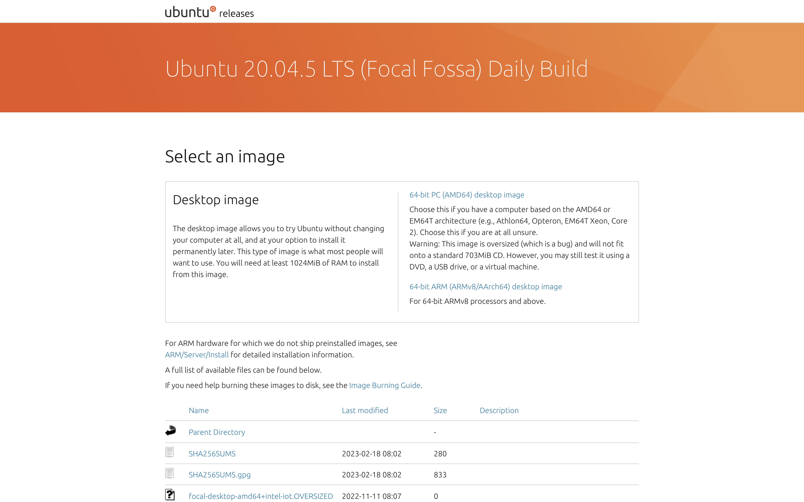{#fig:001 width=70%}

2. Скачивание виртуальной машины Parallels Desktop 18

{#fig:002 width=70%}

3. Запуск и настройка виртуальной машины

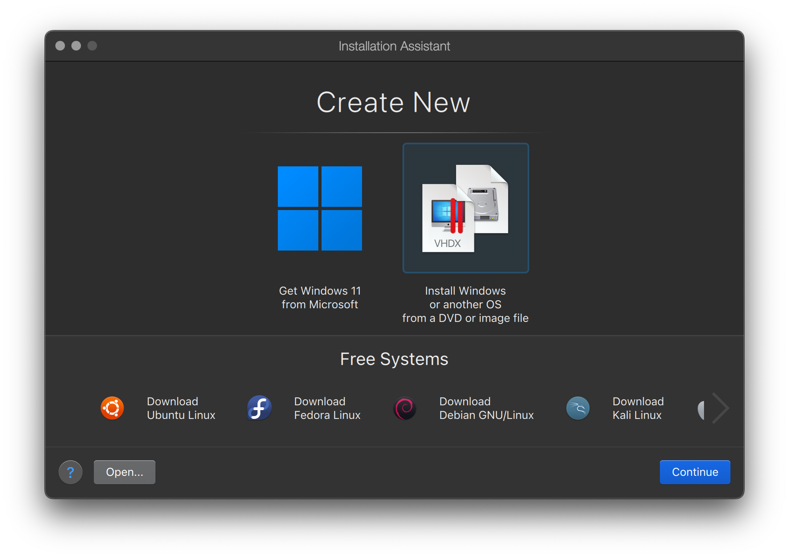{#fig:003 width=70%}

4. Установка дистрибутива в виртуальную машину 

{#fig:004 width=70%}

5. Запуск ОС

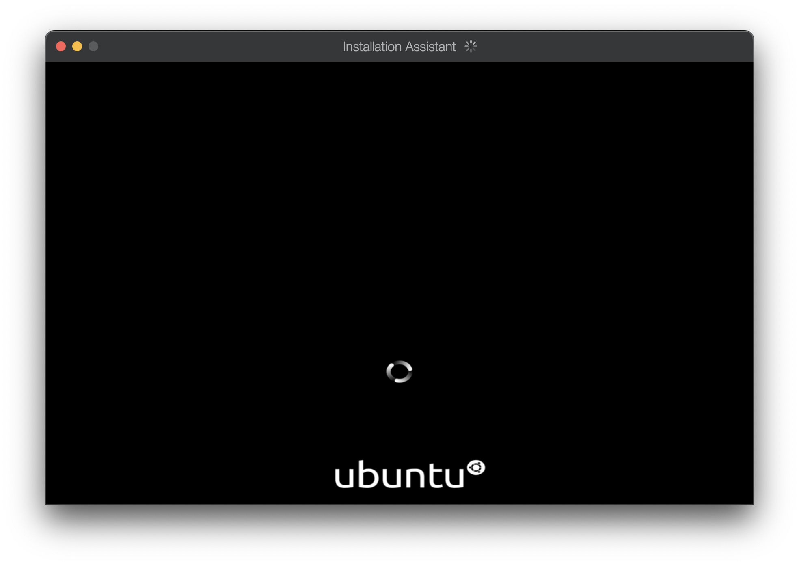{#fig:005 width=70%}

6. Установка ОС

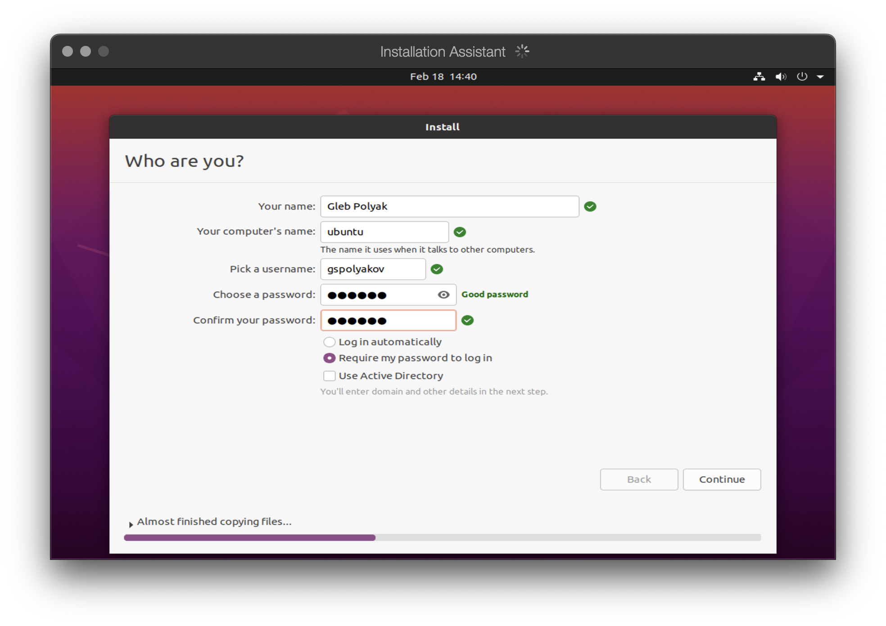{#fig:006 width=70%}

7. Настройка ОС

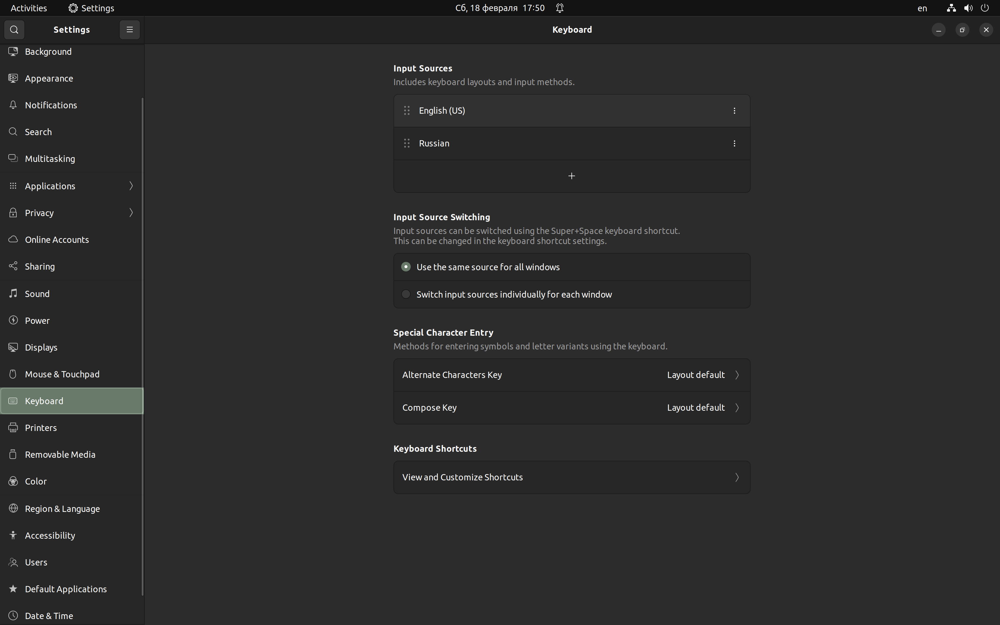{#fig:007 width=70%}

8. Обновление всех пакетов

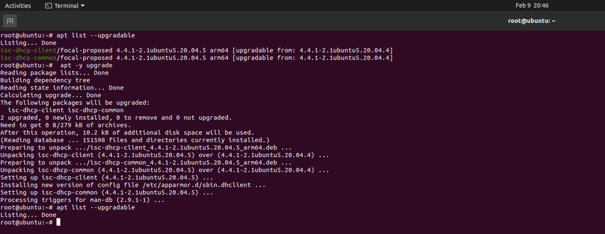{#fig:008 width=70%}

9. Установка Tmux mc

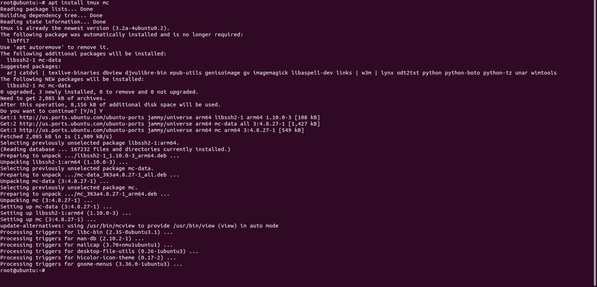{#fig:009 width=70%}

10. Установка Pandoc

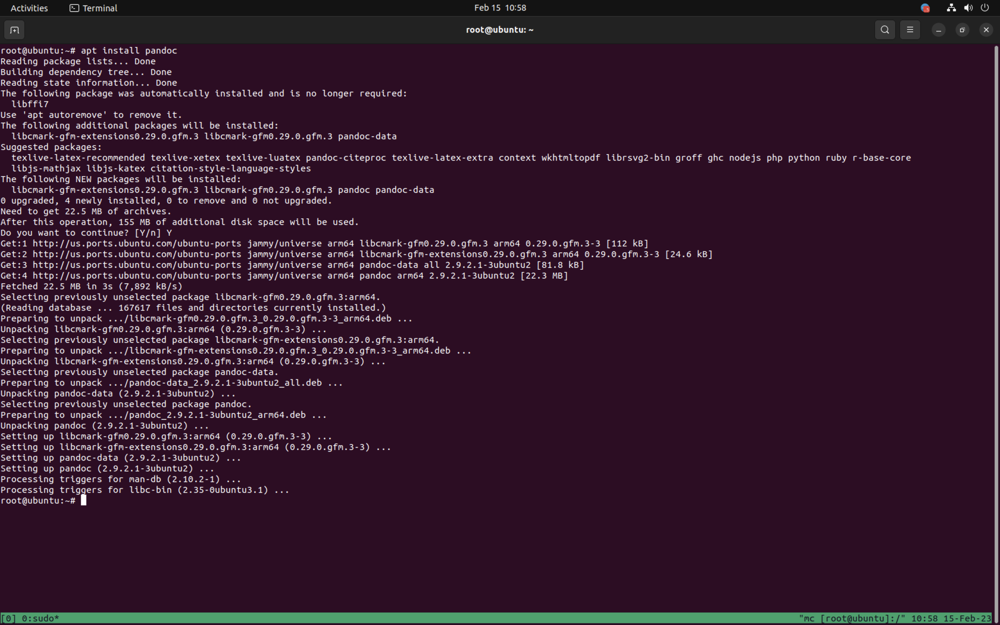{#fig:010 width=70%}

11. Установка расширений для Pandoc

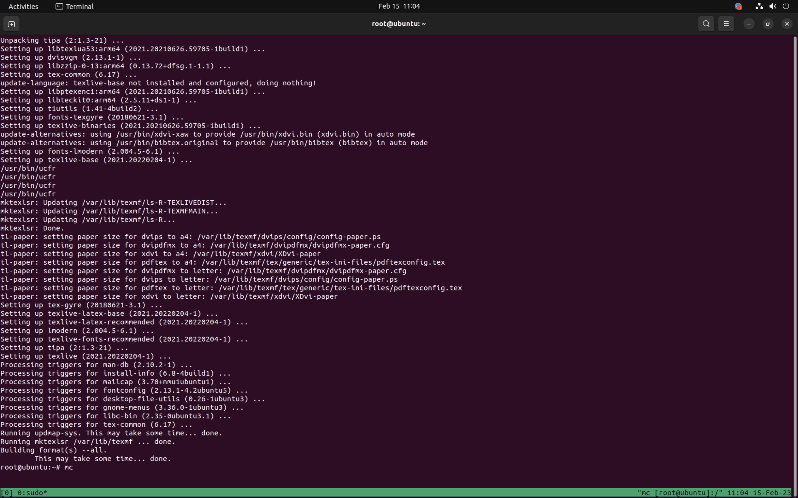{#fig:011 width=70%}

12. Установка TexLive

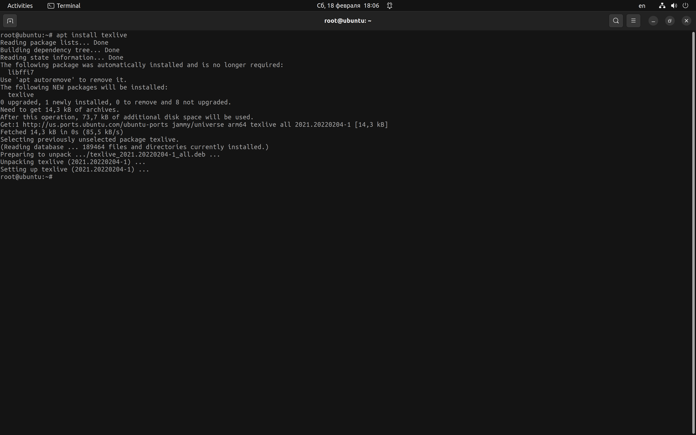{#fig:012 width=70%}

13. Домашнее задание:
	* Версия ядра Linux (Linux version).

	{#fig:013 width=70%}

	* Частота процессора (Detected Mhz processor).

	{#fig:014 width=70%}

	* Модель процессора (CPU0).

	{#fig:015 width=70%}

	* Объём доступной оперативной памяти (Memory available).

	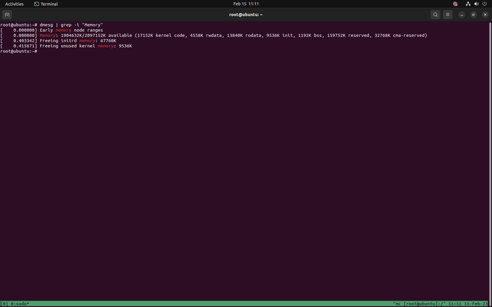{#fig:016 width=70%}

	* Тип обнаруженного гипервизора (Hypervisor detected).

	Не обнаружен
	
	* Тип файловой системы корневого раздела.
	* Последовательность монтирования файловых систем.

	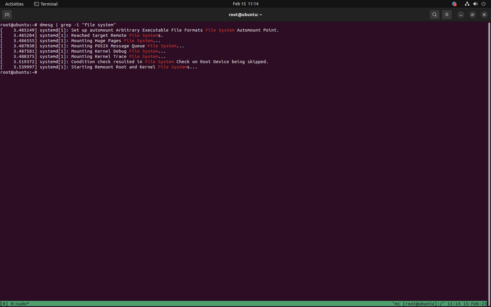{#fig:019 width=70%}

### Контрольные вопросы:

1. Какую информацию содержит учётная запись пользователя?
	
	Учётная запись пользователя в Linux содержит следующую информацию:
	
	* Имя пользователя
	* Пароль
	* Идентификатор пользователя
	* Группы
	* Домашний каталог
	* Реальное имя пользователя

2. Укажите команды терминала и приведите примеры:

	* Для получения справки по команде: man <command>, например: man ls
	* Для перемещения по файловой системе: cd <directory>, например: cd /home/user/Documents
	* Для просмотра содержимого каталога: ls <directory>, например: ls /home/user/Documents
	* Для определения объёма каталога: du <directory>, например: du /home/user/Documents
	* Для создания / удаления каталогов / файлов: mk(dir)/rm(dir), например mkdir new_folder
	* Для задания определённых прав на файл / каталог: chmod <permissions> <file/directory>, например chmod 755 file.txt
	* Для просмотра истории команд: history, например: history | grep command

3. Что такое файловая система? Приведите примеры с краткой характеристикой.

	Файловая система - это метод организации и хранения файлов на жестком диске, флеш-накопителе или других устройствах хранения данных. Она определяет, как файлы и каталоги будут храниться, организовываться, доступны и управляться в системе. Файловые системы обычно предоставляют абстракцию, которая скрывает низкоуровневые детали работы с жестким диском от пользователей и приложений.
	
	Некоторые из наиболее распространенных файловых систем в Linux и других UNIX-подобных операционных системах включают в себя:
	
	* Ext4 (Extended Filesystem 4): это одна из наиболее распространенных и рекомендуемых файловых систем для Linux. Она поддерживает файлы размером до 16 терабайт и имеет множество улучшений по сравнению с предыдущими версиями Ext.
	* XFS (XFS File System): это высокопроизводительная файловая система, которая используется в больших хранилищах данных, где требуется обработка больших файлов. Она поддерживает файлы размером до 8 экзабайт и имеет высокую степень отказоустойчивости.
	* Btrfs (B-tree File System): это новая файловая система, которая включает множество функций, таких как копии в реальном времени и восстановление после сбоев, а также поддерживает сжатие и криптографию.
	* NTFS (New Technology File System): это файловая система, разработанная для операционных систем Windows. Она поддерживает файлы размером до 16 экзабайт и предоставляет различные функции, такие как права доступа и журналирование.
	* FAT (File Allocation Table): это старая файловая система, которая используется для совместимости с устройствами, такими как флеш-накопители и карточки памяти. Она имеет ограничения на размер файлов и не поддерживает журналирование.
	* HFS+ (Hierarchical File System Plus): это файловая система, используемая на компьютерах Mac. Она поддерживает файлы размером до 8 экзабайт и предоставляет функции, такие как кодирование и метаданные файлов.
	
4. Как посмотреть, какие файловые системы подмонтированы в ОС?

	В Linux можно посмотреть список всех файловых систем, которые в данный момент подмонтированы в систему, используя команду mount. Эта команда выводит список всех подмонтированных файловых систем и информацию о каждой из них. Для выполнения этой команды необходимы привилегии суперпользователя (root).

5. Как удалить зависший процесс?

	Для удаления зависшего процесса в операционной системе Linux можно использовать команду kill с указанием идентификатора процесса (PID). Эта команда отправляет сигнал процессу, который может привести к его завершению. Если процесс не реагирует на сигнал, можно использовать более жесткий сигнал с помощью опции -9.

# Выводы

Выполняя данную лабораторную работу, я приобрел практические навыки установки операционной системы на виртуальную машину и настройки минимально необходимых для дальнейшей работы сервисов.

# Список литературы{.unnumbered}

::: {#refs}
:::
