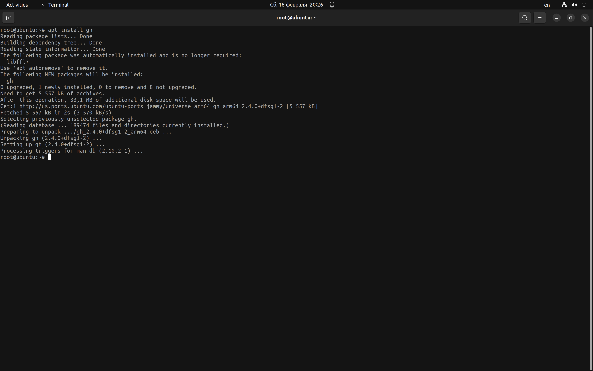
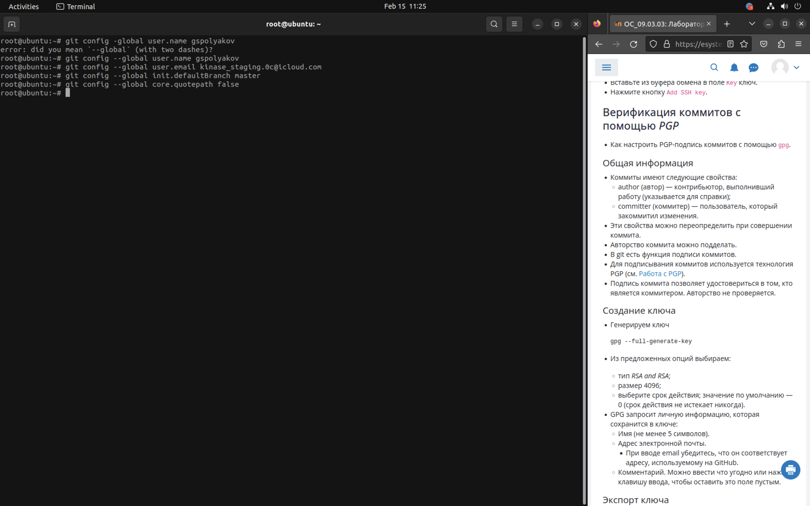
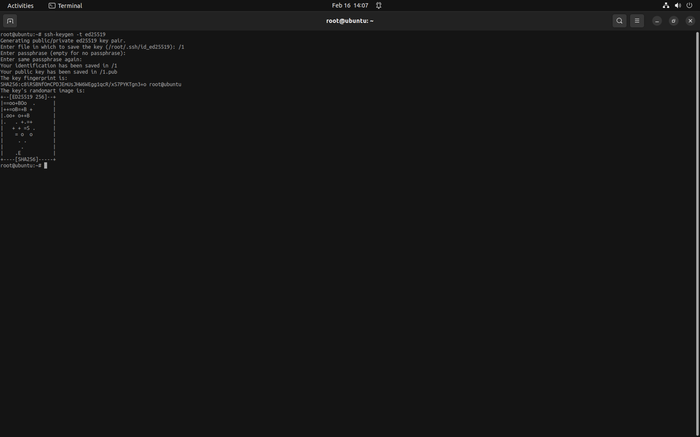
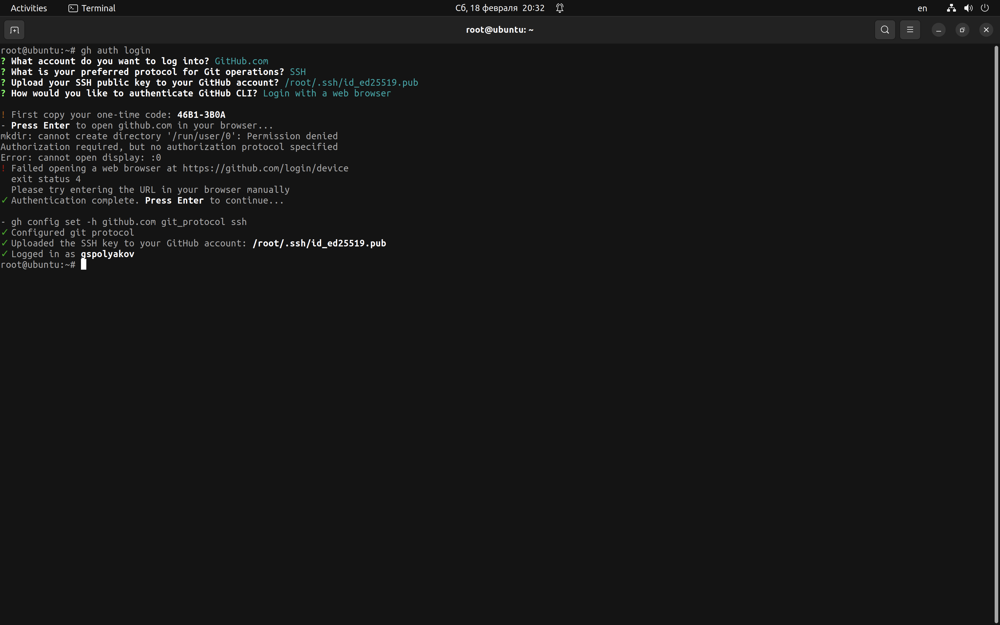
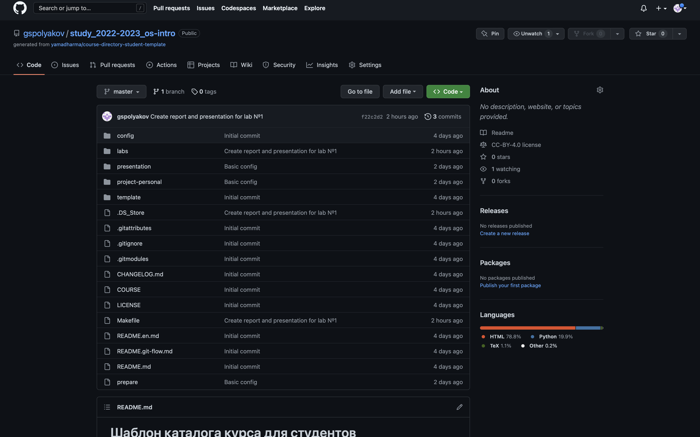

---
## Front matter
title: "Лабораторная работа № 2"
subtitle: "Первоначальная настройка Git"
author: "Поляков Глеб Сергеевич"

## Generic otions
lang: ru-RU
toc-title: "Содержание"

## Bibliography
bibliography: bib/cite.bib
csl: pandoc/csl/gost-r-7-0-5-2008-numeric.csl

## Pdf output format
toc: true # Table of contents
toc-depth: 2
lof: true # List of figures
lot: true # List of tables
fontsize: 12pt
linestretch: 1.5
papersize: a4
documentclass: scrreprt
## I18n polyglossia
polyglossia-lang:
  name: russian
  options:
	- spelling=modern
	- babelshorthands=true
polyglossia-otherlangs:
  name: english
## I18n babel
babel-lang: russian
babel-otherlangs: english
## Fonts
mainfont: PT Serif
romanfont: PT Serif
sansfont: PT Sans
monofont: PT Mono
mainfontoptions: Ligatures=TeX
romanfontoptions: Ligatures=TeX
sansfontoptions: Ligatures=TeX,Scale=MatchLowercase
monofontoptions: Scale=MatchLowercase,Scale=0.9
## Biblatex
biblatex: true
biblio-style: "gost-numeric"
biblatexoptions:
  - parentracker=true
  - backend=biber
  - hyperref=auto
  - language=auto
  - autolang=other*
  - citestyle=gost-numeric
## Pandoc-crossref LaTeX customization
figureTitle: "Рис."
tableTitle: "Таблица"
listingTitle: "Листинг"
lofTitle: "Список иллюстраций"
lotTitle: "Список таблиц"
lolTitle: "Листинги"
## Misc options
indent: true
header-includes:
  - \usepackage{indentfirst}
  - \usepackage{float} # keep figures where there are in the text
  - \floatplacement{figure}{H} # keep figures where there are in the text
---

# Цель работы

Целью работы является изучить идеологию и применение средств контроля версий. Приобрести практические навыки по работе с системой git.

# Задание

Здесь приводится описание задания в соответствии с рекомендациями
методического пособия и выданным вариантом.

# Теоретическое введение

### Системы контроля версий. Общие понятия

Системы контроля версий (Version Control System, VCS) применяются при работе нескольких человек над одним проектом. Обычно основное дерево проекта хранится в локальном или удалённом репозитории, к которому настроен доступ для участников проекта. При внесении изменений в содержание проекта система контроля версий позволяет их фиксировать, совмещать изменения, произведённые разными участниками проекта, производить откат к любой более ранней версии проекта, если это требуется.

В классических системах контроля версий используется централизованная модель, предполагающая наличие единого репозитория для хранения файлов. Выполнение большинства функций по управлению версиями осуществляется специальным сервером. Участник проекта (пользователь) перед началом работы посредством определённых команд получает нужную ему версию файлов. После внесения изменений, пользователь размещает новую версию в хранилище. При этом предыдущие версии не удаляются из центрального хранилища и к ним можно вернуться в любой момент. Сервер может сохранять не полную версию изменённых файлов, а производить так называемую дельта-компрессию — сохранять только изменения между последовательными версиями, что позволяет уменьшить объём хранимых данных.

Системы контроля версий поддерживают возможность отслеживания и разрешения конфликтов, которые могут возникнуть при работе нескольких человек над одним файлом. Можно объединить (слить) изменения, сделанные разными участниками (автоматически или вручную), вручную выбрать нужную версию, отменить изменения вовсе или заблокировать файлы для изменения. В зависимости от настроек блокировка не позволяет другим пользователям получить рабочую копию или препятствует изменению рабочей копии файла средствами файловой системы ОС, обеспечивая таким образом, привилегированный доступ только одному пользователю, работающему с файлом.
Системы контроля версий также могут обеспечивать дополнительные, более гибкие функциональные возможности. Например, они могут поддерживать работу с несколькими версиями одного файла, сохраняя общую историю изменений до точки ветвления версий и собственные истории изменений каждой ветви. Кроме того, обычно доступна информация о том, кто из участников, когда и какие изменения вносил. Обычно такого рода информация хранится в журнале изменений, доступ к которому можно ограничить.

В отличие от классических, в распределённых системах контроля версий центральный репозиторий не является обязательным.

Среди классических VCS наиболее известны CVS, Subversion, а среди распределённых — Git, Bazaar, Mercurial. Принципы их работы схожи, отличаются они в основном синтаксисом используемых в работе команд.

### Система контроля версий Git

Система контроля версий Git представляет собой набор программ командной строки. Доступ к ним можно получить из терминала посредством ввода команды git с различными опциями.

Благодаря тому, что Git является распределённой системой контроля версий, резервную копию локального хранилища можно сделать простым копированием или архивацией.

### Основные команды git

| Команда | Описание|
|-----------|----------------------------------------|
| git init | создание основного дерева репозитория |
| git pull | получение обновлений (изменений) текущего дерева из центрального репозитория |
| git push | отправка всех произведённых изменений локального дерева в центральный репозиторий |
| git status | просмотр списка изменённых файлов в текущей директории|
| git diff | просмотр текущих изменения |
| git add . | добавить все изменённые и/или созданные файлы и/или каталоги|
| git add имена_файлов | добавить конкретные изменённые и/или созданные файлы и/или каталоги |
| git rm имена_файлов | удалить файл и/или каталог из индекса репозитория (при этом файл и/или каталог остаётся в локальной директории) |
| git commit -am 'Описание коммита' | сохранить все добавленные изменения и все изменённые файлы |
| git checkout -b имя_ветки| создание новой ветки, базирующейся на текущей|
| git checkout имя_ветки| переключение на некоторую ветку (при переключении на ветку, которой ещё нет в локальном репозитории, она будет создана и связана с удалённой)|
| git push origin имя_ветки| отправка изменений конкретной ветки в центральный репозиторий|
| git merge --no-ff имя_ветки| слияние ветки с текущим деревом|
| git branch -d имя_ветки| удаление локальной уже слитой с основным деревом ветки принудительное удаление локальной ветки|
| git branch -D имя_ветки| принудительное удаление локальной ветки|
| git push origin :имя_ветки| удаление ветки с центрального репозитория|

### Стандартные процедуры работы при наличии центрального репозитория

Работа пользователя со своей веткой начинается с проверки и получения изменений из центрального репозитория (при этом в локальное дерево до начала этой процедуры не должно было вноситься изменений):
  
	git checkout master
	git pull
	git checkout -b имя_ветки

Затем можно вносить изменения в локальном дереве и/или ветке.
После завершения внесения какого-то изменения в файлы и/или каталоги проекта необходимо разместить их в центральном репозитории. Для этого необходимо проверить, какие файлы изменились к текущему моменту:
git status
и при необходимости удаляем лишние файлы, которые не хотим отправлять в центральный репозиторий.
Затем полезно просмотреть текст изменений на предмет соответствия правилам ведения чистых коммитов:
git diff
Если какие-либо файлы не должны попасть в коммит, то помечаем только те файлы, изменения которых нужно сохранить. Для этого используем команды добавления и/или удаления с нужными опциями:

	git add имена_файлов
	git rm имена_файлов

Если нужно сохранить все изменения в текущем каталоге, то используем:
	
	git add .

Затем сохраняем изменения, поясняя, что было сделано:

	git commit -am "Some commit message"
и отправляем в центральный репозиторий: 
	
	git push origin имя_ветки
или

	git push

# Выполнение лабораторной работы

1. Установка git

К сожалению, скриншиот был утерян

2. Установка gh

{#fig:001 width=70%}

3. Базовая настройка git

{#fig:002 width=70%}

4. Создание ключа ssh

{#fig:003 width=70%}

5. Настройка gh

{#fig:004 width=70%}

6. Сознание репозитория курса на основе шаблона

{#fig:005 width=70%}

7. Настройка каталога курса

К сожалению, скриншиот был утерян

### Контрольные вопросы:

1. Что такое системы контроля версий (VCS) и для решения каких задач они предназначаются?
	
	Системы контроля версий (VCS) - это программное обеспечение, которое позволяет отслеживать изменения в коде, документах и других файлах, которые хранятся в репозитории. Они позволяют контролировать и управлять версиями файлов, отслеживать изменения, вносимые в файлы, и восстанавливать предыдущие версии.
	
	VCS решают следующие задачи:

	* Управление версиями: сохранение и отслеживание изменений в коде и документах
	* Совместная работа над проектом: позволяют разным разработчикам работать над одним и тем же кодом и контролировать изменения
	* Восстановление предыдущих версий: возможность возвращения к предыдущим версиям файлов и кода
	* Слияние изменений: позволяют объединять изменения, внесенные несколькими разработчиками в один исходный код

2. Объясните следующие понятия VCS и их отношения: хранилище, commit, история, рабочая копия.

	Хранилище (repository) - это место, где хранятся файлы, версии и история изменений в проекте.

	Commit (зафиксировать изменения) - это операция, при которой внесенные изменения в файлы исходного кода или документы сохраняются в VCS.

	История (history) - это список всех commit'ов, которые были внесены в хранилище.
	
	Рабочая копия (working copy) - это локальная копия файлов исходного кода из хранилища, которая находится на компьютере разработчика.

	Отношения между этими понятиями таковы: при работе с VCS разработчик обычно клонирует репозиторий (хранилище) на свой компьютер, создавая рабочую копию проекта. Затем он вносит изменения в файлы, находящиеся в рабочей копии, и зафиксирует эти изменения в хранилище с помощью коммитов. Все коммиты хранятся в истории изменений, которую можно использовать для просмотра и восстановления предыдущих версий файлов.

3. Что представляют собой и чем отличаются централизованные и децентрализованные VCS? Приведите примеры VCS каждого вида.
	
	Централизованные VCS это тип VCS, в котором все версии файлов исходного кода хранятся в центральном репозитории. Все разработчики работают с этим центральным репозиторием, загружая и скачивая файлы для выполнения задач. Каждый разработчик работает с локальной копией файлов, которая содержит последнюю версию файлов из центрального репозитория. Централизованные VCS могут быть полезными для команд, которые работают над большими проектами и имеют централизованную структуру управления. Пример CVCS:

	* Subversion (SVN) - одна из наиболее известных и широко используемых централизованных VCS.

	Децентрализованные VCS это тип VCS, в котором каждый разработчик имеет свою локальную копию полного репозитория. Это позволяет разработчикам работать независимо друг от друга и синхронизироваться с другими разработчиками только при необходимости. Каждый разработчик может легко фиксировать изменения в своем локальном репозитории и сливать изменения с другими разработчиками, что делает работу в команде более эффективной. Пример DVCS:

	* Git - наиболее популярная и широко используемая децентрализованная VCS.

4. Опишите действия с VCS при единоличной работе с хранилищем.

	* Создание репозитория
	* Инициализация репозитория
	* Добавление файлов
	* Фиксация изменений
	* Просмотр истории изменений
	* Восстановление прошлых версий
	* Отправка изменений на сервер
	* Получение изменений с сервера
	
5. Опишите порядок работы с общим хранилищем VCS.
	
	* Создание репозитория
	* Клонирование репозитория
	* Создание веток
	* Работа над файлами
	* Фиксация изменений
	* Обновление центрального репозитория
	* Получение изменений
	* Разрешение конфликтов
	* Объединение изменений

6. Каковы основные задачи, решаемые инструментальным средством git?

	Основные задачи, которые решает инструментальное средство Git, включают:

	* Управление версиями файлов
	* Работа в команде
	* Ветвление и слияние
	* Откат изменений
	* Резервное копирование
	* Интеграция с другими инструментами
	* Управление проектами

7. Назовите и дайте краткую характеристику командам git.
	
	* git init: инициализирует новый репозиторий Git.
	* git clone: создает локальную копию удаленного репозитория.
	* git add: добавляет файлы для отслеживания в Git.
	* git commit: создает новую версию репозитория, включая все изменения, которые были произведены после предыдущего коммита.
	* git status: показывает текущее состояние репозитория, включая измененные файлы и неотслеживаемые файлы.
	* git push: отправляет изменения в локальном репозитории на удаленный репозиторий.
	* git pull: получает изменения из удаленного репозитория и обновляет локальный репозиторий.
	* git branch: создает новую ветку в репозитории.
	* git checkout: переключает ветки или возвращает репозиторий к предыдущему коммиту.
	* git merge: объединяет изменения из одной ветки с другой веткой.
	* git log: показывает список всех коммитов в репозитории.
	* git stash: временно сохраняет текущие изменения, чтобы можно было переключиться на другую ветку или коммит.
	* git tag: создает метку, которая может быть использована для пометки определенной версии проекта.

8. Приведите примеры использования при работе с локальным и удалённым репозиториями.

	Например, при работе с локальным репозиторием можно использовать следующие команды Git:
	
	* git init: для создания нового репозитория
	* git add: для добавления файлов в репозиторий
	* git commit: для сохранения изменений в репозитории
	* git status: для проверки статуса файлов в репозитории
	* git diff: для просмотра изменений между версиями файлов в репозитории
	* git branch: для создания и переключения между ветками
	
	при работе с удаленным репозиторием можно использовать команды, такие как:
	
	* git clone: для создания локальной копии удаленного репозитория
	* git push: для отправки изменений из локального репозитория в удаленный репозиторий
	* git pull: для получения изменений из удаленного репозитория и обновления локального репозитория
	* git fetch: для загрузки изменений из удаленного репозитория без их автоматического объединения с локальным репозиторием
	* git remote: для управления удаленными репозиториями, подключенными к локальному репозиторию

9. Что такое и зачем могут быть нужны ветви (branches)?

	Ветви (branches) в системе контроля версий (VCS), такой как Git, являются копиями репозитория, которые могут разрабатываться параллельно. Каждая ветвь представляет собой отдельную линию разработки, в которой можно вносить изменения, не затрагивая основную линию разработки.

	Ветви могут быть полезны в следующих ситуациях:

	* Разработка новых функций: Когда необходимо разработать новую функциональность, можно создать новую ветвь и работать в ней. При этом, основная линия разработки (обычно ветка "master") будет оставаться неизменной, пока не будет готова и протестирована новая функциональность.
	* Исправление ошибок: В случае обнаружения ошибок в коде, можно создать ветвь, где будет вестись работа по исправлению этих ошибок. При этом, основная линия разработки будет продолжать развиваться без изменений.
	* Релизы: Когда приложение готово к релизу, можно создать новую ветку, где будет находиться код, который будет использоваться для создания выпуска (release). При этом, разработчики смогут продолжать работу над новыми функциональностями и исправлениями ошибок в основной линии разработки.
	* Эксперименты: Ветви могут использоваться для экспериментирования с разными идеями и концепциями, не влияя на основную линию разработки. Если эксперимент успешен, изменения могут быть включены в основную ветвь.

10. Как и зачем можно игнорировать некоторые файлы при commit?

	Иногда бывает необходимо игнорировать определенные файлы или папки при выполнении команды git commit. Например, это могут быть временные файлы, создаваемые вашей IDE, лог-файлы, файлы с настройками, кэши и другие файлы, которые не должны попадать в репозиторий.

	Использование файла .gitignore позволяет избежать добавления в репозиторий ненужных файлов и сократить объем хранимых данных, что повышает эффективность работы с репозиторием.

# Выводы

Выполняя данную лабораторную работу, я изучил идеологию и применение средств контроля версий. Приобрел практические навыки по работе с системой git.

# Список литературы{.unnumbered}

::: {#refs}
:::
