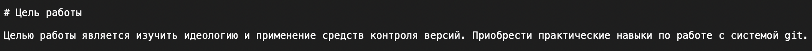
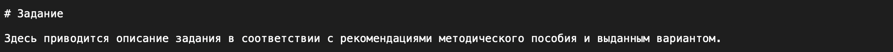
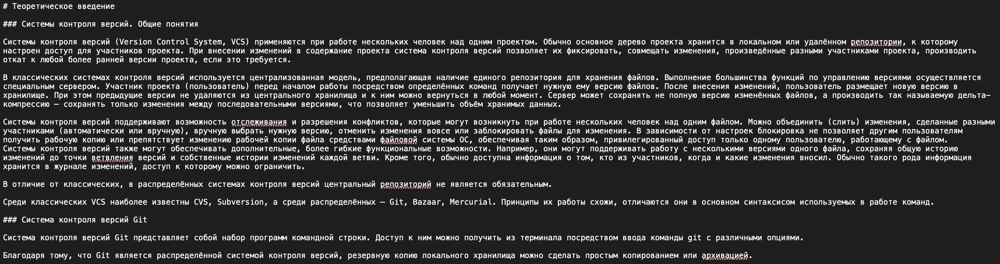
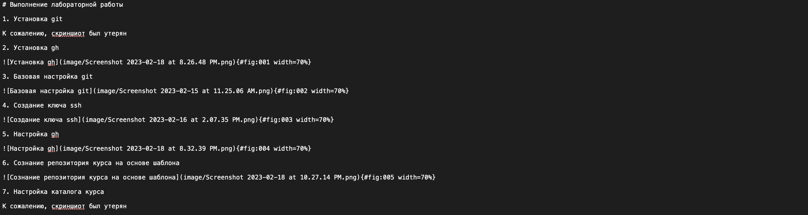
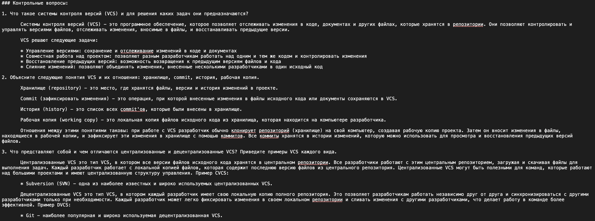

---
## Front matter
title: "Лабораторная работа №3"
subtitle: "Markdown"
author: "Поляков Глеб Сергеевич"

## Generic otions
lang: ru-RU
toc-title: "Содержание"

## Bibliography
bibliography: bib/cite.bib
csl: pandoc/csl/gost-r-7-0-5-2008-numeric.csl

## Pdf output format
toc: true # Table of contents
toc-depth: 2
lof: true # List of figures
lot: true # List of tables
fontsize: 12pt
linestretch: 1.5
papersize: a4
documentclass: scrreprt
## I18n polyglossia
polyglossia-lang:
  name: russian
  options:
	- spelling=modern
	- babelshorthands=true
polyglossia-otherlangs:
  name: english
## I18n babel
babel-lang: russian
babel-otherlangs: english
## Fonts
mainfont: PT Serif
romanfont: PT Serif
sansfont: PT Sans
monofont: PT Mono
mainfontoptions: Ligatures=TeX
romanfontoptions: Ligatures=TeX
sansfontoptions: Ligatures=TeX,Scale=MatchLowercase
monofontoptions: Scale=MatchLowercase,Scale=0.9
## Biblatex
biblatex: true
biblio-style: "gost-numeric"
biblatexoptions:
  - parentracker=true
  - backend=biber
  - hyperref=auto
  - language=auto
  - autolang=other*
  - citestyle=gost-numeric
## Pandoc-crossref LaTeX customization
figureTitle: "Рис."
tableTitle: "Таблица"
listingTitle: "Листинг"
lofTitle: "Список иллюстраций"
lotTitle: "Список таблиц"
lolTitle: "Листинги"
## Misc options
indent: true
header-includes:
  - \usepackage{indentfirst}
  - \usepackage{float} # keep figures where there are in the text
  - \floatplacement{figure}{H} # keep figures where there are in the text
---

# Цель работы

Научиться оформлять отчёты с помощью легковесного языка разметки Markdown.

# Задание

- Сделайте отчёт по предыдущей лабораторной работе в формате Markdown.
- В качестве отчёта просьба предоставить отчёты в 3 форматах: pdf, docx и md (в архиве, поскольку он должен содержать скриншоты, Makefile и т.д.)

# Теоретическое введение

## Предварительные сведения

### Базовые сведения о Markdown

Чтобы создать заголовок, используйте знак ( # ), например:

# This is heading 1
## This is heading 2
### This is heading 3
#### This is heading 4

Чтобы задать для текста полужирное начертание, заключите его в двойные звездочки:

This text is **bold**.

Чтобы задать для текста курсивное начертание, заключите его в одинарные звездочки:
	
This text is *italic*.

Чтобы задать для текста полужирное и курсивное начертание, заключите его в тройные звездочки:
	
This is text is both ***bold and italic***.

Блоки цитирования создаются с помощью символа >:
> The drought had lasted now for ten million years, and the reign of
↪ the terrible lizards had long since ended. Here on the Equator, in
↪ the continent which would one day be known as Africa, the battle
↪ for existence had reached a new climax of ferocity, and the victor
↪ was not yet in sight. In this barren and desiccated land, only the
↪ small or the swift or the fierce could flourish, or even hope to
↪ survive.

Неупорядоченный (маркированный) список можно отформатировать с помощью звездочек или тире:

- List item 1 
- List item 2 
- List item 3

Чтобы вложить один список в другой, добавьте отступ для элементов дочернего списка:

- List item 1
	- List item A 
	- List item B
- List item 2

Упорядоченный список можно отформатировать с помощью соответствующих цифр:

1. First instruction 
2. Second instruction 
3. Third instruction

Чтобы вложить один список в другой, добавьте отступ для элементов дочернего списка:

1. First instruction 
	1. Sub-instruction
	2. Sub-instruction
2. Second instruction

Синтаксис Markdown для встроенной ссылки состоит из части [link text], представляющей текст гиперссылки, и части (file-name.md) –URL-адреса или имени файла, на который дается ссылка:
[link text](file-name.md)

Markdown поддерживает как встраивание фрагментов кода в предложение, так и их размещение между предложениями в виде отдельных огражденных блоков. Огражденные блоки кода — это простой способ выделить синтаксис для фрагментов кода. Общий формат огражденных блоков кода:

``` language your code goes in here```

Верхние и нижние индексы: 

записывается как

	H~2~O

записывается как

	2^10^

Внутритекстовые формулы делаются аналогично формулам LaTeX. Например, формула sin2(𝑥) + cos2(𝑥) = 1 запишется как
$\sin^2 (x) + \cos^2 (x) = 1$
Выключные формулы:
sin2(𝑥) + cos2(𝑥) = 1

{#eq:eq:sin2+cos2} со ссылкой в тексте «Смотри формулу ([-@eq:eq:sin2+cos2]).» записывается как
	
	$$
	\sin^2 (x) + \cos^2 (x) = 1
	$$ {#eq:eq:sin2+cos2}
	Смотри формулу ([-@eq:eq:sin2+cos2]).
	
## Обработка файлов в формате Markdown

Для обработки файлов в формате Markdown будем использовать Pandoc https://pandoc.org/. Конкретно, нам понадобится программа pandoc-citeproc https://github.com/jgm/pandoc/releases, https://github.com/lierdakil/pandoc- crossref/releases.

Преобразовать файл README.md можно следующим образом:

	pandoc README.md -o README.pdf

или так
	
	pandoc README.md -o README.docx

Можно использовать следующий Makefile:

	FILES = $(patsubst %.md, %.docx, $(wildcard *.md)) FILES += $(patsubst %.md, %.pdf, $(wildcard *.md))
	LATEX_FORMAT =
	FILTER = --filter pandoc-crossref
	%.docx: %.md
	-pandoc "$<" $(FILTER) -o "$@"
	%.pdf: %.md
	-pandoc "$<" $(LATEX_FORMAT) $(FILTER) -o "$@"
	all: $(FILES) @echo $(FILES)
	clean:
	-rm $(FILES) *~
# Выполнение лабораторной работы

1. Добавление цели работы(рис. @fig:001).

	{#fig:001 width=70%}

2. Добавление задания(рис. @fig:002).

	{#fig:002 width=70%}

3. Добавление теоретического введения(рис. @fig:003).

	{#fig:003 width=70%}

4. Добавление выполнения лабораторной работы(рис. @fig:004).

	{#fig:004 width=70%}

5. Добавление контрольных вопросов(рис. @fig:005).

	{#fig:005 width=70%}

# Выводы

Научился оформлять отчёты с помощью легковесного языка разметки Markdown.

# Список литературы{.unnumbered}

::: {#refs}
:::
