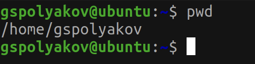
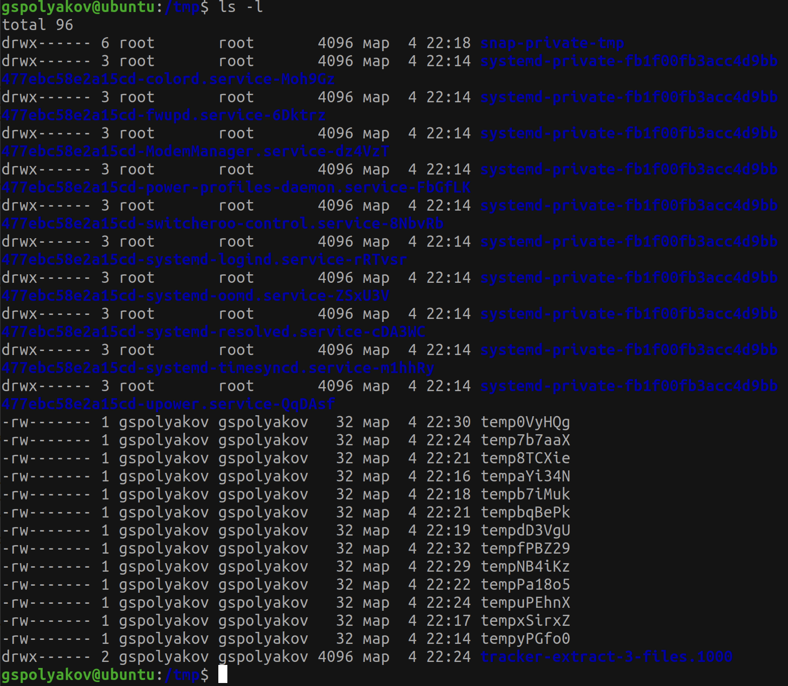

---
## Front matter
title: "Лабораторная работа №4"
subtitle: "Markdown"
author: "Поляков Глеб Сергеевич"

## Generic otions
lang: ru-RU
toc-title: "Содержание"

## Bibliography
bibliography: bib/cite.bib
csl: pandoc/csl/gost-r-7-0-5-2008-numeric.csl

## Pdf output format
toc: true # Table of contents
toc-depth: 2
lof: true # List of figures
lot: true # List of tables
fontsize: 12pt
linestretch: 1.5
papersize: a4
documentclass: scrreprt
## I18n polyglossia
polyglossia-lang:
  name: russian
  options:
	- spelling=modern
	- babelshorthands=true
polyglossia-otherlangs:
  name: english
## I18n babel
babel-lang: russian
babel-otherlangs: english
## Fonts
mainfont: PT Serif
romanfont: PT Serif
sansfont: PT Sans
monofont: PT Mono
mainfontoptions: Ligatures=TeX
romanfontoptions: Ligatures=TeX
sansfontoptions: Ligatures=TeX,Scale=MatchLowercase
monofontoptions: Scale=MatchLowercase,Scale=0.9
## Biblatex
biblatex: true
biblio-style: "gost-numeric"
biblatexoptions:
  - parentracker=true
  - backend=biber
  - hyperref=auto
  - language=auto
  - autolang=other*
  - citestyle=gost-numeric
## Pandoc-crossref LaTeX customization
figureTitle: "Рис."
tableTitle: "Таблица"
listingTitle: "Листинг"
lofTitle: "Список иллюстраций"
lotTitle: "Список таблиц"
lolTitle: "Листинги"
## Misc options
indent: true
header-includes:
  - \usepackage{indentfirst}
  - \usepackage{float} # keep figures where there are in the text
  - \floatplacement{figure}{H} # keep figures where there are in the text
---

# Цель работы

Приобретение практических навыков взаимодействия пользователя с системой по- средством командной строки.

# Задание

1. Определите полное имя вашего домашнего каталога. Далее относительно этого каталога будут выполняться последующие упражнения.
2. Выполните следующие действия:
	2. Перейдите в каталог /tmp.
	2. Выведите на экран содержимое каталога /tmp. Для этого используйте команду ls с различными опциями. Поясните разницу в выводимой на экран информации.
	2. Определите, есть ли в каталоге /var/spool подкаталог с именем cron?
	2. Перейдите в Ваш домашний каталог и выведите на экран его содержимое. Определите, кто является владельцем файлов и подкаталогов?
3. Выполните следующие действия:
	3. В домашнем каталоге создайте новый каталог с именем newdir.
	3. В каталоге ~/newdir создайте новый каталог с именем morefun.
	3. В домашнем каталоге создайте одной командой три новых каталога с именами letters, memos, misk. Затем удалите эти каталоги одной командой.
	3. Попробуйте удалить ранее созданный каталог ~/newdir командой rm. Проверьте, был ли каталог удалён.
	3. Удалите каталог ~/newdir/morefun из домашнего каталога. Проверьте, был ли каталог удалён.
4. С помощью команды man определите, какую опцию команды ls нужно использовать для просмотра содержимое не только указанного каталога, но и подкаталогов, входящих в него.
5. С помощью команды man определите набор опций команды ls, позволяющий отсортировать по времени последнего изменения выводимый список содержимого каталога с развёрнутым описанием файлов.
6. Используйте команду man для просмотра описания следующих команд: cd, pwd, mkdir, rmdir, rm. Поясните основные опции этих команд.
7. Используя информацию, полученную припомощи команды history, выполните модификацию и исполнение нескольких команд из буфера команд.

# Выполнение лабораторной работы

1. Определите полное имя вашего домашнего каталога. Далее относительно этого каталога будут выполняться последующие упражнения.(рис. @fig:001)

	{#fig:001 width=70%}

2. Переход в каталог /tmp. (рис. @fig:002)

	{#fig:002 width=70%}

2. Вывел на экран содержимое каталога /tmp. (рис. @fig:003) (рис. @fig:004) (рис. @fig:005)

	{#fig:003 width=70%}
	{#fig:004 width=70%}
	{#fig:005 width=70%}

2. Поиск в /var/spool подкаталога cron (рис. @fig:006)

	{#fig:006 width=70%}

2. Перешел в домашний каталог и вывел на экран его содержимое. (рис. @fig:007)

	{#fig:007 width=70%}

3. В домашнем каталоге создал новый каталог с именем newdir.(рис. @fig:008)

	{#fig:008 width=70%}

3. В каталоге ~/newdir создайте новый каталог с именем morefun. (рис. @fig:009)

	{#fig:009 width=70%}

3. В домашнем каталоге создайте одной командой три новых каталога с именами letters, memos, misk. Затем удалите эти каталоги одной командой. {#fig:010 width=70%} {#fig:011 width=70%}{#fig:012 width=70%}

	{#fig:010 width=70%}
	{#fig:011 width=70%}
	{#fig:012 width=70%}

3. Попробуйте удалить ранее созданный каталог ~/newdir командой rm. Проверьте, был ли каталог удалён.

3. Удалите каталог ~/newdir/morefun из домашнего каталога. Проверьте, был ли каталог удалён.

4. С помощью команды man определите, какую опцию команды ls нужно использовать для просмотра содержимое не только указанного каталога, но и подкаталогов, входящих в него.

5. С помощью команды man определите набор опций команды ls, позволяющий отсортировать по времени последнего изменения выводимый список содержимого каталога с развёрнутым описанием файлов.

6. Используйте команду man для просмотра описания следующих команд: cd, pwd, mkdir, rmdir, rm. Поясните основные опции этих команд.

7. Используя информацию, полученную припомощи команды history, выполните модификацию и исполнение нескольких команд из буфера команд.

2. Добавление задания(рис. @fig:002).

3. Добавление теоретического введения(рис. @fig:003).

	{#fig:003 width=70%}

4. Добавление выполнения лабораторной работы(рис. @fig:004).

	{#fig:004 width=70%}

5. Добавление контрольных вопросов(рис. @fig:005).

	{#fig:005 width=70%}

# Выводы

Научился оформлять отчёты с помощью легковесного языка разметки Markdown.

# Список литературы{.unnumbered}

::: {#refs}
:::
