---
## Front matter
title: "Лабораторная работа №6"
subtitle: "Поиск файлов. Перенаправление ввода-вывода. Просмотр запущенных процессов"
author: "Поляков Глеб Сергеевич"

## Generic otions
lang: ru-RU
toc-title: "Содержание"

## Bibliography
bibliography: bib/cite.bib
csl: pandoc/csl/gost-r-7-0-5-2008-numeric.csl

## Pdf output format
toc: true # Table of contents
toc-depth: 2
lof: true # List of figures
lot: true # List of tables
fontsize: 12pt
linestretch: 1.5
papersize: a4
documentclass: scrreprt
## I18n polyglossia
polyglossia-lang:
  name: russian
  options:
	- spelling=modern
	- babelshorthands=true
polyglossia-otherlangs:
  name: english
## I18n babel
babel-lang: russian
babel-otherlangs: english
## Fonts
mainfont: PT Serif
romanfont: PT Serif
sansfont: PT Sans
monofont: PT Mono
mainfontoptions: Ligatures=TeX
romanfontoptions: Ligatures=TeX
sansfontoptions: Ligatures=TeX,Scale=MatchLowercase
monofontoptions: Scale=MatchLowercase,Scale=0.9
## Biblatex
biblatex: true
biblio-style: "gost-numeric"
biblatexoptions:
  - parentracker=true
  - backend=biber
  - hyperref=auto
  - language=auto
  - autolang=other*
  - citestyle=gost-numeric
## Pandoc-crossref LaTeX customization
figureTitle: "Рис."
tableTitle: "Таблица"
listingTitle: "Листинг"
lofTitle: "Список иллюстраций"
lotTitle: "Список таблиц"
lolTitle: "Листинги"
## Misc options
indent: true
header-includes:
  - \usepackage{indentfirst}
  - \usepackage{float} # keep figures where there are in the text
  - \floatplacement{figure}{H} # keep figures where there are in the text
---

# Цель работы

Ознакомление с инструментами поиска файлов и фильтрации текстовых данных. Приобретение практических навыков: по управлению процессами (и заданиями), по проверке использования диска и обслуживанию файловых систем.

# Задание

1. Осуществите вход в систему, используя соответствующее имя пользователя.

2. Запишите в файл file.txt названия файлов, содержащихся в каталоге /etc. Допишите в этот же файл названия файлов, содержащихся в вашем домашнем каталоге.

3. Выведите имена всех файлов из file.txt, имеющих расширение .conf, после чего запишите их в новый текстовой файл conf.txt.

4. Определите, какие файлы в вашем домашнем каталоге имеют имена, начинавшиеся с символа c? Предложите несколько вариантов, как это сделать.

5. Выведите на экран (постранично) имена файлов из каталога /etc, начинающиеся с символа h.

6. Запустите в фоновом режиме процесс, который будет записывать в файл ~/logfile файлы, имена которых начинаются с log.

7. Удалите файл ~/logfile.

8. Запустите из консоли в фоновом режиме редактор gedit.

9. Определите идентификатор процесса gedit, используя команду ps, конвейер и фильтр grep. Как ещё можно определить идентификатор процесса?

10. Прочтите справку (man) команды kill, после чего используйте её для завершения процесса gedit.

11. Выполните команды df и du, предварительно получив более подробную информацию об этих командах, с помощью команды man.

12. Воспользовавшись справкой команды find, выведите имена всех директорий, имеющихся в вашем домашнем каталоге.

# Теоретическое введение

### Перенаправление ввода-вывода
В системе по умолчанию открыто три специальных потока:

- stdin — стандартный поток ввода (по умолчанию: клавиатура), файловый дескриптор 0;
- stdout — стандартный поток вывода (по умолчанию: консоль), файловый дескриптор 1;
- stderr—стандартныйпотоквыводсообщенийобошибках(поумолчанию:консоль), файловый дескриптор 2.

Большинство используемых в консоли команд и программ записывают результаты своей работы в стандартный поток вывода stdout. Например, команда ls выводит в стандартный поток вывода (консоль) список файлов в текущей директории. Потоки вывода и ввода можно перенаправлять на другие файлы или устройства. Проще всего это делается с помощью символов >, >>, <, <<. Рассмотрим пример.
 
	# Перенаправление stdout (вывода) в файл.
	# Если файл отсутствовал, то он создаётся,
	# иначе -- перезаписывается.
	# Создаёт файл, содержащий список дерева каталогов.
	ls -lR > dir-tree.list
	1>filename
	# Перенаправление вывода (stdout) в файл "filename".
	1>>filename
	# Перенаправление вывода (stdout) в файл "filename",
	# файл открывается в режиме добавления.
	2>filename
	# Перенаправление stderr в файл "filename".
	2>>filename
	# Перенаправление stderr в файл "filename",
	# файл открывается в режиме добавления.
	&>filename
	# Перенаправление stdout и stderr в файл "filename".

### Конвейер
Конвейер (pipe) служит для объединения простых команд или утилит в цепочки, в которых результат работы предыдущей команды передаётся последующей. Синтаксис следующий:

	команда 1 | команда 2
	# означает, что вывод команды 1 передастся на ввод команде 2

Конвейеры можно группировать в цепочки и выводить с помощью перенаправления в файл, например:
	
	ls -la |sort > sortilg_list

вывод команды ls -la передаётся команде сортировки sort\verb, которая пишет результат в файл sorting_list\verb.
Чаще всего скрипты на Bash используются в качестве автоматизации каких-то рутинных операций в консоли, отсюда иногда возникает необходимость в обработке stdout одной команды и передача на stdin другой команде, при этом результат выполнения команды должен обработан.

###Поиск файла

Команда find используется для поиска и отображения на экран имён файлов, соответствующих заданной строке символов.
Формат команды:
	
	find  путь  [-опции]

Путь определяет каталог, начиная с которого по всем подкаталогам будет вестись поиск.
**Примеры:**
	
1. Вывести на экран имена файлов из вашего домашнего каталога и его подкаталогов, начинающихся на f:

		find ~ -name "f*" -print

	Здесь ~ — обозначение вашего домашнего каталога, -name — после этой опции указывается имя файла, который нужно найти, "f\*" — строка символов, определяющая имя файла, -print — опция, задающая вывод результатов поиска на экран. 

2. Вывести на экран имена файлов в каталоге /etc, начинающихся с символа p:
		
		find /etc -name "p\*" -print
  
3. Найти в Вашем домашнем каталоге файлы, имена которых заканчиваются символом ~ и удалить их:
	
		find ~ -name "*~" -exec rm "{}" \;

	Здесь опция -exec rm "{}" \; задаёт применение команды rm ко всем файлам, имена которых соответствуют указанной после опции -name строке символов. 

Для просмотра опций команды find воспользуйтесь командой man. 

### Фильтрация текста

Найти в текстовом файле указанную строку символов позволяет команда grep. Формат команды:

	grep строка имя_файла

Кроме того, команда grep способна обрабатывать стандартный вывод других команд (любой текст). Для этого следует использовать конвейер, связав вывод команды с вводом grep.

Примеры:

1. Показать строки во всех файлах в вашем домашнем каталоге с именами, начинающимися на f, в которых есть слово begin:
	
		grep begin f*

2. Найти в текущем каталоге все файлы, содержащих в имени «лаб»:

		ls -l | grep лаб

### Проверка использования диска
Команда df показывает размер каждого смонтированного раздела диска. Формат команды:
	
	df [-опции] [файловая_система] Пример:
	df -vi

Команда du показывает число килобайт, используемое каждым файлом или каталогом. Формат команды:

	du [-опции] [имя_файла...] Пример.
	du -a ~/

На afs можно посмотреть использованное пространство командой
	
	fs quota

### Управление задачами
Любую выполняющуюся в консоли команду или внешнюю программу можно запустить в фоновом режиме. Для этого следует в конце имени команды указать знак амперсанда &. Например:

	gedit &

Будет запущен текстовой редактор gedit в фоновом режиме. Консоль при этом не будет заблокирована.

Запущенные фоном программы называются задачами (jobs). Ими можно управлять с помощью команды jobs, которая выводит список запущенных в данный момент задач. Для завершения задачи необходимо выполнить команду
	
	kill %номер задачи

### Управление процессами

Любой команде, выполняемой в системе, присваивается идентификатор процесса (process ID). Получить информацию о процессе и управлять им, пользуясь идентификатором процесса, можно из любого окна командного интерпретатора.

###Получение информации о процессах
Команда ps используется для получения информации о процессах. Формат команды:

	ps [-опции]

Для получения информации о процессах, управляемых вами и запущенных (работающих или остановленных) на вашем терминале, используйте опцию aux.
Пример:

	ps aux

Для запуска команды в фоновом режиме необходимо в конце командной строки указать знак & (амперсанд).
Пример работы, требующей много машинного времени для выполнения, и которую целесообразно запустить в фоновом режиме:

	find /var/log -name "*.log" -print > l.log &

# Выполнение лабораторной работы

1. Осуществил вход в систему, используя соответствующее имя пользователя (рис. @fig:001).
	
	{#fig:001 width=70%}

2. Записал в файл file.txt названия файлов, содержащихся в каталоге /etc. Допишисал в этот же файл названия файлов, содержащихся в моём домашнем каталоге.(рис. @fig:002).
	
	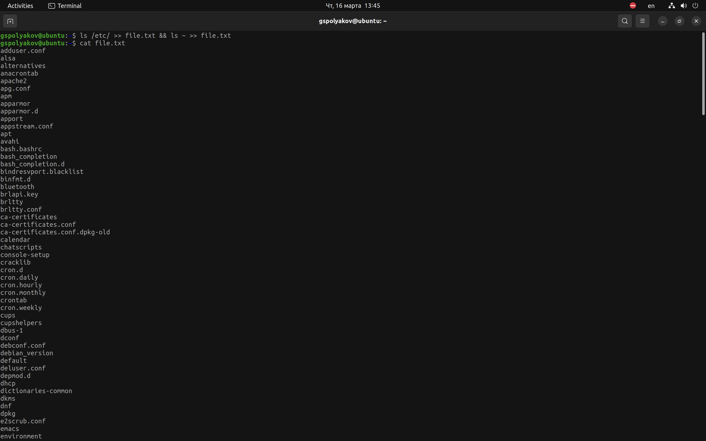{#fig:002 width=70%}

3. Вывел имена всех файлов из file.txt, имеющих расширение .conf, после чего записал их в новый текстовой файл conf.txt. (рис. @fig:003).
	
	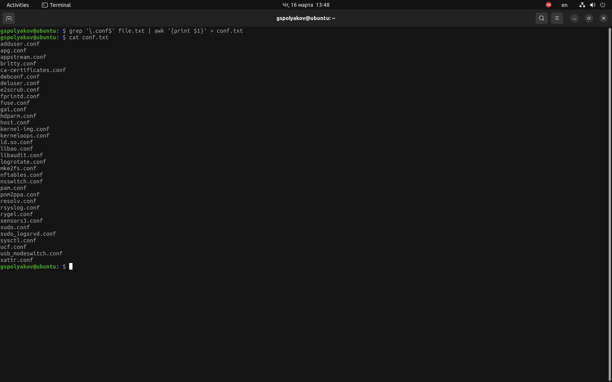{#fig:003 width=70%}

4. Определил, какие файлы в вашем домашнем каталоге имеют имена, начинавшиеся с символа c? Предложил несколько вариантов, как это сделать.(рис. @fig:005) и (рис. @fig:006).
5. 
	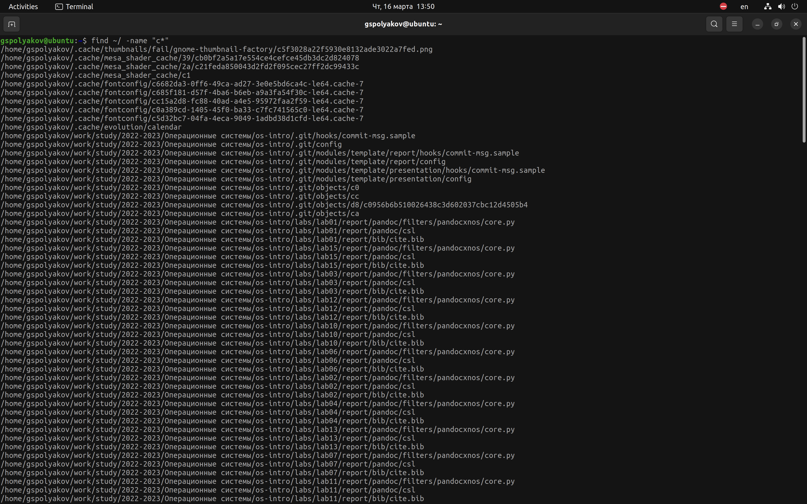{#fig:005 width=70%}
	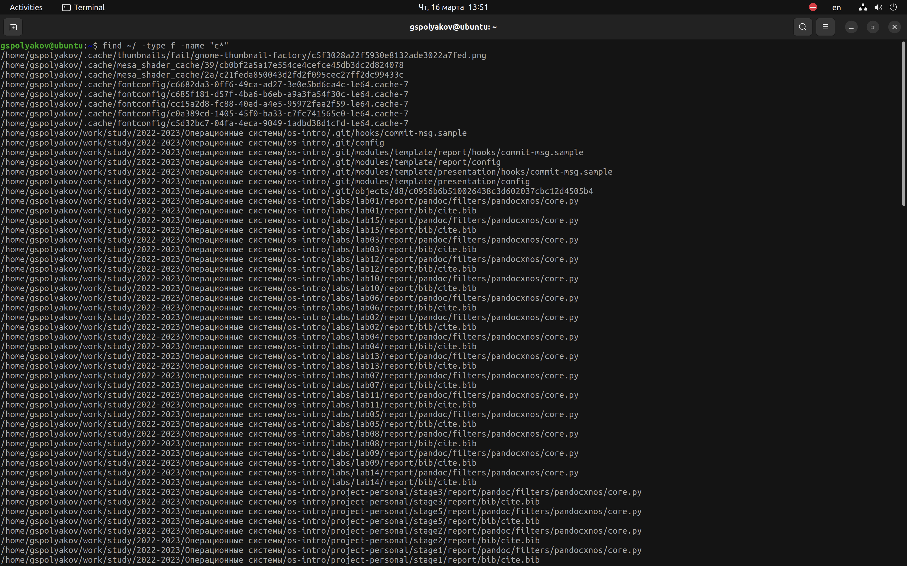{#fig:006 width=70%}

5. Вывел на экран (постранично) имена файлов из каталога /etc, начинающиеся с символа h.(рис. @fig:007).
	
	{#fig:007 width=70%}

6. Запустил в фоновом режиме процесс, который будет записывать в файл ~/logfile файлы, имена которых начинаются с log.(рис. @fig:008).
	
	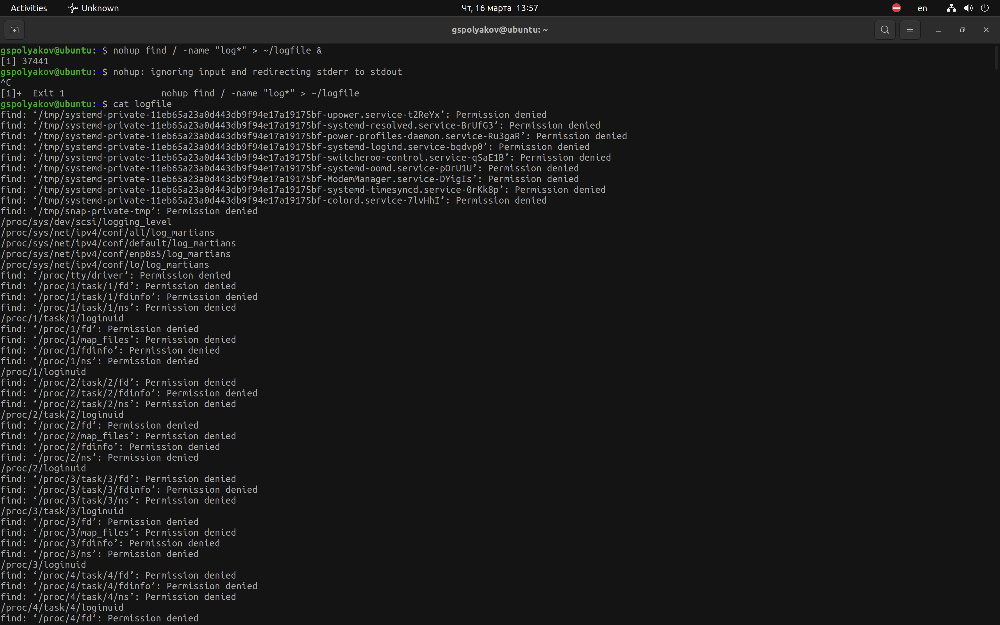{#fig:008 width=70%}

7. Удалил файл ~/logfile.(рис. @fig:009).
	
	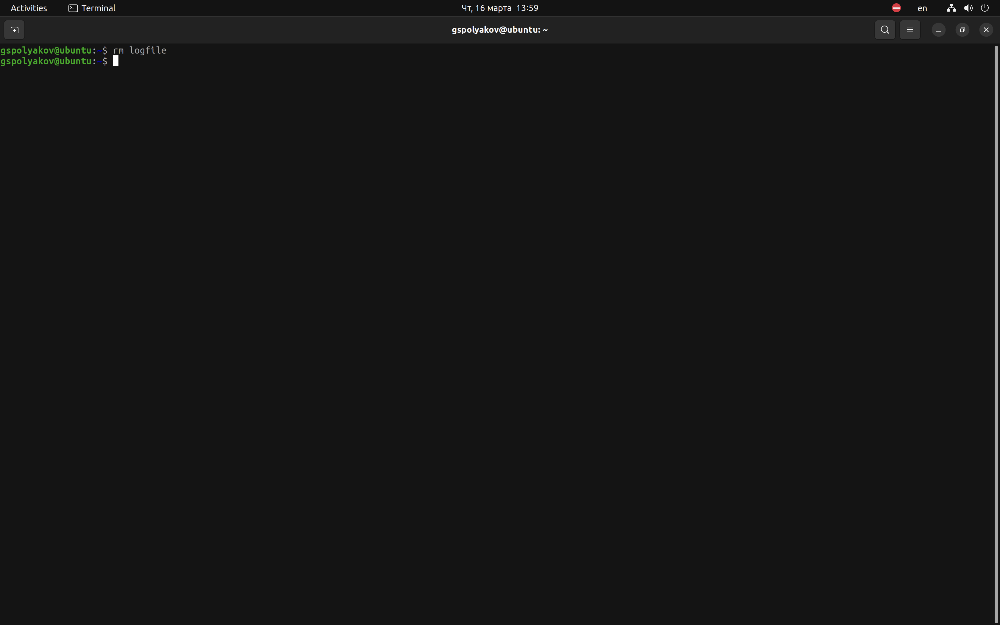{#fig:009 width=70%}

8. Запустил из консоли в фоновом режиме редактор gedit.(рис. @fig:010).
	
	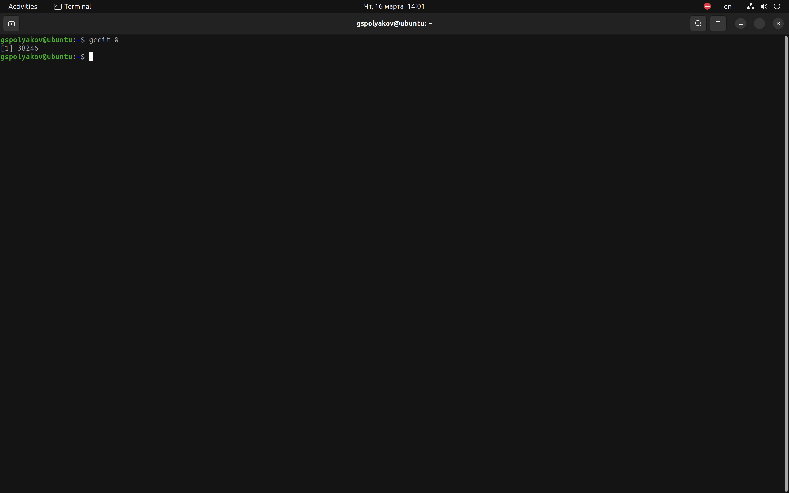{#fig:010 width=70%}

9. Определил идентификатор процесса gedit, используя команду ps, конвейер и фильтр grep. Как ещё можно определить идентификатор процесса?(рис. @fig:011).
	
	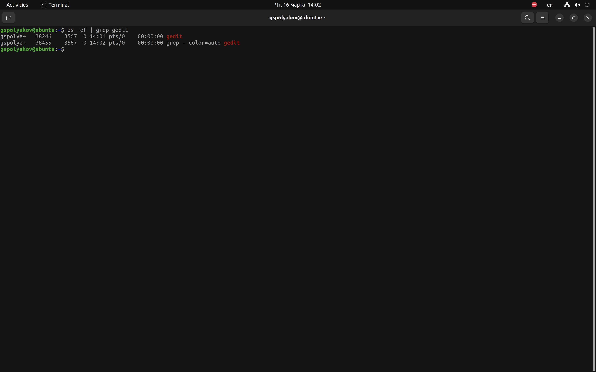{#fig:011 width=70%}

10. Прочел справку (man) команды kill, после чего использовал её для завершения процесса gedit.(рис. @fig:012) (рис. @fig:013).
	
	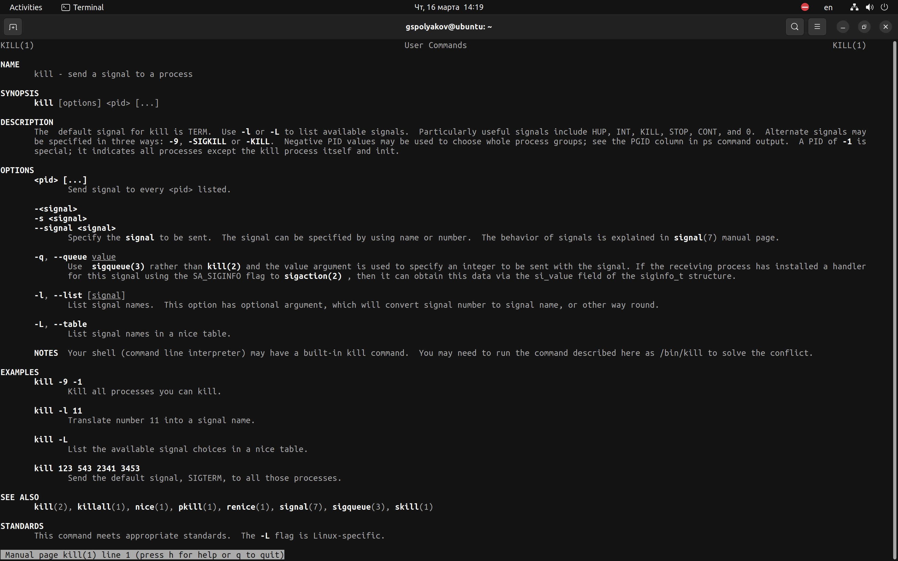{#fig:012 width=70%}
	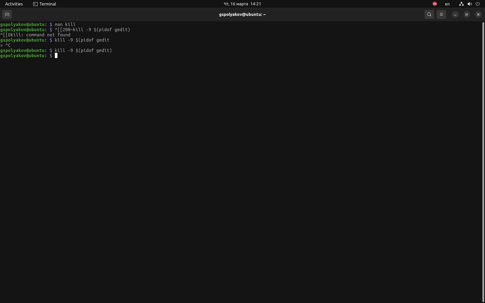{#fig:013 width=70%}

11. Выполнил команды df и du, предварительно получив более подробную информацию об этих командах, с помощью команды man.(рис. @fig:014).
	
	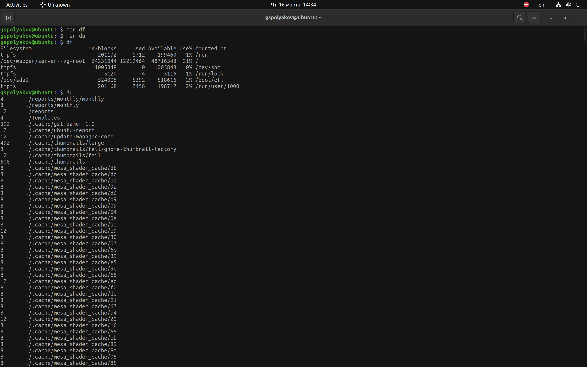{#fig:014 width=70%}

12. Воспользовавшись справкой команды find, вывел имена всех директорий, имеющихся в вашем домашнем каталоге.(рис. @fig:015).
	
	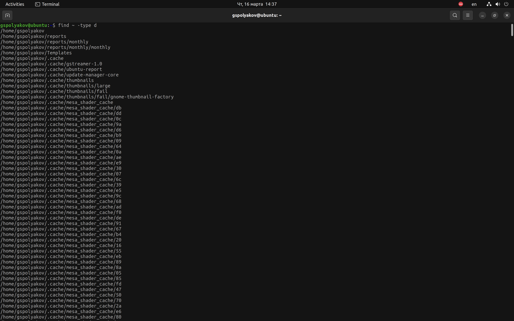{#fig:015 width=70%}

# Выводы

Ознакомился с инструментами поиска файлов и фильтрации текстовых данных. Приобрел практические навыки: по управлению процессами (и заданиями), по проверке использования диска и обслуживанию файловых систем.

# Список литературы{.unnumbered}

::: {#refs}
:::
