---
## Front matter
lang: ru-RU
title: Структура научной презентации
subtitle: Простейший шаблон
author: Поляков Г. С.
institute: Российский университет дружбы народов, Москва, Россия
date: 2023-02-18

## i18n babel
babel-lang: russian
babel-otherlangs: english

## Formatting pdf
toc: false
toc-title: Содержание
slide_level: 2
aspectratio: 169
section-titles: true
theme: metropolis
header-includes:
 - \metroset{progressbar=frametitle,sectionpage=progressbar,numbering=fraction}
 - '\makeatletter'
 - '\beamer@ignorenonframefalse'
 - '\makeatother'
---

# Информация

## Докладчик

:::::::::::::: {.columns align=center}
::: {.column width="70%"}

  Поляков Глеб Сергеевич
  
  НПИбд-02-22
  
  РУДН, Москва, Россия

:::
::: {.column width="30%"}

:::
::::::::::::::

##Изучил информацию о mc, вызвав в командной строке man mc (рис. @fig:001).
	{#fig:001 width=70%}
##Запустите из командной строки mc, изучите его структуру и меню (рис. @fig:002).
	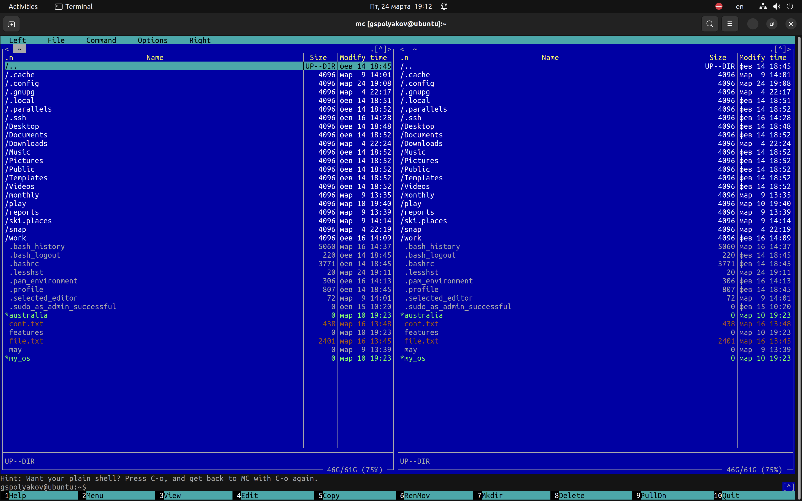{#fig:002 width=70%}
##Выполнил несколько операций в mc, используя управляющие клавиши (операции с панелями; выделение/отмена выделения файлов, копирование/перемещение файлов, получение информации о размере и правах доступа на файлы и/или каталоги и т.п.)(рис. @fig:003).
	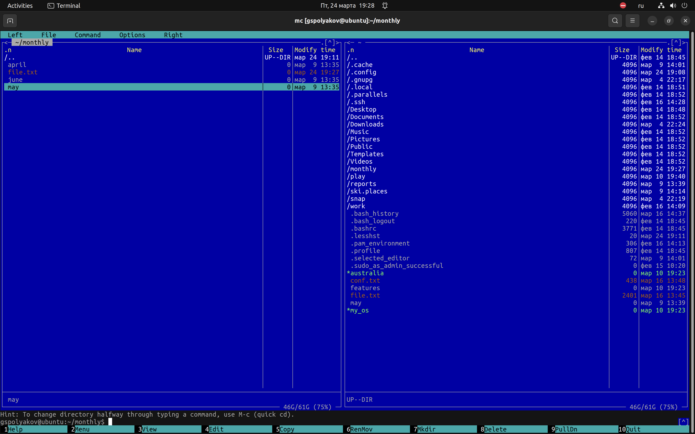{#fig:003 width=70%}
	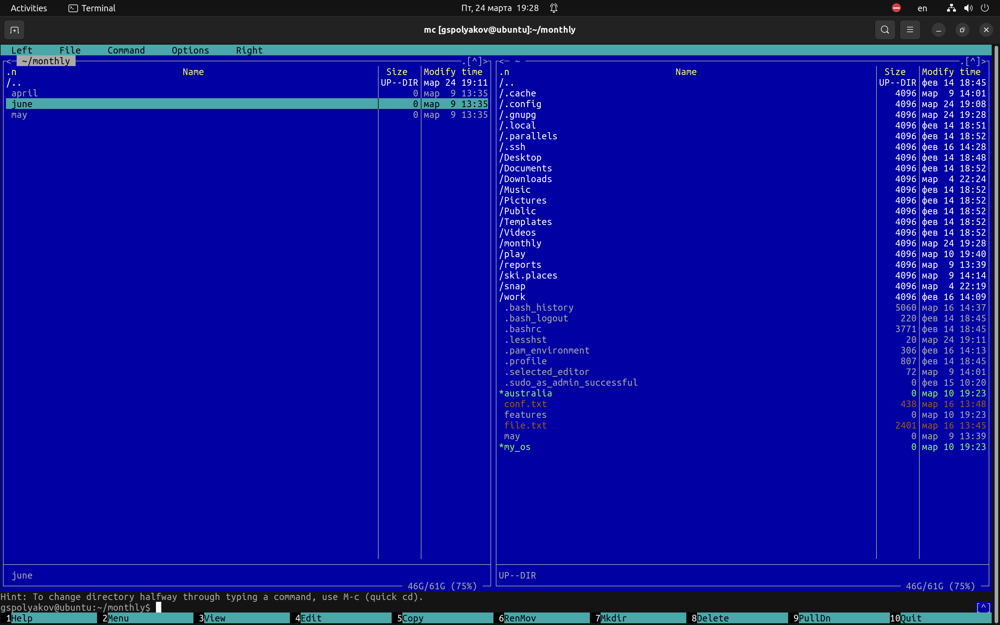{#fig:004 width=70%}
	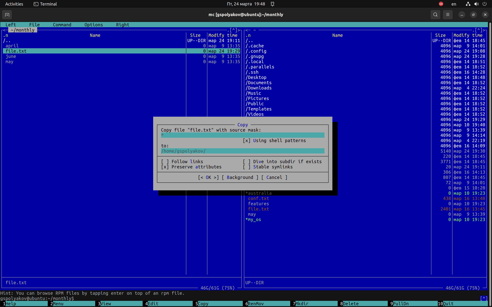{#fig:005 width=70%}
##Выполнил основные команды меню левой (или правой) панели. Оценил степень подробности вывода информации о файлах (рис. @fig:006).
	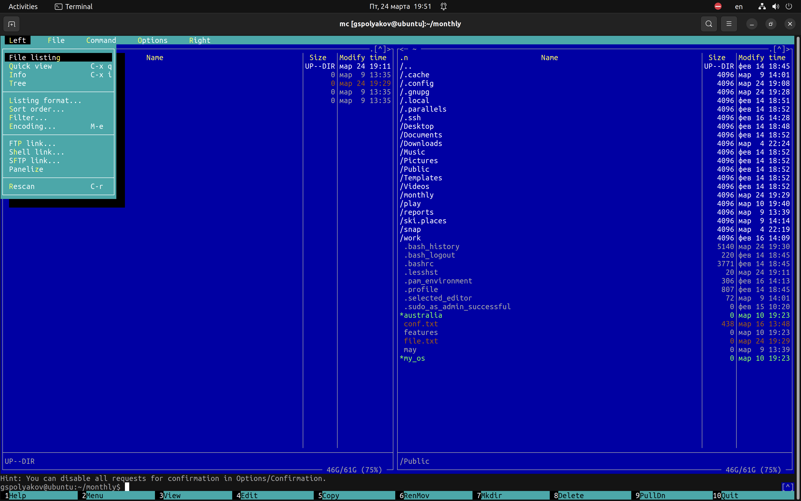{#fig:006 width=70%}

##Используя возможности подменю Файл, выполнил:
	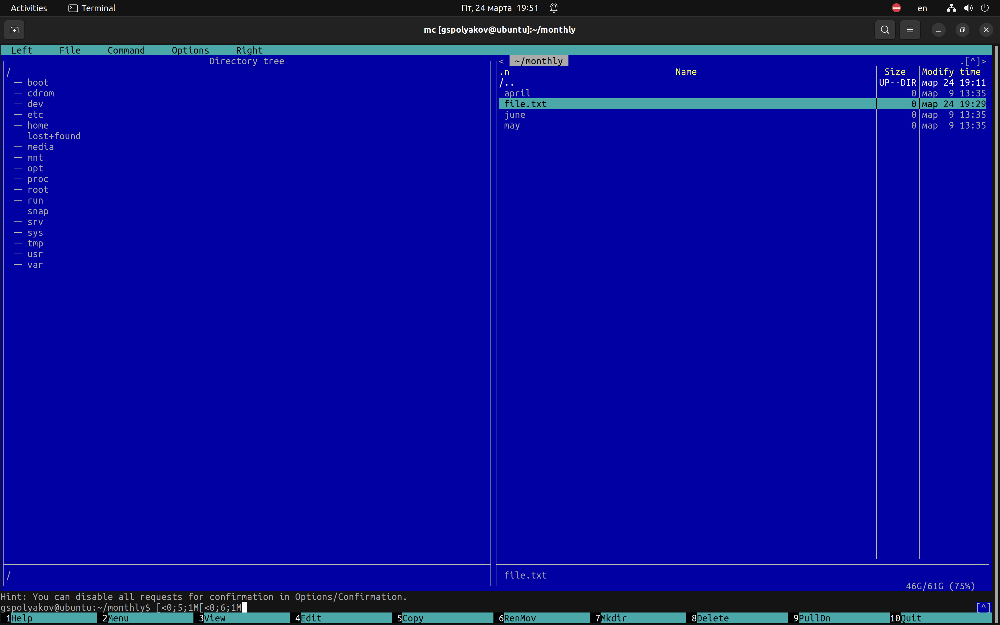{#fig:007 width=70%}
	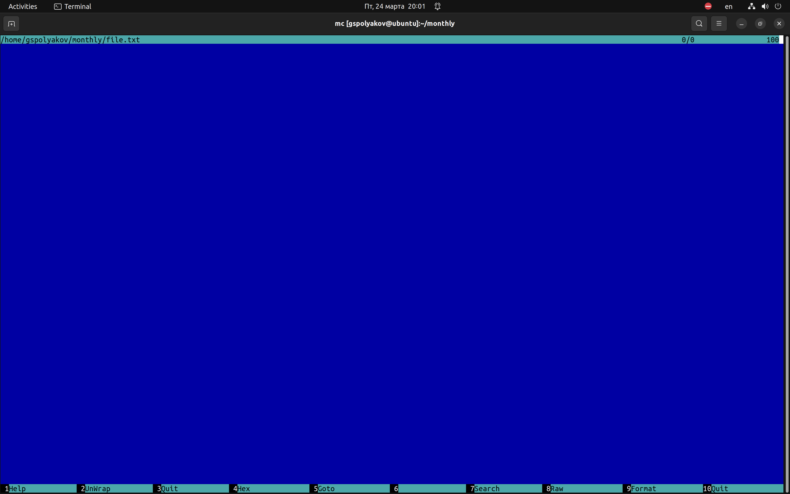{#fig:008 width=70%}
	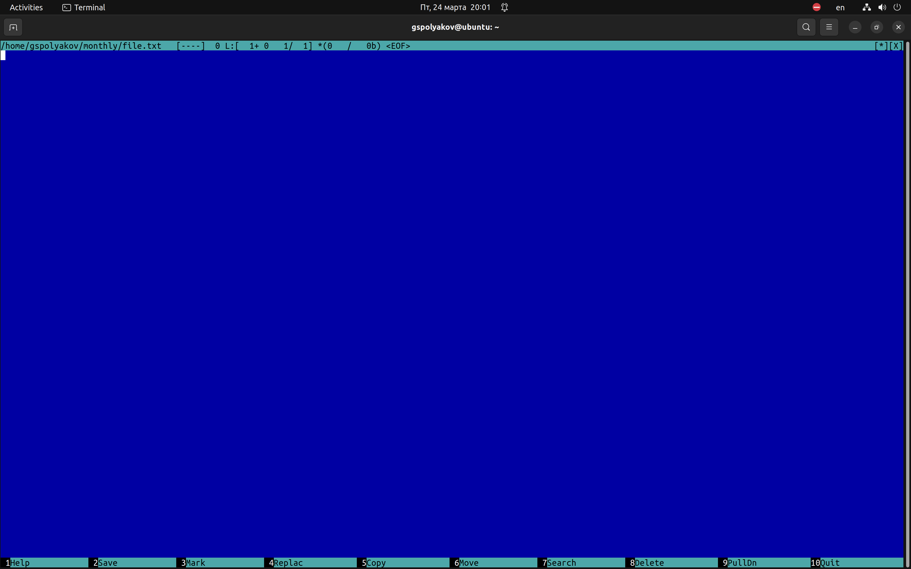{#fig:009 width=70%}
	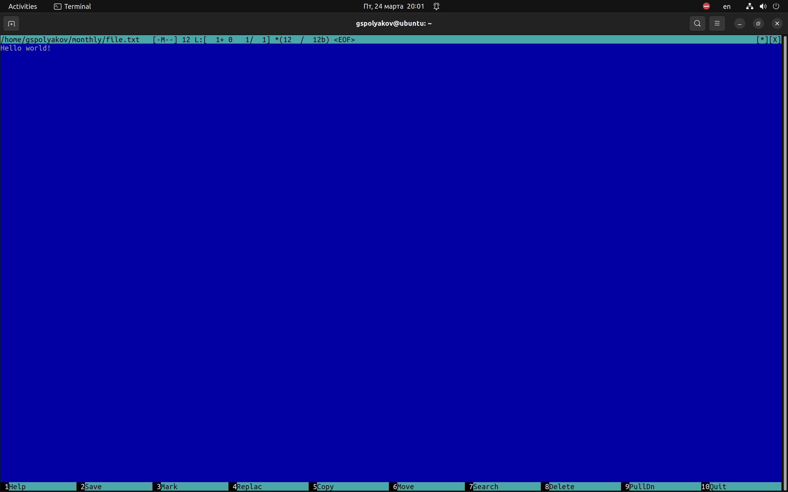{#fig:010 width=70%}	
##С помощью соответствующих средств подменю Команда осуществите:
	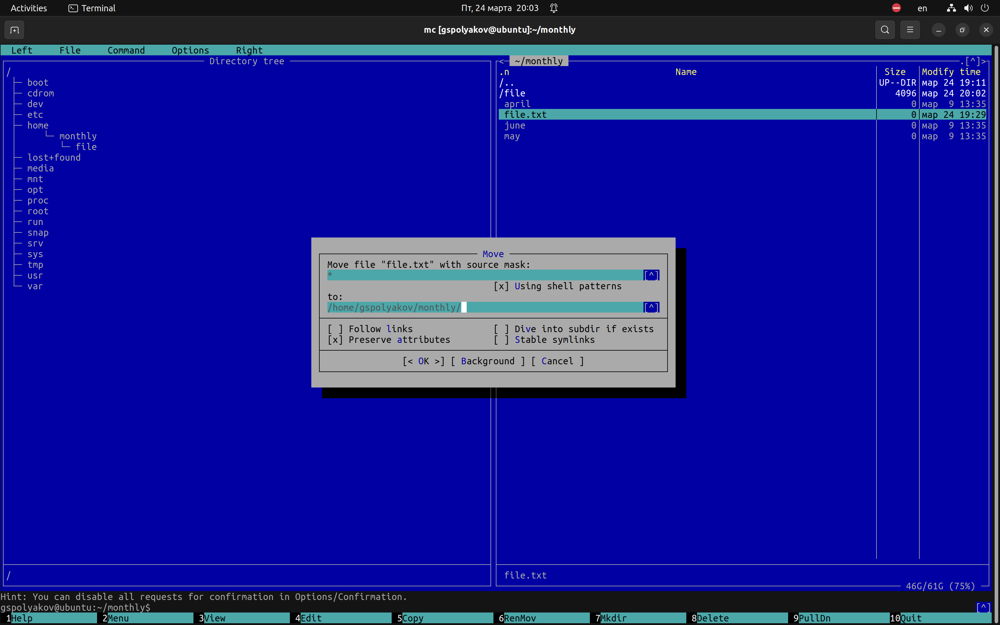{#fig:011 width=70%}

##Создайте текстовой файл text.txt. Откройте этот файл с помощью встроенного в mc редактора. Вставьте в открытый файл небольшой фрагмент текста, скопированный из любого другого файла или Интернета.
	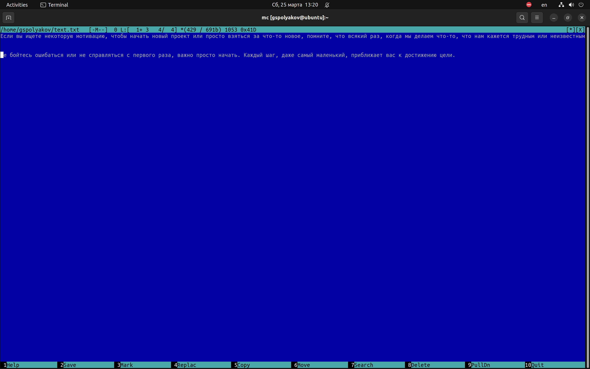{#fig:014 width=70%}
##Проделайте с текстом следующие манипуляции, используя горячие клавиши:
	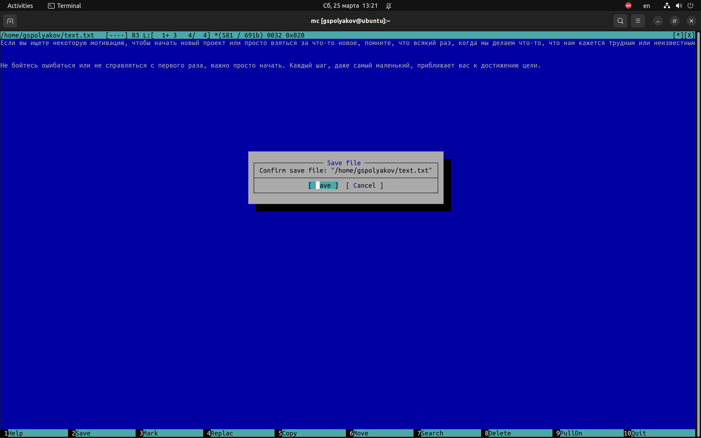{#fig:014 width=70%}
	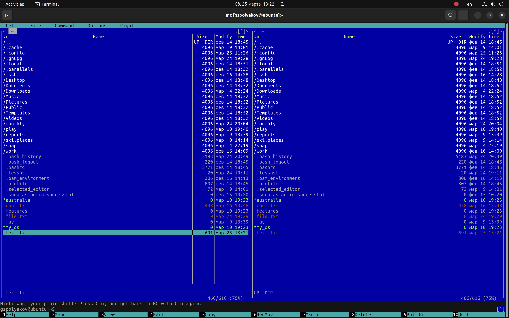{#fig:014 width=70%}
	{#fig:014 width=70%}
	{#fig:014 width=70%}
	{#fig:014 width=70%}
###Откройте файл сисходным текстом на некотором языке программирования (например C или Java)
	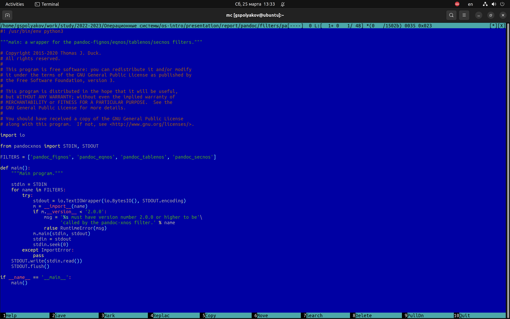{#fig:014 width=70%}
### Используя меню редактора, включите подсветку синтаксиса, если она не включена, или выключите, если она включена.
	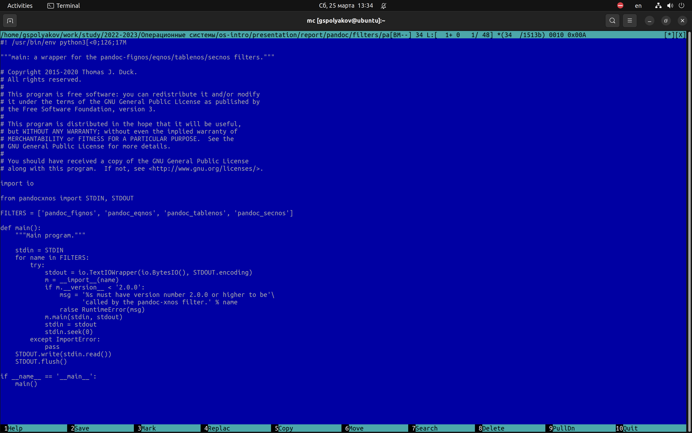{#fig:014 width=70%}
## Вывод

Освоил основные возможности командной оболочки Midnight Commander. Приобрел навыки практической работы по просмотру каталогов и файлов; манипуляций с ними.