---
## Front matter
title: "Лабораторная работа №8"
subtitle: "Простейший вариант"
author: "Поляков"

## Generic otions
lang: ru-RU
toc-title: "Содержание"

## Bibliography
bibliography: bib/cite.bib
csl: pandoc/csl/gost-r-7-0-5-2008-numeric.csl

## Pdf output format
toc: true # Table of contents
toc-depth: 2
lof: true # List of figures
lot: true # List of tables
fontsize: 12pt
linestretch: 1.5
papersize: a4
documentclass: scrreprt
## I18n polyglossia
polyglossia-lang:
  name: russian
  options:
	- spelling=modern
	- babelshorthands=true
polyglossia-otherlangs:
  name: english
## I18n babel
babel-lang: russian
babel-otherlangs: english
## Fonts
mainfont: PT Serif
romanfont: PT Serif
sansfont: PT Sans
monofont: PT Mono
mainfontoptions: Ligatures=TeX
romanfontoptions: Ligatures=TeX
sansfontoptions: Ligatures=TeX,Scale=MatchLowercase
monofontoptions: Scale=MatchLowercase,Scale=0.9
## Biblatex
biblatex: true
biblio-style: "gost-numeric"
biblatexoptions:
  - parentracker=true
  - backend=biber
  - hyperref=auto
  - language=auto
  - autolang=other*
  - citestyle=gost-numeric
## Pandoc-crossref LaTeX customization
figureTitle: "Рис."
tableTitle: "Таблица"
listingTitle: "Листинг"
lofTitle: "Список иллюстраций"
lotTitle: "Список таблиц"
lolTitle: "Листинги"
## Misc options
indent: true
header-includes:
  - \usepackage{indentfirst}
  - \usepackage{float} # keep figures where there are in the text
  - \floatplacement{figure}{H} # keep figures where there are in the text
---

# Цель работы

Освоение основных возможностей командной оболочки Midnight Commander. Приобретение навыков практической работы по просмотру каталогов и файлов; манипуляций с ними.

# Задание

### Задание по mc
1. Изучите информацию о mc, вызвав в командной строке man mc.
2. Запустите из командной строки mc, изучите его структуру именю.
3. Выполните несколько операций в mc, используя управляющие клавиши (операции с панелями; выделение/отмена выделения файлов, копирование/перемещение фай- лов, получение информации о размере и правах доступа на файлы и/или каталоги и т.п.)
4. Выполните основные команды меню левой (или правой) панели. Оцените степень подробности вывода информации о файлах.
5. Используя возможности подменю Файл, выполните:
	- просмотр содержимого текстового файла;
	- редактирование содержимого текстового файла (без сохранения результатов редактирования);
	- создание каталога;
	- копирование файлов в созданный каталог.
6. С помощью соответствующих средств подменю Команда осуществите:
	- поиск в файловой системе файла с заданными условиями (например, файла с расширением .c или .cpp, содержащего строку main);
	- выбор и повторение одной из предыдущих команд;
	- переход в домашний каталог;
	- анализ файла меню и файла расширений.
7. Вызовите подменю Настройки. Освойте операции, определяющие структуру экрана mc (Full screen, Double Width, Show Hidden Files и т.д.)ю

### Задание по встроенному редактору mc
1. Создайте текстовый файл text.txt.
2. Откройте этот файл с помощью встроенного в mc редактора.
3. Вставьте в открытый файл небольшой фрагмент текста, скопированный из любого другого файла или Интернета.
4. Проделайте с текстом следующие манипуляции, используя горячие клавиши:
	4. 1. Удалите строку текста.
	4. 2. Выделите фрагмент текста и скопируйте его на новую строку.
	4. 3. Выделите фрагмент текста и перенесите его на новую строку.
	4. 4. Сохраните файл.
	4. 5. Отмените последнее действие.
	4. 6. Перейдите в конец файла (нажав комбинацию клавиш) и напишите некоторый текст.
	4. 7. Перейдите в начало файла (нажав комбинацию клавиш) и напишите некоторый текст.
	4. 8. Сохраните и закройте файл.
5. Откройте файл с исходным текстом на некотором языке программирования (например C или Java)
6. Используя меню редактора, включите подсветку синтаксиса, если она не включена, или выключите, если она включена.

# Теоретическое введение

### Общие сведения
Командная оболочка — интерфейс взаимодействия пользователя с операционной системой и программным обеспечением посредством команд.

Midnight Commander (или mc) — псевдографическая командная оболочка для UNIX/Linux систем. Для запуска mc необходимо в командной строке набрать mc и нажать Enter.
Рабочее пространство mc имеет две панели, отображающие по умолчанию списки файлов двух каталогов.

Над панелями располагается меню, доступ к которому осуществляется с помощью
клавиши F9 . Под панелями внизу расположены управляющие экранные кнопки, ассоциированные с функциональными клавишами F1 – F10 (табл. 7.1). Над ними располагается командная строка, предназначенная для ввода команд.

**Функциональные клавиши mc:**

| | |
|--------------|------------------------------|
| F1 | Вызов контекстно-зависимой подсказки|
| F2 | Вызов пользовательского меню с возможностью создания и/или дополнения дополнительных функций |
| F3 | Просмотр содержимого файла, на который указывает подсветка в активной панели (без возможности редактирования) |
| F4 | Вызов встроенного в mc редактора для изменения содержания файла,на который указывает подсветка в активной панели |
| F5 | Копирование одного или нескольких файлов, отмеченных в первой (активной) панели, в каталог, отображаемый на второй панели |
| F6 | Перенос одного или нескольких файлов, отмеченных в первой (активной) панели, в каталог, отображаемый на второй панели |
| F7 | Создание подкаталога в каталоге, отображаемом в активной панели |
| F8 | Удаление одного или нескольких файлов (каталогов), отмеченных в первой (активной) панели файлов |
| F9 | Вызов меню mc|
| F10 | Выход из mc|

### Режимы отображения панелей и управление ими

Панель в mc отображает список файлов текущего каталога. Абсолютный путь к этому каталогу отображается в заголовке панели. У активной панели заголовок и одна из её строк подсвечиваются. Управление панелями осуществляется с помощью определённых комбинаций клавиш или пунктов меню mc.

Панели можно поменять местами. Для этого и используется комбинация клавиш Ctrl-u или команда меню mc Переставить панели. Также можно временно убрать отображение панелей (отключить их) с помощью комбинации клавиш Ctrl-o или команды меню mc

Отключить панели . Это может быть полезно, например, если необходимо увидеть вывод какой-то информации на экран после выполнения какой-либо команды shell.

С помощью последовательного применения комбинации клавиш Ctrl-x d есть возможность сравнения каталогов, отображённых на двух панелях. Панели могут дополнительно быть переведены в один из двух режимов: Информация или Дерево.

В режиме Информация на панель выводятся сведения о файле и текущей файловой системе,
расположенных на активной панели. В режиме Дерево на одной из панелей выводится структура дерева каталогов.
Управлять режимами отображения панелей можно через пункты меню mc Правая панель и Левая панель.

### Меню панелей
Перейти в строку меню панелей mc можно с помощью функциональной клавиши F9. В строке меню имеются пять меню: Левая панель, Файл, Настройки и Правая панель.
Подпункт меню Быстрый просмотр позволяет выполнить быстрый просмотр содержимого панели.
Подпунктменю Информация позволяет посмотреть информацию о файле или каталоге.
В меню каждой (левой или правой) панели можно выбрать Формат списка:

- стандартный — выводит список файлов и каталогов с указанием размера и времени правки;
- ускоренный — позволяет задать число столбцов, накоторые разбивается панель при выводе списка имён файлов или каталогов без дополнительной информации;
- расширенный — помимо названия файла или каталога выводит сведения о правах доступа, владельце, группе, размере, времени правки;
- определённый пользователем — позволяет вывестите сведения о файле или каталоге, которые задаст сам пользователь.

Подпункт меню Порядок сортировки позволяет задать критерии сортировки при выводе списка файлов и каталогов: без сортировки, по имени, расширенный, время правки, время доступа, время изменения атрибута, размер, узел.

#### Меню Файл
В меню Файл содержит перечень команд, которые могут быть применены к одному или нескольким файлам или каталогам.
Команды меню Файл:

- Просмотр ( F3 ) — позволяет посмотреть содержимое текущего (или выделенного) файла без возможности редактирования.
- Просмотр вывода команды ( М + ! ) — функция запроса команды с параметрами (аргумент к текущему выбранному файлу).
- Правка ( F4 ) — открывает текущий (или выделенный) файл для его редактирования.
- Копирование ( F5 ) — осуществляет копирование одного или нескольких файлов или каталогов в указанное пользователем во всплывающем окне место.
- Права доступа ( Ctrl-x c ) — позволяет указать (изменить) права доступа к одному или нескольким файлам или каталогам
- Жёсткая ссылка ( Ctrl-x l ) — позволяет создать жёсткую ссылку к текущему (или выделенному) файлу1.
- Символическая ссылка ( Ctrl-x s ) — позволяет создать символическую ссылку к текущему (или выделенному) файлу2.
- Владелец/группа ( Ctrl-x o ) — позволяет задать (изменить) владельца и имя группы для одного или нескольких файлов или каталогов.
- Права(расширенные)—позволяетизменитьправадоступаивладениядляодного или нескольких файлов или каталогов.
- Переименование ( F6 ) — позволяет переименовать (или переместить) один или несколько файлов или каталогов.
- Создание каталога ( F7 ) — позволяет создать каталог.
- Удалить ( F8 ) — позволяет удалить один или несколько файлов или каталогов.
- Выход( F10 ) — завершает работу mc.

#### Меню Команда
В меню Команда содержатся более общие команды для работы с mc.
Команды меню Команда :

- Дерево каталогов — отображает структуру каталогов системы.
- Поиск файла — выполняет поиск файлов по заданным параметрам.
	1. Жёсткая ссылка проявляется как реальный файл. После её создания невозможно определить, где сам файл, а где ссылка на него. Если удалить один из этих файлов, то другой останется целым.
   2. Символическая ссылка — ссылка (указатель) на имя файла-оригинала.
- Переставить панели — меняет местами левую и правую панели.
- Сравнить каталоги ( Ctrl-x d ) — сравнивает содержимое двух каталогов.
- Размеры каталогов — отображает размер и время изменения каталога (поумолчанию в mc размер каталога корректно не отображается).
- История командной строки — выводит на экран список ранее выполненных в оболочке команд.
- Каталоги быстрого доступа (Ctrl-\) — при вызове выполняется быстрая смена текущего каталога на один из заданного списка.
- Восстановление файлов — позволяет восстановить файлы на файловых системах ext2 и ext3.
- Редактироватьфайлрасширений—позволяетзадатьспомощьюопределённогосинтаксиса действия при запуске файлов с определённым расширением (например, какое программного обеспечение запускать для открытия или редактирования файлов с расширением doc или docx).
- Редактировать файл меню — позволяет отредактировать контекстное меню пользователя, вызываемое по клавише F2.
- Редактировать файл расцветки имён — позволяет подобрать оптимальную для пользователя расцветку имён файлов в зависимости от их типа.

#### Меню Настройки

Меню Настройки содержит ряд дополнительных опций по внешнему виду и функциональности mc.
Меню Настройки содержит:

- Конфигурация — позволяет скорректировать настройки работы спанелями.
- Внешний види Настройки панелей — определяет элементы (строка меню, командная строка, подсказки и прочее), отображаемые при вызове mc, а также геометрию расположения панелей и цветовыделение.
- Биты символов — задаёт формат обработки информации локальным терминалом.
- Подтверждение — позволяет установить или убрать вывод окна с запросом подтверждения действий при операциях удаления и перезаписи файлов, а также при выходе из программы.
- Распознание клавиш — диалоговое окно используется для тестирования функциональных клавиш, клавиш управления курсором и прочее.
- Виртуальные ФС –– настройки виртуальной файловой системы: тайм-аут, пароль и прочее.

### Редактор mc
Встроенный в mc редактор вызывается с помощью функциональной клавиши F4. В нём удобно использовать различные комбинации клавиш при редактировании содержимого (как правило текстового) файла (табл. 7.2).

Здесь описываются теоретические аспекты, связанные с выполнением работы.

Например, в табл. @tbl:std-dir приведено краткое описание стандартных каталогов Unix.

: Описание некоторых каталогов файловой системы GNU Linux {#tbl:std-dir}

| Имя каталога | Описание каталога|
|--------------|------------------------------|
| `/`          | Корневая директория, содержащая всю файловую|
| `/bin `      | Основные системные утилиты, необходимые как в однопользовательском режиме, так и при обычной работе всем пользователям|
| `/etc`       | Общесистемные конфигурационные файлы и файлы конфигурации установленных программ|
| `/home`      | Содержит домашние директории пользователей, которые, в свою очередь, содержат персональные настройки и данные пользователя |
| `/media`     | Точки монтирования для сменных носителей|
| `/root`      | Домашняя директория пользователя  `root`|
| `/tmp`       | Временные файлы|
| `/usr`       | Вторичная иерархия для данных пользователя|

Более подробно об Unix см. в [@gnu-doc:bash;@newham:2005:bash;@zarrelli:2017:bash;@robbins:2013:bash;@tannenbaum:arch-pc:ru;@tannenbaum:modern-os:ru].

# Выполнение лабораторной работы
1. Изучил информацию о mc, вызвав в командной строке man mc (рис. @fig:001).
	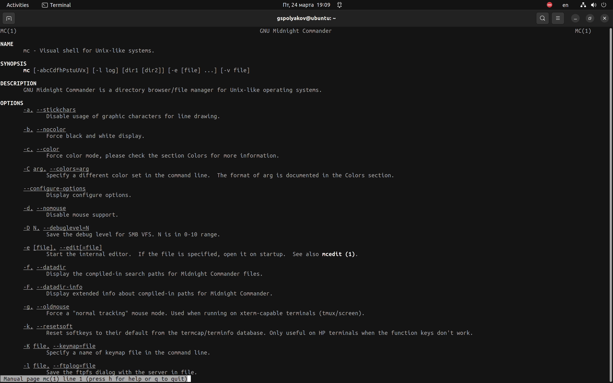{#fig:001 width=70%}
2. Запустите из командной строки mc, изучите его структуру и меню (рис. @fig:002).
	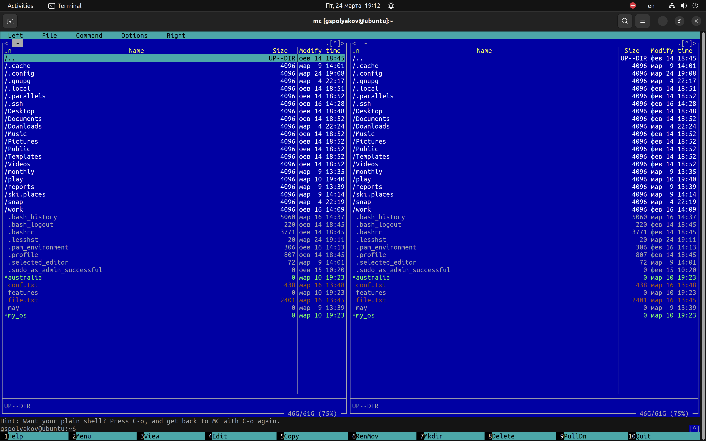{#fig:002 width=70%}
3. Выполнил несколько операций в mc, используя управляющие клавиши (операции с панелями; выделение/отмена выделения файлов, копирование/перемещение файлов, получение информации о размере и правах доступа на файлы и/или каталоги и т.п.)(рис. @fig:003).
	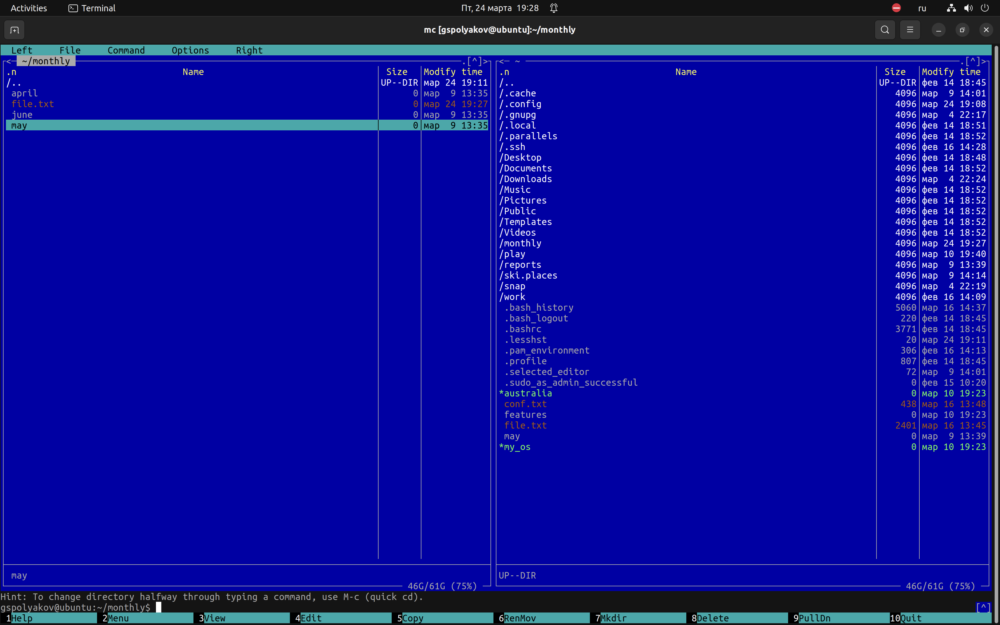{#fig:003 width=70%}
	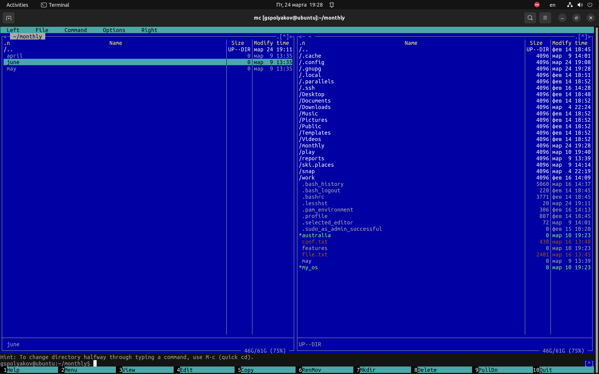{#fig:004 width=70%}
	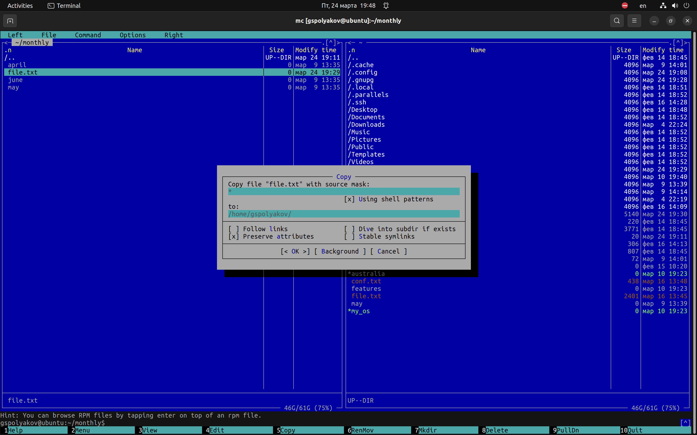{#fig:005 width=70%}
4. Выполнил основные команды меню левой (или правой) панели. Оценил степень подробности вывода информации о файлах (рис. @fig:006).
	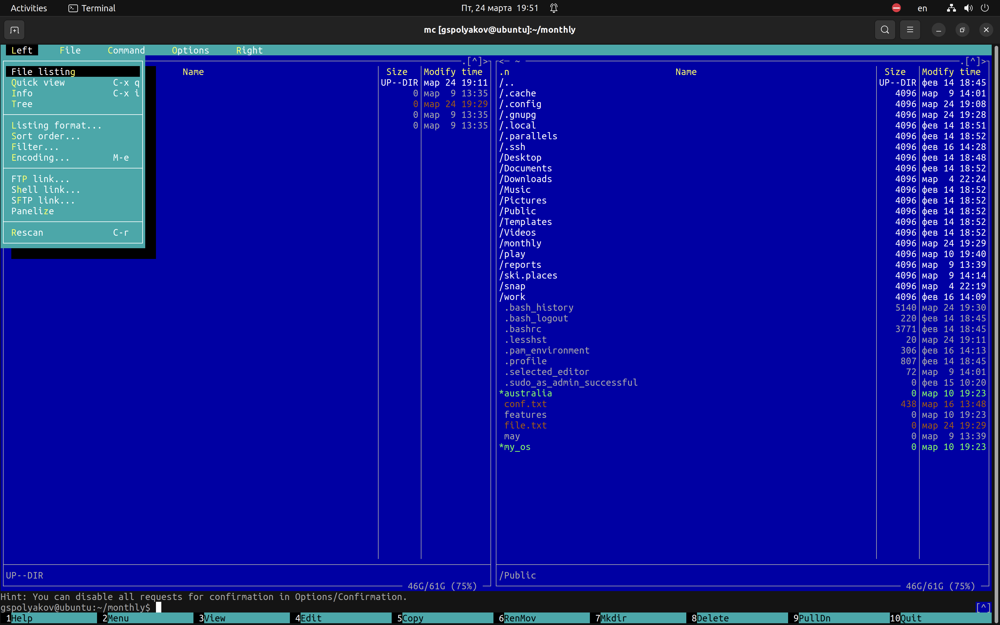{#fig:006 width=70%}

5. Используя возможности подменю Файл, выполнил:
	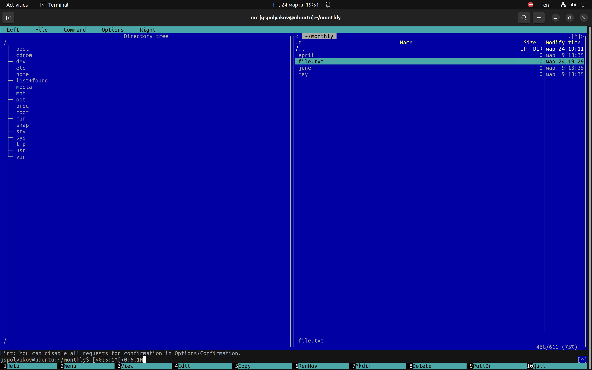{#fig:007 width=70%}
	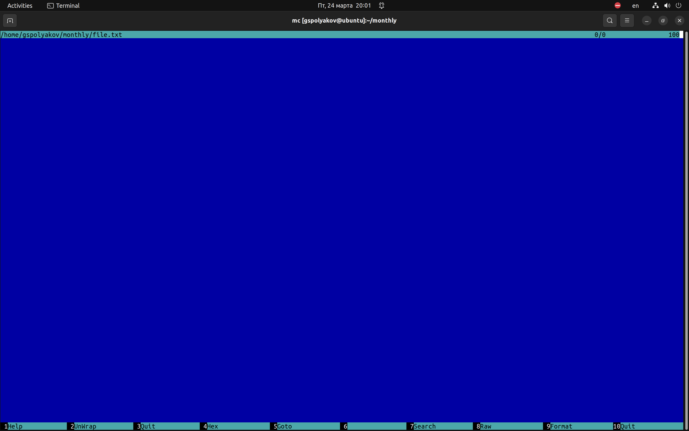{#fig:008 width=70%}
	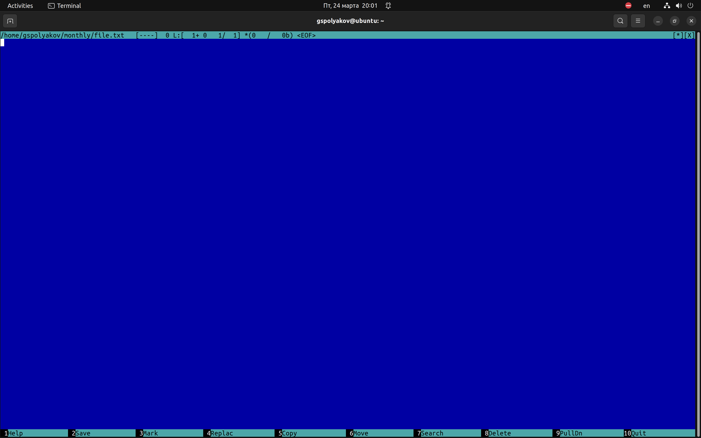{#fig:009 width=70%}
	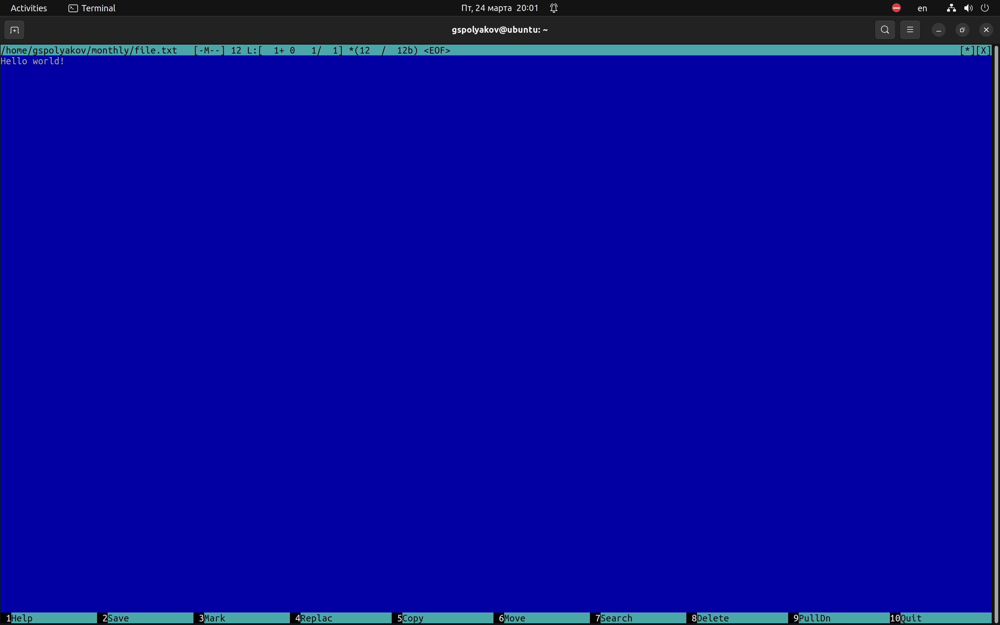{#fig:010 width=70%}	
6. С помощью соответствующих средств подменю Команда осуществите:
	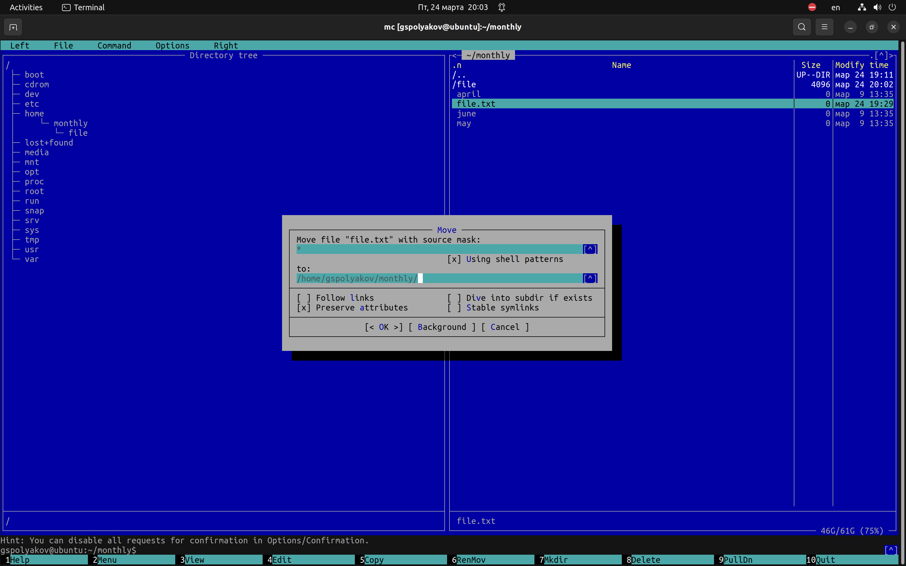{#fig:011 width=70%}

7. Вызовите подменю Настройки. Освойте операции, определяющие структуру экрана mc (Full screen, Double Width, Show Hidden Files и т.д.).

1. Создайте текстовой файл text.txt.
2. Откройте этот файл с помощью встроенного в mc редактора.
3. Вставьте в открытый файл небольшой фрагмент текста, скопированный из любого другого файла или Интернета.
	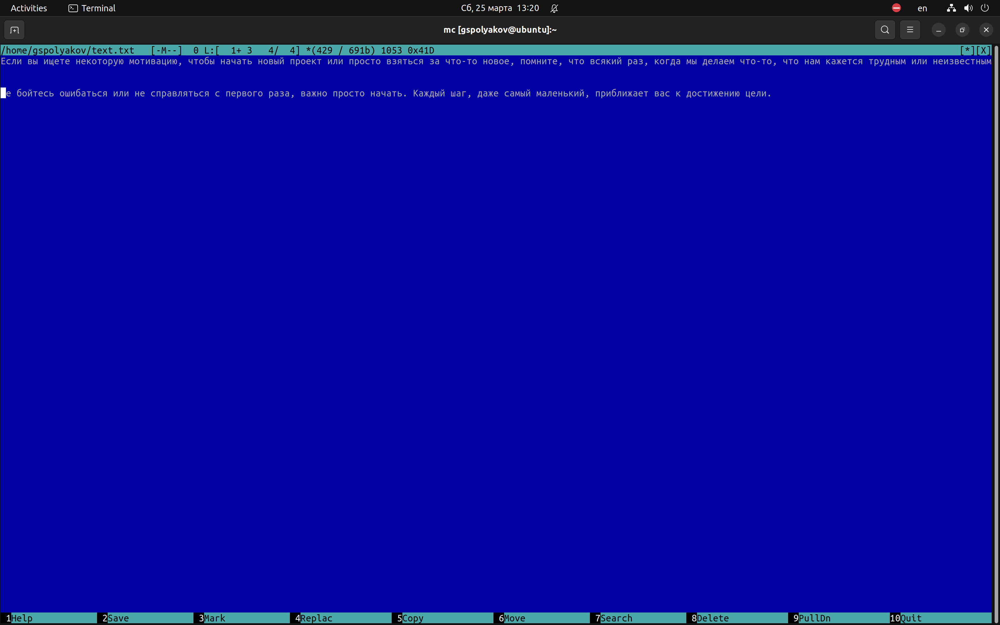{#fig:014 width=70%}
4. Проделайте с текстом следующие манипуляции, используя горячие клавиши:
	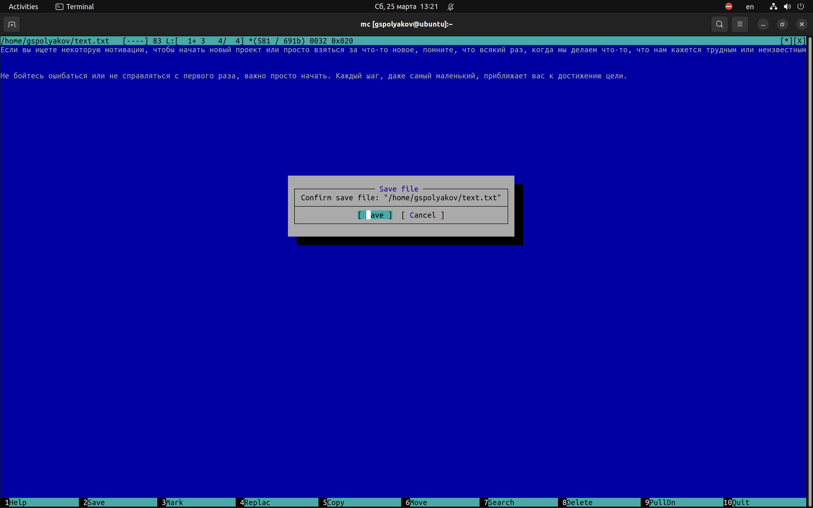{#fig:014 width=70%}
	{#fig:014 width=70%}
	{#fig:014 width=70%}
	{#fig:014 width=70%}
	{#fig:014 width=70%}
5. Откройте файл сисходным текстом на некотором языке программирования (например C или Java)
	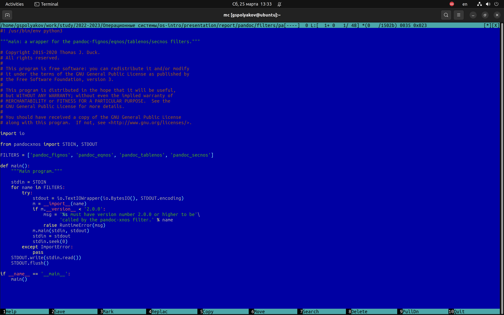{#fig:014 width=70%}
6. Используя меню редактора, включите подсветку синтаксиса, если она не включена, или выключите, если она включена.
	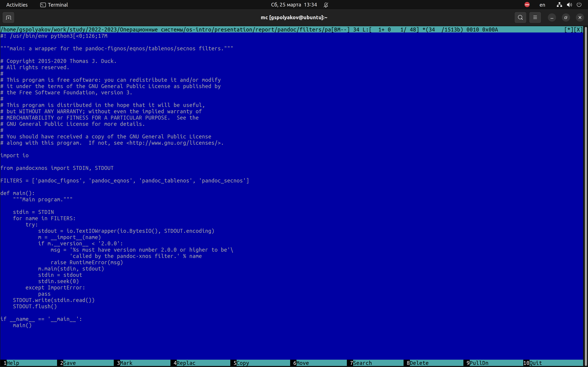{#fig:014 width=70%}
# Выводы

Освоил основные возможности командной оболочки Midnight Commander. Приобрел навыки практической работы по просмотру каталогов и файлов; манипуляций с ними.

# Список литературы{.unnumbered}

::: {#refs}
:::
