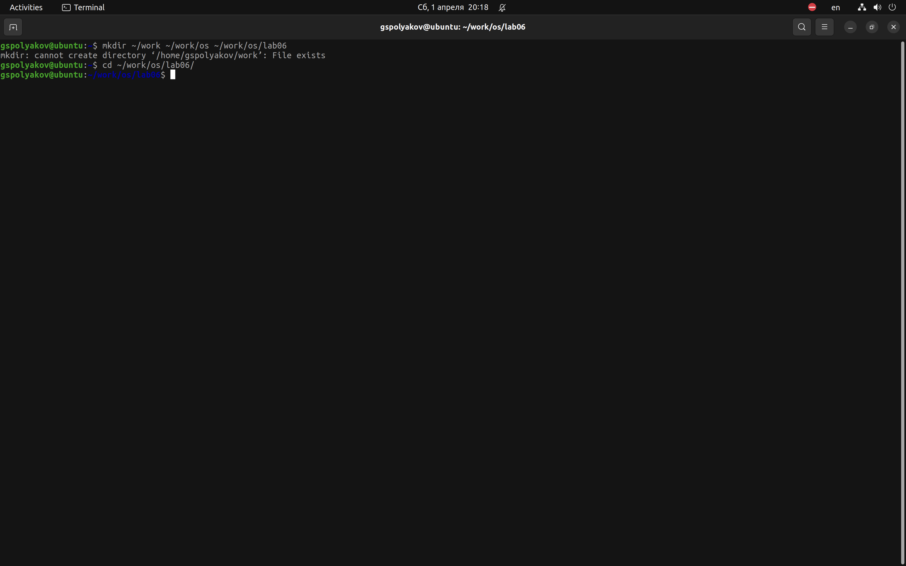
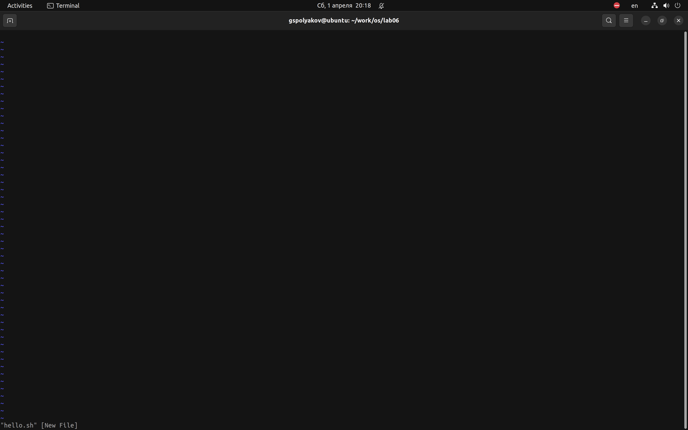
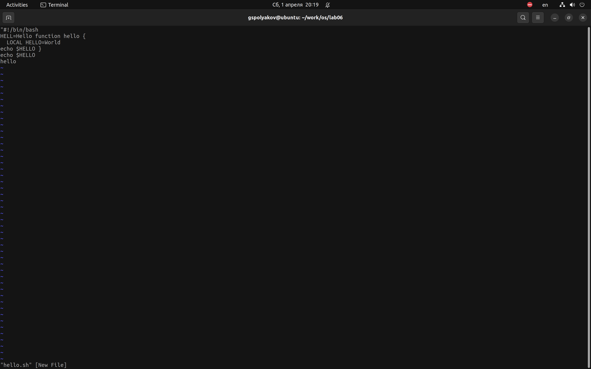
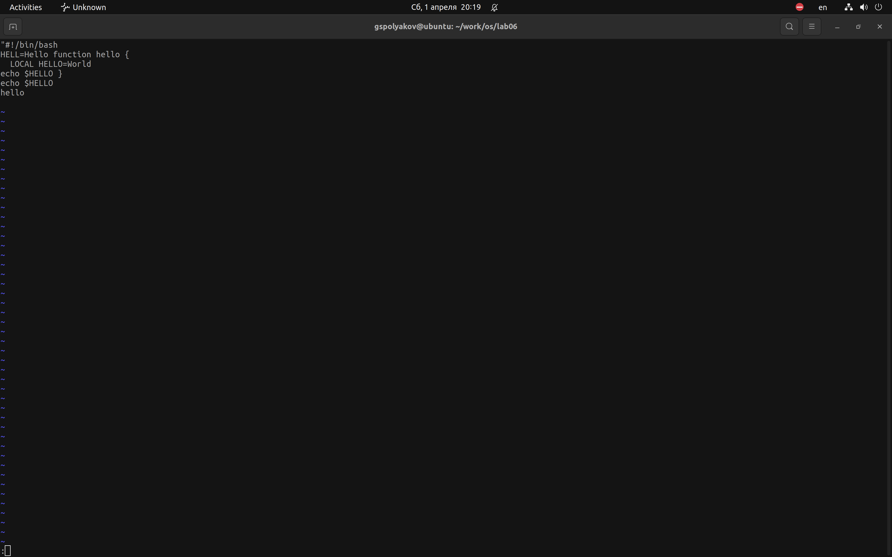
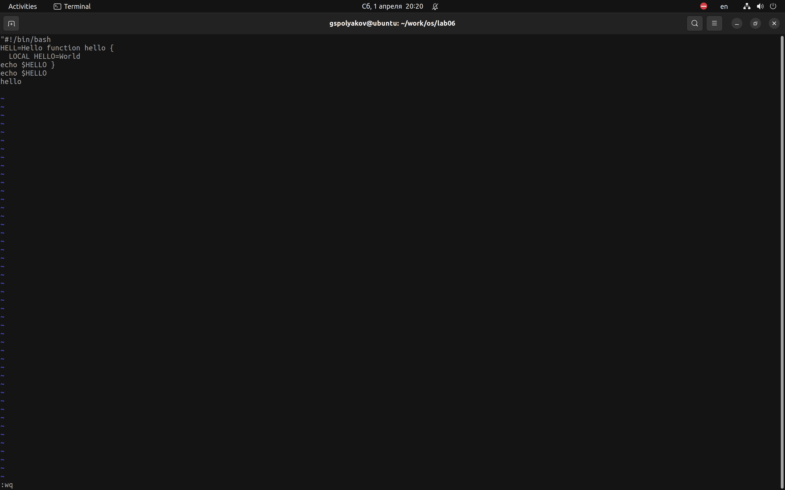
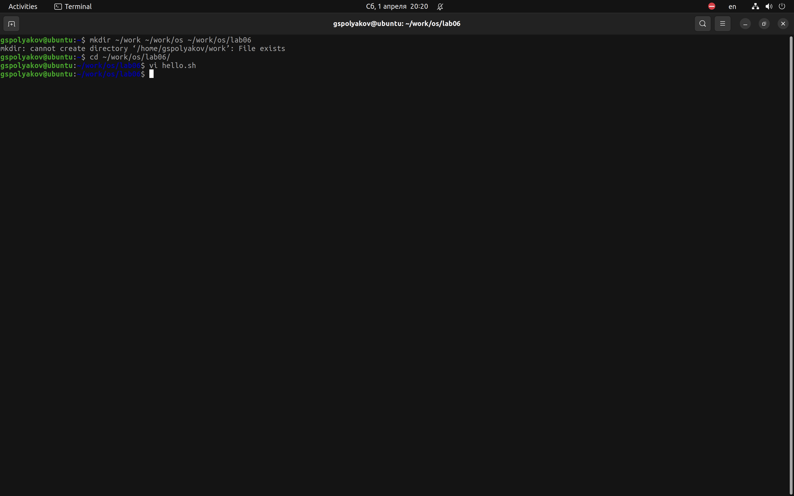
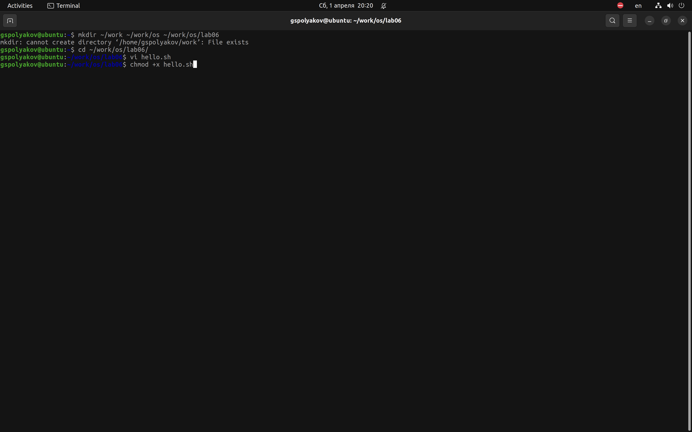
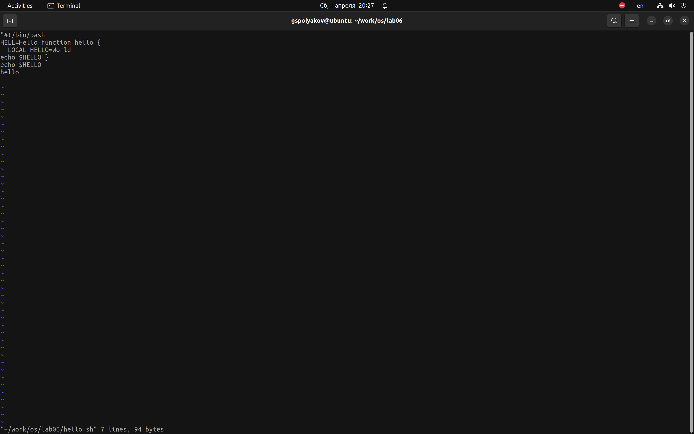
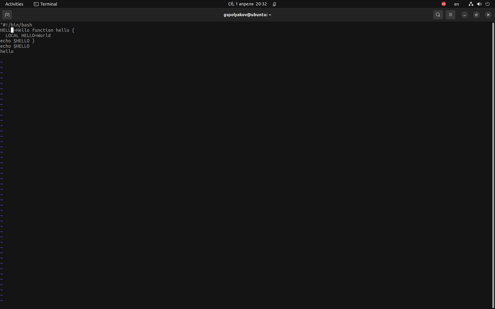
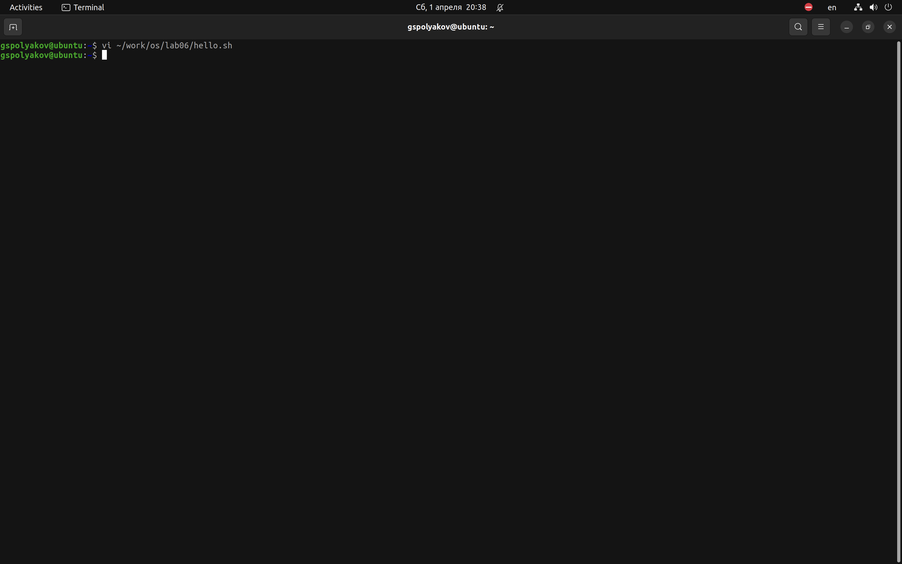

---
## Front matter
lang: ru-RU
title: Лабораторная работа №8
subtitle: Vi
author: Поляков Г. С.
institute: Российский университет дружбы народов, Москва, Россия
date: 2023-02-18

## i18n babel
babel-lang: russian
babel-otherlangs: english

## Formatting pdf
toc: false
toc-title: Содержание
slide_level: 2
aspectratio: 169
section-titles: true
theme: metropolis
header-includes:
 - \metroset{progressbar=frametitle,sectionpage=progressbar,numbering=fraction}
 - '\makeatletter'
 - '\beamer@ignorenonframefalse'
 - '\makeatother'
---

# Информация

## Докладчик

:::::::::::::: {.columns align=center}
::: {.column width="70%"}

  Поляков Глеб Сергеевич
  
  НПИбд-02-22
  
  РУДН, Москва, Россия

:::
::: {.column width="30%"}

:::
::::::::::::::

## Создайте каталог с именем ~/work/os/lab06.

{#fig:001 width=70%}

## Перейдите во вновь созданный каталог.

{#fig:002 width=70%}

## Вызовите vi и создайте файл hello.sh.

{#fig:003 width=70%}

## Нажмите клавишу *i* и вводите текст.

{#fig:004 width=70%}

## Нажмите клавишу Esc для перехода в командный режим после завершения ввода текста..

{#fig:005 width=70%}

## Нажмите *:* для перехода в режим последней строки и внизу вашего экрана появится приглашение в виде двоеточия.

{#fig:006 width=70%}

## Нажмите w (записать) и q (выйти), а затем нажмите клавишу *Enter* для сохранения вашего текста и завершения работы.

{#fig:007 width=70%}

## Сделайте файл исполняемым.

{#fig:008 width=70%}

## Вызовите vi на редактирование файла.

{#fig:009 width=70%}

## Установите курсор в конец слова HELL второй строки.

{#fig:010 width=70%}

## Перейдите в режим вставки и замените на HELLO. Нажмите *Esc* для возврата в командный режим.

{#fig:011 width=70%}

## Установите курсор на четвертую строку и сотрите слово LOCAL.

{#fig:012 width=70%}

## Перейдите в режим вставки и наберите следующий текст: local, нажмите *Esc* для возврата в командный режим.

{#fig:013 width=70%}
{#fig:013 width=70%}

## Установите курсор на последней строке файла. Вставьте послен её строку.

{#fig:014 width=70%}

## Нажмите *Esc* для перехода в командный режим.

{#fig:015 width=70%}

## Удалите последнюю строку.

{#fig:016 width=70%}

## Введите команду отмены изменений *u* для отмены последней команды.

{#fig:017 width=70%}

## Введите символ *:* для перехода в режим последней строки. Запишите произведённые изменения и выйдите из vi.

{#fig:018 width=70%}

## Выводы

Познакомился с операционной системой Linux. Получил практические навыки работы с редактором vi, установленным по умолчанию практически во всех дистрибутивах.