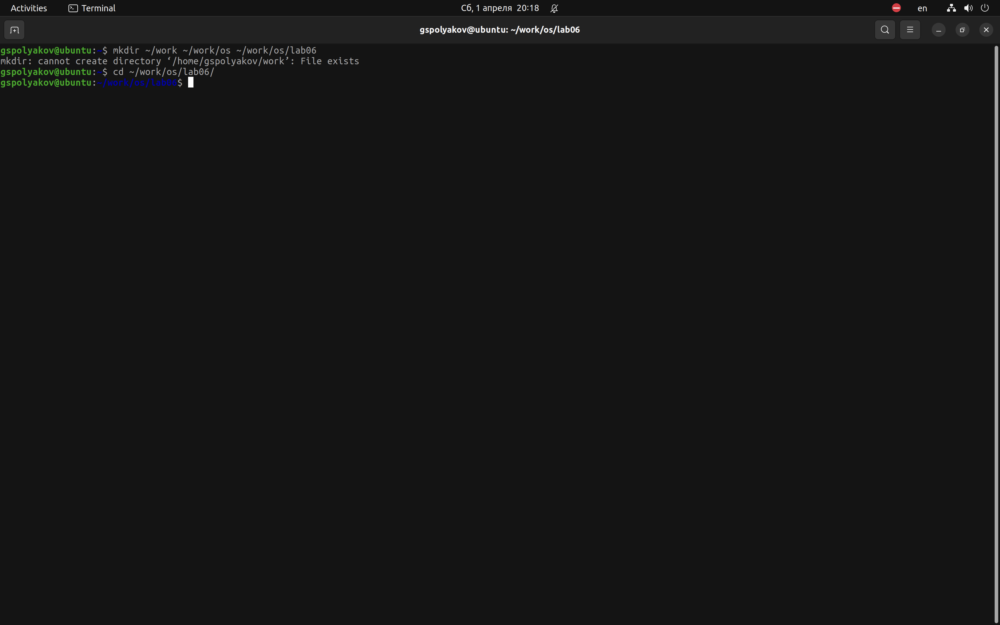
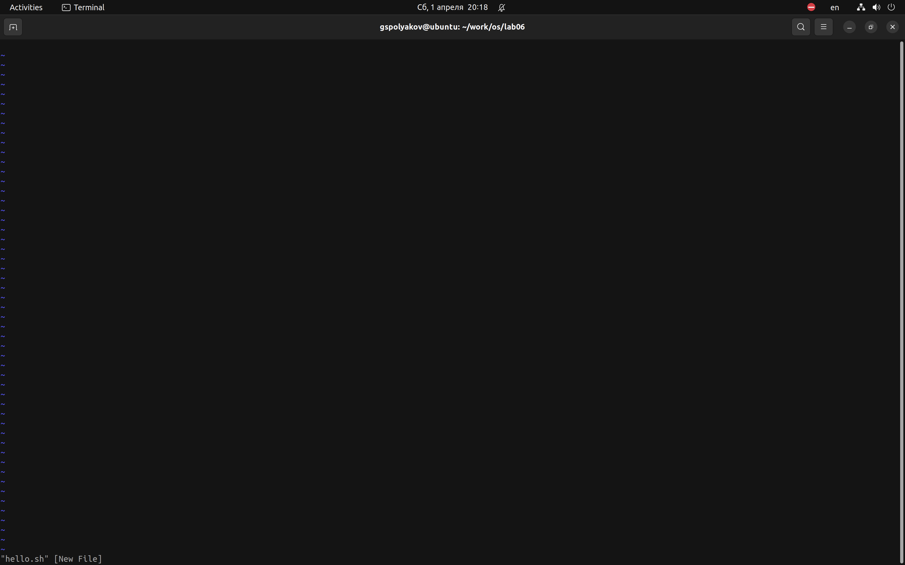
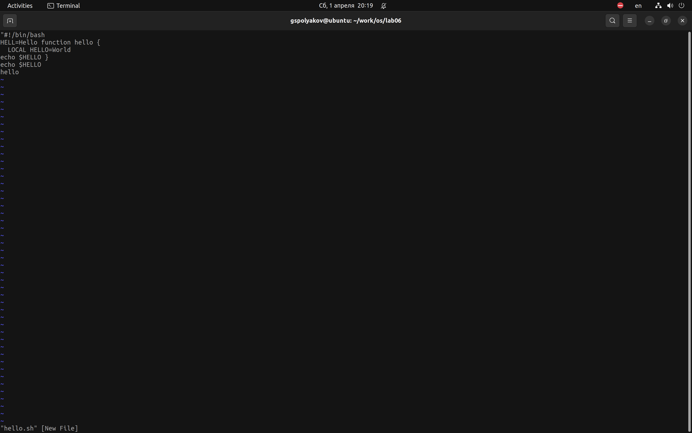
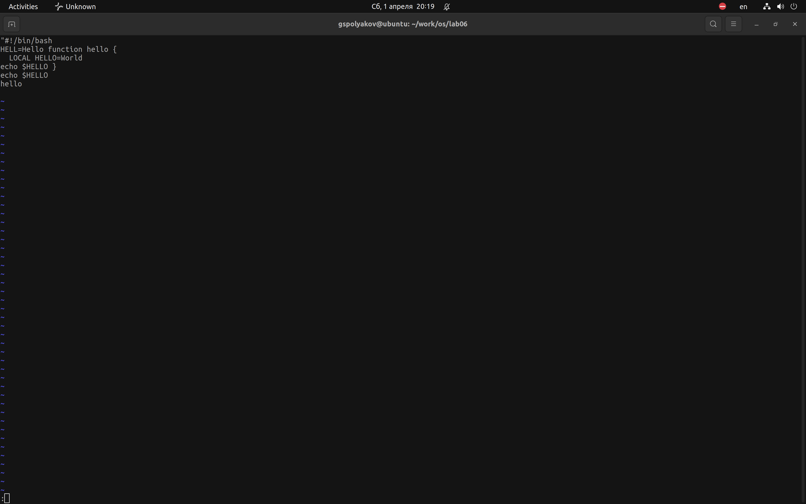
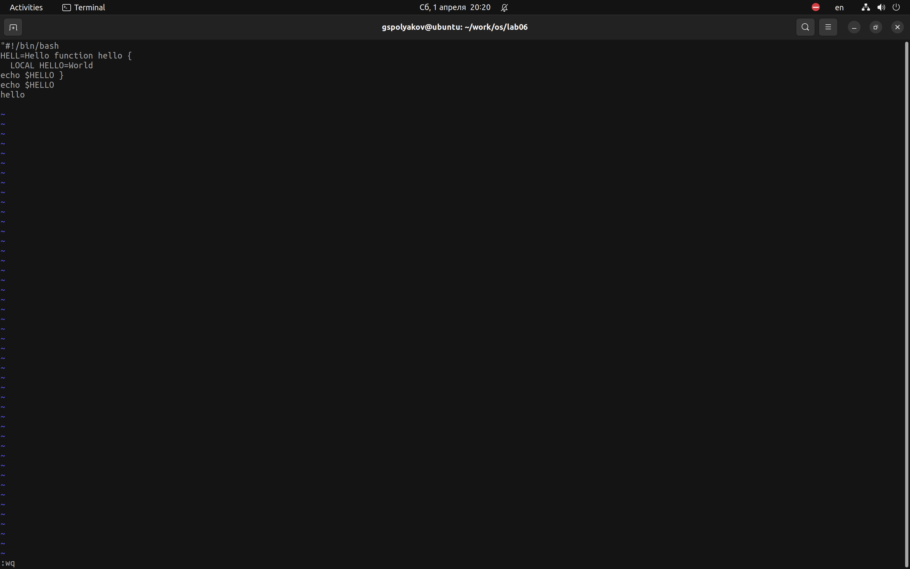
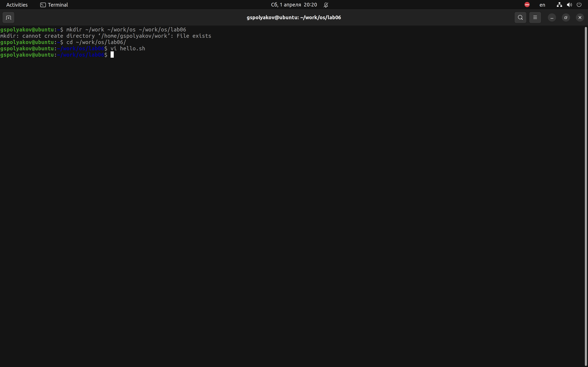
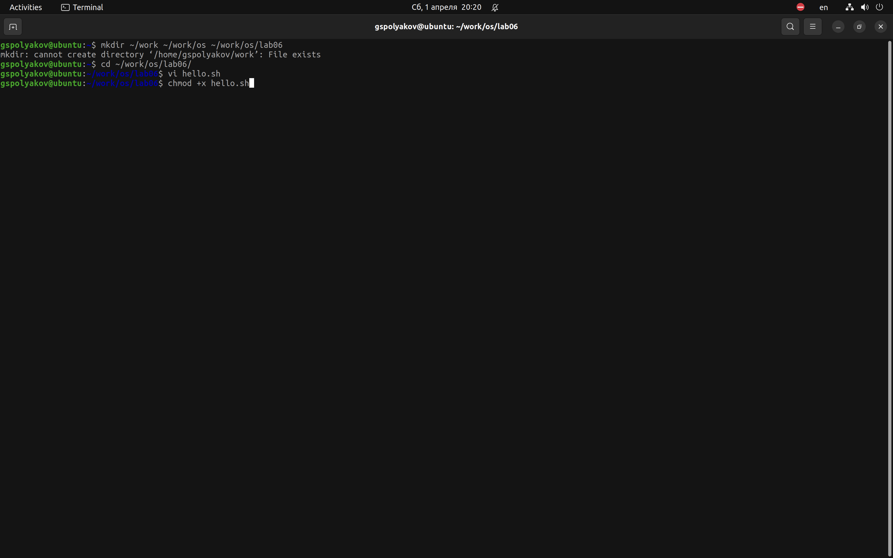
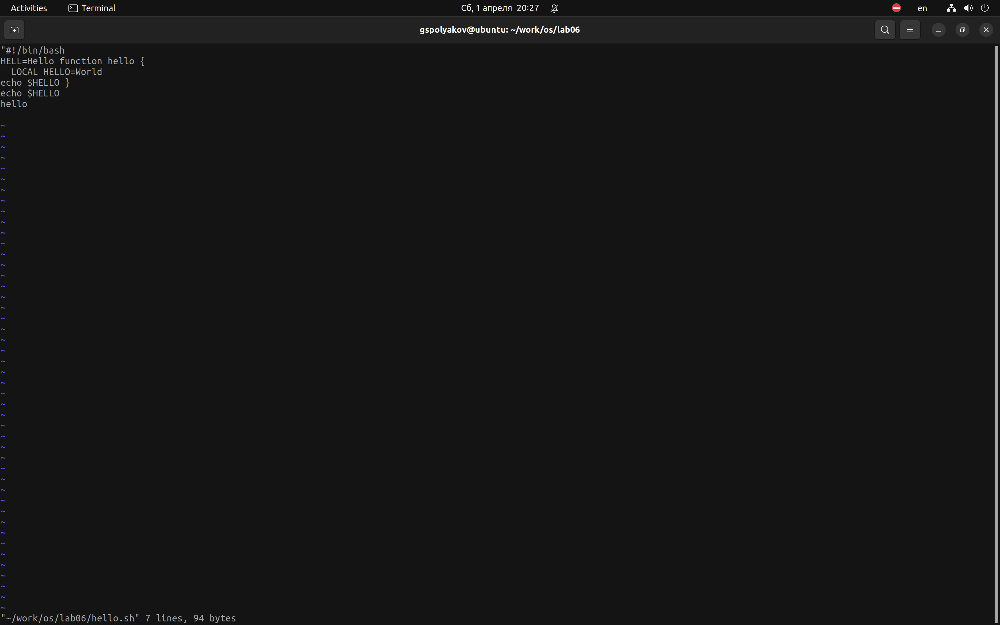
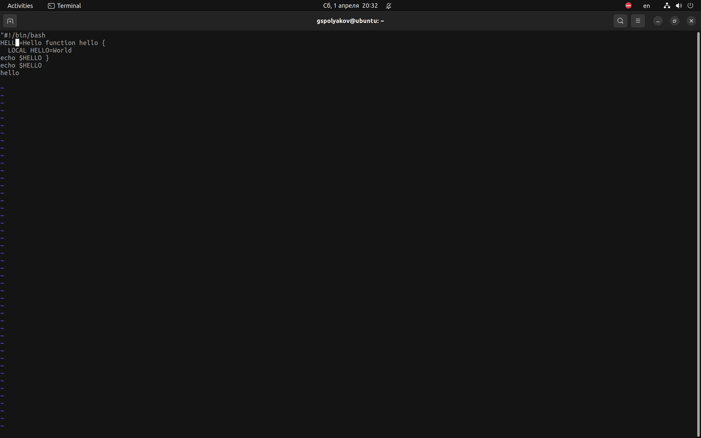
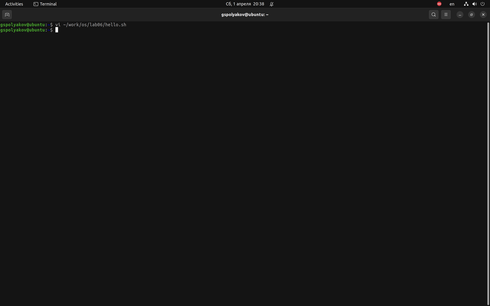

---
## Front matter
title: "Лабораторная работа №8"
subtitle: "Vi"
author: "Поляков Глеб Сергеевич"

## Generic otions
lang: ru-RU
toc-title: "Содержание"

## Bibliography
bibliography: bib/cite.bib
csl: pandoc/csl/gost-r-7-0-5-2008-numeric.csl

## Pdf output format
toc: true # Table of contents
toc-depth: 2
lof: true # List of figures
lot: true # List of tables
fontsize: 12pt
linestretch: 1.5
papersize: a4
documentclass: scrreprt
## I18n polyglossia
polyglossia-lang:
  name: russian
  options:
	- spelling=modern
	- babelshorthands=true
polyglossia-otherlangs:
  name: english
## I18n babel
babel-lang: russian
babel-otherlangs: english
## Fonts
mainfont: PT Serif
romanfont: PT Serif
sansfont: PT Sans
monofont: PT Mono
mainfontoptions: Ligatures=TeX
romanfontoptions: Ligatures=TeX
sansfontoptions: Ligatures=TeX,Scale=MatchLowercase
monofontoptions: Scale=MatchLowercase,Scale=0.9
## Biblatex
biblatex: true
biblio-style: "gost-numeric"
biblatexoptions:
  - parentracker=true
  - backend=biber
  - hyperref=auto
  - language=auto
  - autolang=other*
  - citestyle=gost-numeric
## Pandoc-crossref LaTeX customization
figureTitle: "Рис."
tableTitle: "Таблица"
listingTitle: "Листинг"
lofTitle: "Список иллюстраций"
lotTitle: "Список таблиц"
lolTitle: "Листинги"
## Misc options
indent: true
header-includes:
  - \usepackage{indentfirst}
  - \usepackage{float} # keep figures where there are in the text
  - \floatplacement{figure}{H} # keep figures where there are in the text
---

# Цель работы

Познакомиться с операционной системой Linux. Получить практические навыки работы с редактором vi, установленным по умолчанию практически во всех дистрибутивах.

# Задание

### Задание 1. Создание нового файла с использованием vi

1. Создайте каталог с именем ~/work/os/lab06. 
2. Перейдите во вновь созданный каталог. 
3. Вызовите vi и создайте файл hello.sh
	
		1. vi hello.sh

4. Нажмите клавишу *i*  и вводите следующий текст.
	
		#!/bin/bash
		HELL=Hello function hello {
		LOCAL HELLO=World
		echo $HELLO }
		echo $HELLO
		hello

5. Нажмите клавишу Esc для перехода в командный режим после завершения ввода текста.
6. Нажмите *:* для перехода в режим последней строки и внизу вашего экрана появится приглашение в виде двоеточия.
7. Нажмите w (записать) и q (выйти), а затем нажмите клавишу *Enter* для сохранения вашего текста и завершения работы.
8. Сделайте файл исполняемым:
		
		chmod +x hello.sh

### Задание 2. Редактирование существующего файла

1. Вызовите vi на редактирование файла
		
		vi ~/work/os/lab06/hello.sh

2. Установите курсор в конец слова HELL второй строки. 
3. Перейдите в режим вставки и замените на HELLO. Нажмите *Esc* для возврата в командный режим.
4. Установите курсор на четвертую строку и сотрите слово LOCAL.
5. Перейдите в режим вставки и наберите следующий текст: local, нажмите *Esc* для возврата в командный режим. 
6. Установите курсор на последней строке файла. Вставьте послен её строку, содержащую следующий текст:
		
		echo $HELLO.

7. Нажмите *Esc* для перехода в командный режим.
8. Удалитепоследнююстроку.
9. Введите команду отмены изменений *u* для отмены последней команды.
10. Введите символ *:* для перехода в режим последней строки. Запишите произведённые изменения и выйдите из vi.

# Теоретическое введение

###Основные группы команд редактора 

#### Команды управления курсором

Команды управления курсором приведены в табл. 8.1.

								Команды управления курсором 

| Курсор влево | Курсор вправо | Курсор вверх | Курсор вниз |
|--------------|---------------|--------------|---------------|
| `<-` | `Space` |  | `Enter` |
| (клавиша Backspace) | (клавиша «пробел») |  |  |
| `h` | `l` | `k` | `l` |
| `<` | `>` | `^` | `!^` |

#### Команды позиционирования

- 0 (ноль) - переход в начало строки;
- $ - переход в конец строки;
- G - переход в конец файла;
- 𝑛 G - переход на строку с номером 𝑛.

#### Команды перемещения по файлу

- Ctrl-d - перейти на пол-экрана вперёд; 
- Ctrl-u - перейти на пол-экрана назад;
- Ctrl-f - перейти на страницу вперёд;
- Ctrl-b - перейти на страницу назад.

#### Команды перемещения по словам

- W или w - перейти на слово вперёд;
- 𝑛 W или𝑛 w — перейти на 𝑛 слов вперёд;
- b или B - перейти на слово назад;
- 𝑛 b или𝑛 B — перейти на 𝑛 слов назад.

### Команды редактирования 

#### Вставка текста

- а - вставить текст после курсора;
- А - вставить текст в конец строки;
- i - вставить текст перед курсором;
- 𝑛 i - вставить текст 𝑛 раз;
- I - вставить текст в начало строки.

#### Вставка строки

- о - вставить строку под курсором;
- О - вставить строку над курсором. 

#### Удаление текста

- x - удалить один символ в буфер;
- d w - удалить одно слово в буфер;
- d $ - удалить в буфер текст от курсора до конца строки; 
- d 0 - удалить в буфер текст от начала строки до позиции курсора;
- d d - удалить в буфер одну строку;
- 𝑛 d d — удалить в буфер 𝑛 строк.

#### Отмена и повтор произведённых изменений
- u - отменить последнее изменение; 
- . - повторить последнее изменение.

#### Копирование текста в буфер
- Y - скопировать строку в буфер;
- 𝑛 Y - скопировать 𝑛 строк в буфер;
- y w - скопировать слово в буфер.

#### Вставка текста из буфера
- p - вставить текст из буфера после курсора;
- P - вставить текст из буфера перед курсором.

#### Замена текста
- c w - заменить слово;
- 𝑛 c w —заменить 𝑛 слов;
- c $ - заменить текст от курсора до конца строки;
- r - заменить слово;
- R - заменить текст.

#### Поиск текста

- / - текст — произвести поиск вперёд по тексту указанной строки символов текст; 
- ? - текст — произвести поиск назад по тексту указанной строки символов текст.

### Команды редактирования в режиме командной строки
#### Копирование и перемещение текста
- : 𝑛,𝑚 d — удалить строки с 𝑛 по 𝑚;
- : 𝑖,𝑗 m 𝑘 — переместить строки с 𝑖 по 𝑗, начиная со строки 𝑘;
- : 𝑖,𝑗 t 𝑘 — копировать строки с 𝑖 по 𝑗 в строку 𝑘;
- : 𝑖,𝑗 w имя-файла - записать строки с 𝑖 по 𝑗 в файл с именем имя-файла. 
####Запись в файл и выход из редактора
- : w - записать изменённый текст в файл, не выходя из vi;
- : w имя-файла - записать изменённый текст в новый файл с именем имя-файла;
- : w ! имя-файла - записать изменённый текст в файл с именем имя-файла;
- : w q - записать изменения в файл и выйти из vi; - выйти из редактора vi;
- : q - выйти из редактора vi;
- : q ! - выйти из редактора без записи;
- : e ! - вернуться в командный режим, отменив все изменения, произведённые со времени последней записи.

### Опции

Опции редактора vi позволяют настроить рабочую среду. Для задания опций используется команда set (в режиме последней строки):

- : set all - вывести полный список опций;
- : set nu - вывести номера строк;
- : set list - вывести невидимые символы;
- : setic - не учитывать при поиске, является ли символ прописным или строчным.

Если вы хотите отказаться от использования опции, то в команде set перед именем опции надо поставить no.

# Выполнение лабораторной работы

### Задание 1. Создание нового файла с использованием vi

1. Создайте каталог с именем ~/work/os/lab06.(рис. @fig:001).

{#fig:001 width=70%}

2. Перейдите во вновь созданный каталог.(рис. @fig:002).

{#fig:002 width=70%}

3. Вызовите vi и создайте файл hello.sh(рис. @fig:003).

{#fig:003 width=70%}

4. Нажмите клавишу *i* и вводите текст(рис. @fig:004).

{#fig:004 width=70%}

5. Нажмите клавишу Esc для перехода в командный режим после завершения ввода текста.(рис. @fig:005).

{#fig:005 width=70%}

6. Нажмите *:* для перехода в режим последней строки и внизу вашего экрана появится приглашение в виде двоеточия.(рис. @fig:006).

{#fig:006 width=70%}

7. Нажмите w (записать) и q (выйти), а затем нажмите клавишу *Enter* для сохранения вашего текста и завершения работы.(рис. @fig:007).

{#fig:007 width=70%}

8. Сделайте файл исполняемым:(рис. @fig:008).

{#fig:008 width=70%}

### Задание 2. Редактирование существующего файла

1. Вызовите vi на редактирование файла(рис. @fig:009).

{#fig:009 width=70%}

2. Установите курсор в конец слова HELL второй строки. (рис. @fig:010).

{#fig:010 width=70%}

3. Перейдите в режим вставки и замените на HELLO. Нажмите *Esc* для возврата в командный режим.(рис. @fig:011).

{#fig:011 width=70%}

4. Установите курсор на четвертую строку и сотрите слово LOCAL.(рис. @fig:012).

{#fig:012 width=70%}

5. Перейдите в режим вставки и наберите следующий текст: local, нажмите *Esc* для возврата в командный режим. (рис. @fig:013).

{#fig:013 width=70%}
{#fig:013 width=70%}

6. Установите курсор на последней строке файла. Вставьте послен её строку(рис. @fig:014).

{#fig:014 width=70%}

7. Нажмите *Esc* для перехода в командный режим.(рис. @fig:015).

{#fig:015 width=70%}

8. Удалите последнюю строку.(рис. @fig:016).

{#fig:016 width=70%}

9. Введите команду отмены изменений *u* для отмены последней команды.(рис. @fig:017).

{#fig:017 width=70%}

10. Введите символ *:* для перехода в режим последней строки. Запишите произведённые изменения и выйдите из vi.(рис. @fig:018).

{#fig:018 width=70%}

# Выводы

Познакомился с операционной системой Linux. Получил практические навыки работы с редактором vi, установленным по умолчанию практически во всех дистрибутивах.

# Список литературы{.unnumbered}

::: {#refs}
:::
