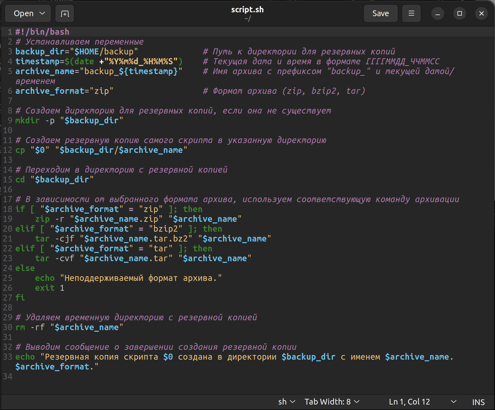
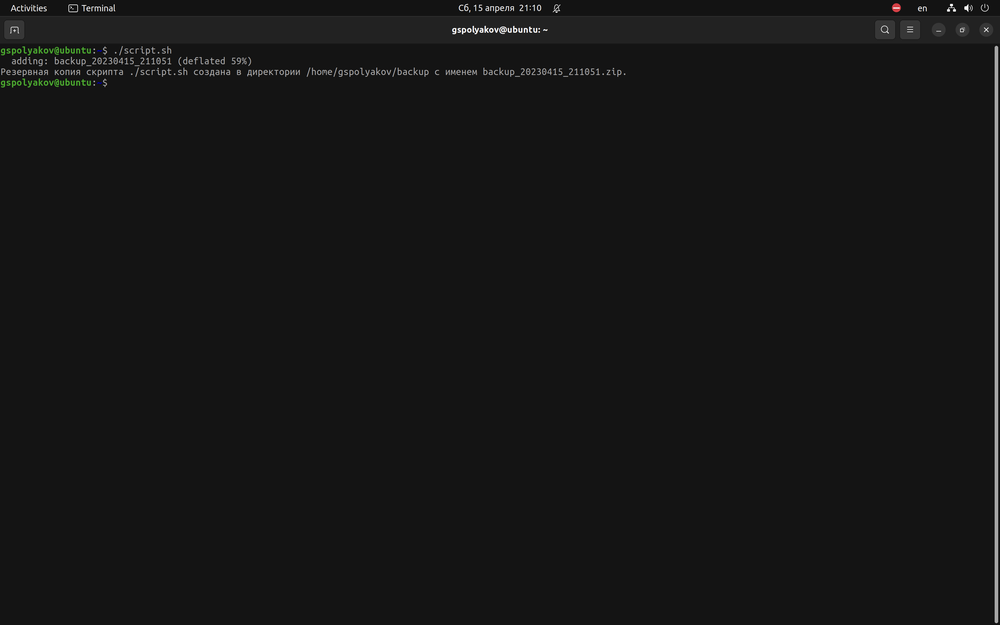
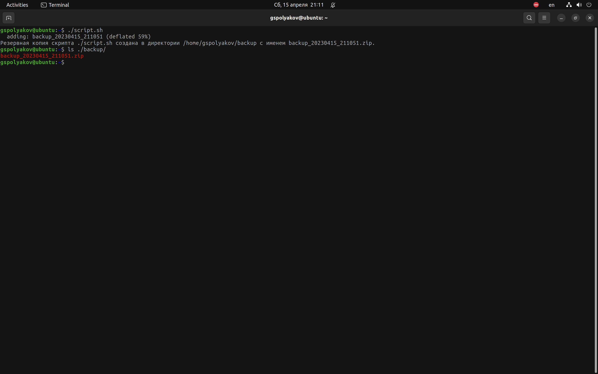
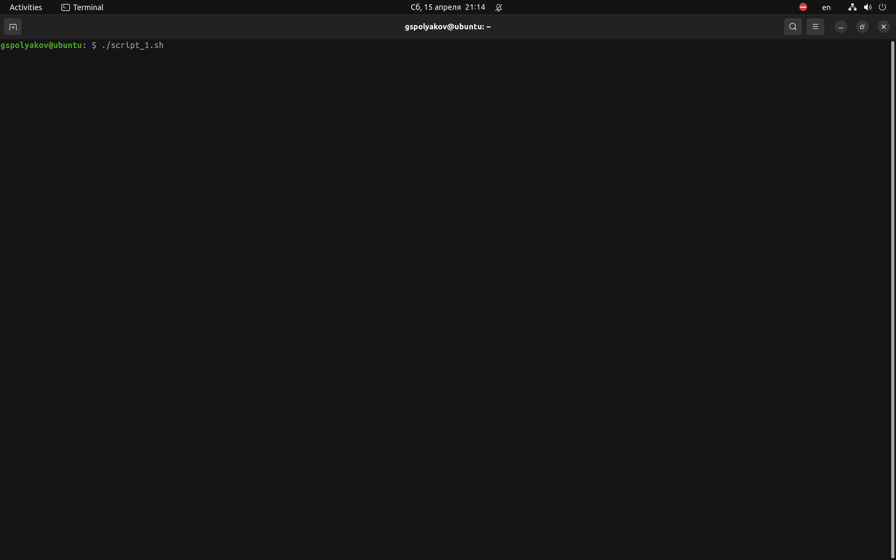
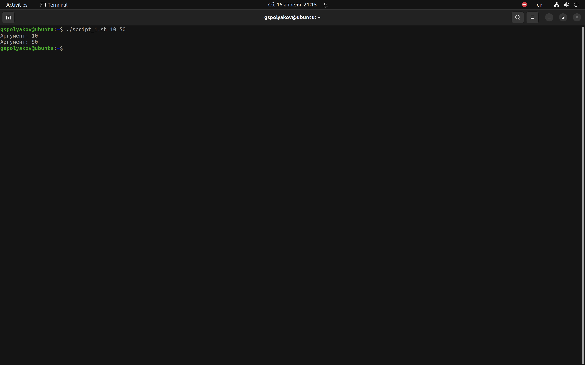
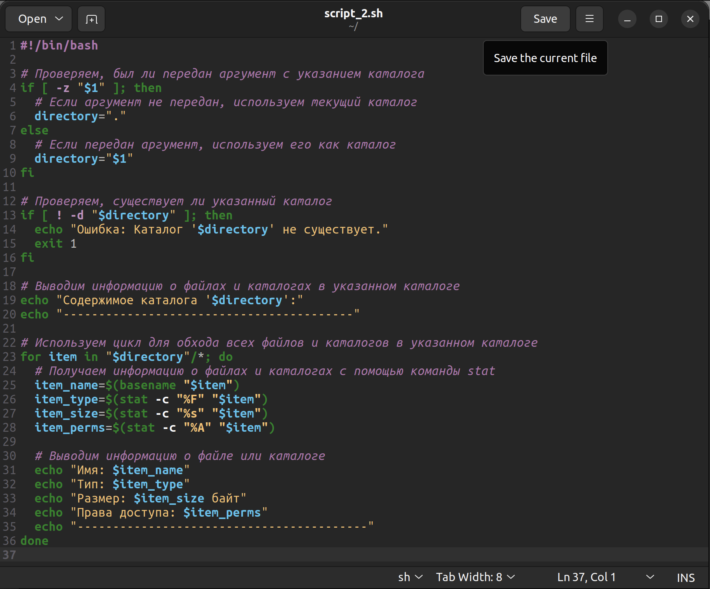
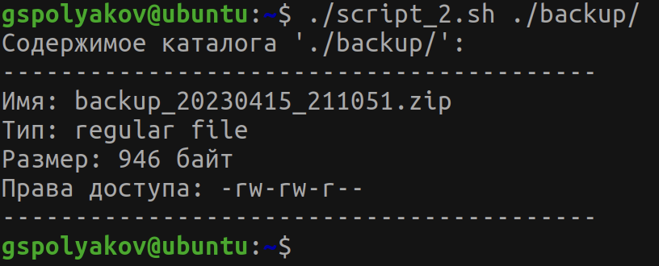
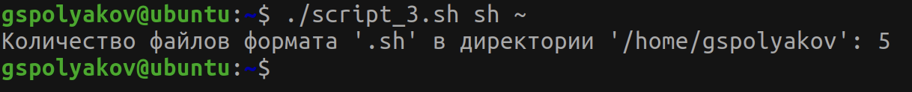

---
## Front matter
title: "Лабораторная работа №10"
subtitle: "Программирование в командном процессоре ОС UNIX. Командные файлы"
author: "Поляков Глеб Сергеевич"

## Generic otions
lang: ru-RU
toc-title: "Содержание"

## Bibliography
bibliography: bib/cite.bib
csl: pandoc/csl/gost-r-7-0-5-2008-numeric.csl

## Pdf output format
toc: true # Table of contents
toc-depth: 2
lof: true # List of figures
lot: true # List of tables
fontsize: 12pt
linestretch: 1.5
papersize: a4
documentclass: scrreprt
## I18n polyglossia
polyglossia-lang:
  name: russian
  options:
	- spelling=modern
	- babelshorthands=true
polyglossia-otherlangs:
  name: english
## I18n babel
babel-lang: russian
babel-otherlangs: english
## Fonts
mainfont: PT Serif
romanfont: PT Serif
sansfont: PT Sans
monofont: PT Mono
mainfontoptions: Ligatures=TeX
romanfontoptions: Ligatures=TeX
sansfontoptions: Ligatures=TeX,Scale=MatchLowercase
monofontoptions: Scale=MatchLowercase,Scale=0.9
## Biblatex
biblatex: true
biblio-style: "gost-numeric"
biblatexoptions:
  - parentracker=true
  - backend=biber
  - hyperref=auto
  - language=auto
  - autolang=other*
  - citestyle=gost-numeric
## Pandoc-crossref LaTeX customization
figureTitle: "Рис."
tableTitle: "Таблица"
listingTitle: "Листинг"
lofTitle: "Список иллюстраций"
lotTitle: "Список таблиц"
lolTitle: "Листинги"
## Misc options
indent: true
header-includes:
  - \usepackage{indentfirst}
  - \usepackage{float} # keep figures where there are in the text
  - \floatplacement{figure}{H} # keep figures where there are in the text
---

# Цель работы

Изучить основы программирования в оболочке ОС UNIX/Linux. Научиться писать небольшие командные файлы.

# Задание

1. Написать скрипт, который при запуске будет делать резервную копию самого себя (то есть файла, в котором содержится его исходный код) в другую директорию backup в вашем домашнем каталоге. При этом файл должен архивироваться одним из архиваторов на выбор zip, bzip2 или tar. Способ использования команд архивации необходимо узнать, изучив справку.
2. Написать пример командного файла, обрабатывающего любое произвольное число аргументов командной строки, в том числе превышающее десять. Например, скрипт может последовательно распечатывать значения всех переданных аргументов.
3. Написать командный файл — аналог команды ls (без использования самой этой команды и команды dir). Требуется, чтобы он выдавал информацию о нужном каталоге и выводил информацию о возможностях доступа к файлам этого каталога.
4. Написать командный файл,который получает в качестве аргумента командной строки формат файла (.txt, .doc, .jpg, .pdf и т.д.) и вычисляет количество таких файлов в указанной директории. Путь к директории также передаётся в виде аргумента командной строки.

# Теоретическое введение
## Указания к лабораторной работе 
### Командные процессоры (оболочки)

Командный процессор (командная оболочка, интерпретатор команд shell) — это программа, позволяющая пользователю взаимодействовать с операционной системой компьютера. В операционных системах типа UNIX/Linux наиболее часто используются следующие реализации командных оболочек:

- оболочка Борна (Bourne shell или sh) — стандартная командная оболочка UNIX / Linux, содержащая базовый, но при этом полный набор функций;
- С-оболочка (или csh) — надстройка над оболочкой Борна, использующая С-подобный синтаксис команд с возможностью сохранения истории выполнения команд;
- оболочка Корна (или ksh) — напоминает оболочку С, но операторы управления программой совместимы с операторами оболочки Борна;
- BASH — сокращение от Bourne Again Shell (опять оболочка Борна), в основе своей совмещает свойства оболочек С и Корна (разработка компании Free Software Foundation). 

POSIX (Portable Operating System Interface for Computer Environments) — набор стандартов описания интерфейсов взаимодействия операционной системы и прикладных программ.

Стандарты POSIX разработаны комитетом IEEE (Institute of Electrical and Electronics Engineers) для обеспечения совместимости различных UNIX/Linux-подобных операционных систем и переносимости прикладных программ на уровне исходного кода. POSIX-совместимые оболочки разработаны на базе оболочки Корна.

Рассмотрим основные элементы программирования в оболочке bash. В других оболочках большинство команд будет совпадать с описанными ниже.

###Переменные в языке программирования bash

Командный процессор bash обеспечивает возможность использования переменных типа *строка символов*. Имена переменных могут быть выбраны пользователем. Пользователь имеет возможность присвоить переменной значение некоторой строки символов. Например, команда
	
	mark=/usr/andy/bin

присваивает значение строки символов /usr/andy/bin переменной mark типа *строка символов*.

Значение, присвоенное некоторой переменной, может быть впоследствии использовано. Для этого в соответствующем месте командной строки должно быть употреблено имя этой переменной, которому предшествует метасимвол \$. Например, команда
	
	mv afile ${mark}

переместит файл afile из текущего каталога в каталог с абсолютным полным именем /usr/andy/bin.

Использование значения, присвоенного некоторой переменной, называется подстановкой. Для того чтобы имя переменной не сливалось с символами, которые могут следовать за ним в командной строке, при подстановке в общем случае используется следующая форма записи:

	${имя переменной}

Например, использование команд 

	b=/tmp/andy-
	ls -l myfile > ${b}lssudo apt-get install texlive-luatex
	
приведёт к переназначению стандартного вывода команды ls с терминала на файл /tmp/andy-ls, а использовани екоманды ls -l >\$b ls приведёт к подстановке в командную строку значения переменной bls. Если переменной bls не было предварительно присвоено никакого значения, то её значением будет символ пробела.

Оболочка bash позволяет работать с массивами. Для создания массива используется команда set с флагом -A. За флагом следует имя переменной, а затем список значений, разделённых пробелами. Например,
	
	set -A states Delaware Michigan "New Jersey"

Далее можно сделать добавление в массив, например, states[49]=Alaska. Индексация
массивов начинается с нулевого элемента.

###Использование арифметических вычислений. Операторы let и read

Оболочка bash поддерживает встроенные арифметические функции. Команда let является показателем того, что последующие аргументы представляют собой выражение, подлежащее вычислению. Простейшее выражение — это единичный терм (term), обычно целочисленный.

Целые числа можно записывать как последовательность цифр или в любом базовом формате типа radix\#number, где radix (основание системы счисления) — любое число не более 26. Для большинства команд используются следующие основания систем исчисления: 2 (двоичная), 8 (восьмеричная) и 16 (шестнадцатеричная). Простейшими математическими выражениями являются сложение (+), вычитание (-), умножение (\*), целочисленное деление (/) и целочисленный остаток от деления (%).

Команда let берет два операнда и присваивает их переменной. Положительным моментом команды let можно считать то, что для идентификации переменной ей не нужензнакдоллара;выможетеписатькомандытипаlet sum=x+7,иletбудетискать переменную x и добавлять к ней 7.

Команда let также расширяет другие выражения let, если они заключены в двойные круглые скобки. Таким способом вы можете создавать довольно сложные выражения.
Команда let не ограничена простыми арифметическими выражениями. Табл. 10.1 показывает полный набор let-операций.

Подобно С оболочка bash может присваивать переменной любое значение, а произвольное выражение само имеет значение, которое может использоваться. При этом «ноль» воспринимается как «ложь», а любое другое значение выражения — как «истина». Для

#Таблица 10.1

облегчения программирования можно записывать условия оболочки bash в двойные скобки—(( )).
Можно присваивать результаты условных выражений переменным, также как и использовать результаты арифметических вычислений в качестве условий. Хорошим примером сказанного является выполнение некоторого действия, одновременно декрементируя
некоторое значение. например:
	
	$ let x=5
	$ while
	> (( x-=1 )) 
	> do
	> something 
	> done
	
Этот пример показывает выполнение некоторого действия с начальным значением 5, которое декрементирует до тех пор, пока оно не будет равно нулю. При каждой итерации выполняется функция something.

Наиболее распространённым является сокращение, избавляющееся от слова let в программах оболочек. Если объявить переменные целыми значениями, то любое присвоение автоматически будет трактоваться как арифметическое действие. Если использовать typeset -iдляобъявленияиприсвоенияпеременной,топрипоследующемеёприменении она станет целой. Также можно использовать ключевое слово integer (псевдоним дляtypeset -i)иобъявлятьтакимобразомпеременныецелыми.Выражениятипах=y+z будет восприниматься в это случае как арифметические.

Команда read позволяет читать значения переменных со стандартного ввода:
	
	echo "Please enter Month and Day of Birth ?"
	read mon day trash

В переменные mon и day будут считаны соответствующие значения, введённые с клавиатуры, а переменная trash нужна для того, чтобы отобрать всю избыточно введённую информацию и игнорировать её.

Изъять переменную из программы можно с помощью команды unset.

Имена некоторых переменных имеют для командного процессора специальный смысл. Значением переменной PATH (т.е. \$РАТН) является список каталогов, в которых командный процессор осуществляет поиск программы или команды, указанной в командной строке, в том случае, если указанное имя программы или команды не содержит ни одного символа /. Если имя команды содержит хотя бы один символ /, то последовательность поиска, предписываемая значением переменной PATH, нарушается. В этом случае в зависимости от того, является имя команды абсолютным или относительным, поиск начинается соответственно от корневого или текущего каталога.

Если Вы сами явно не присвоите переменной PATH какое-либо значение, то стандартной (по умолчанию) последовательностью поиска файла является следующая: текущий каталог, каталог /bin, каталог /usr/bin. Именно в такой последовательности командный процессор ищет файлы, содержащие программы, которые обеспечивают выполнение таких, например, команд, как echo, ls и cat.
В списке каталогов, являющемся значением переменной PATH, имена каталогов отделяются друг от друга с помощью символа двоеточия. В качестве примера приведём команду:

	PATH=~/bin:/usr/local/bin/:/bin:/usr/bin

Переменные PS1 и PS2 предназначены для отображения промптера командного процессора. PS1 — это промптер командного процессора, по умолчанию его значение равно символу \$ или #. Если какая-то интерактивная программа, запущенная командным процессором, требует ввода, то используется промптер PS2. Он по умолчанию имеет значение символа >.
Другие стандартные переменные:

- HOME — имя домашнего каталога пользователя. Если команда cd вводится без аргументов, то происходит переход в каталог, указанный в этой переменной.
- IFS — последовательность символов, являющихся разделителями в командной строке, например, пробел, табуляция и перевод строки (new line).
- MAIL — командный процессор каждый раз перед выводом на экран промптера проверяет содержимое файла, имя которого указано в этой переменной, и если содержимое этого файла изменилось с момента последнего ввода из него, то перед тем как вывести на терминал промптер, командный процессор выводит на терминал сообщение You have mail (у Вас есть почта).
- TERM — тип используемого терминала.
- LOGNAME — содержит регистрационное имя пользователя, которое устанавливается автоматически при входе в систему.
В командном процессоре Си имеется ещё несколько стандартных переменных. Значение всех переменных можно просмотреть с помощью команды set.

###Метасимволы и их экранирование

При перечислении имён файлов текущего каталога можно использовать следующие символы:

- \* — соответствует произвольной, в том числе и пустой строке;
- ? — соответствует любому одинарному символу;
- [c1 - c1] — соответствует любому символу, лексикографически находящемуся между символами c1 и с2. Например,
- echo * — выведет имена всех файлов текущего каталога, что представляет собой простейший аналог команды ls;
- ls \*.c — выведет все файлы с последними двумя символами, совпадающими с .c.
- echo prog.? — выведет все файлы, состоящие из пяти или шести символов, первыми пятью символами которых являются prog..
- [a-z]\* — соответствует произвольному имени файла в текущем каталоге, начинающемуся с любой строчной буквы латинского алфавита.

Такие символы, как ' < > * ? | \ " & , являются метасимволами иимеют для командного процессора специальный смысл. Снятие специального смысла с метасимвола называется экранированием метасимвола. Экранирование может быть осуществлено с помощью предшествующего метасимволу символа \, который, в свою очередь, является метасимволом.

Для экранирования группы метасимволов нужно заключить её в одинарные кавычки. Строка, заключённая в двойные кавычки, экранирует все метасимволы, кроме \$, ' , \, ".

Например:

- echo \*выведетнаэкрансимвол\*,
- echo ab’\*\|\*’cdвыведетнаэкранстрокуab\*\|\*cd.

Последовательность команд может быть помещена в текстовый файл. Такой файл называется командным. Далее этот файл можно выполнить по команде:
	
	bash командный_файл [аргументы]

Чтобы не вводить каждый раз последовательности символов bash, необходимо изменить код защиты этого командного файла, обеспечив доступ к этому файлу по выполнению. Это может быть сделано с помощью команды

	chmod +x имя_файла

Теперь можно вызывать свой командный файл на выполнение, просто вводя его имя с терминала так, как-будто он является выполняемой программой. Командный процессор распознает, что в Вашем файле на самом деле хранится не выполняемая программа, а программа, написанная на языке программирования оболочки, и осуществит её интерпретацию.
Группу команд можно объединить в функцию. Для этого существует ключевое слово function, после которого следует имя функции и список команд, заключённых в фигурные скобки. Удалить функцию можно с помощью команды unset c флагом -f.
Команда typeset имеет четыре опции для работы с функциями:

- -f — перечисляет определённые на текущий момент функции;
- -ft — при последующем вызове функции инициирует её трассировку;
- -fx — экспортирует все перечисленные функции в любые дочерние программы оболочек;
- -fu — обозначает указанные функции как автоматически загружаемые. Автоматически загружаемые функции хранятся в командных файлах, а при их вызове оболочка просматривает переменную FPATH, отыскивая файл с одноимёнными именами функций, загружает его и вызывает эти функции.

###Передача параметров в командные файлы и специальные переменные

При вызове командного файла на выполнение параметры ему могут быть переданы точно таким же образом, как и выполняемой программе. С точки зрения командного файла эти параметры являются позиционными. Символ \$ является метасимволом командного процессора. Он используется, в частности, для ссылки на параметры, точнее, для получения их значений в командном файле. В командный файл можно передать до девяти параметров. При использовании где-либо в командном файле комбинации символов \$i, где 0 < i < 10, вместо неё будет осуществлена подстановка значения параметра с порядковым номером i, т.е. аргумента командного файла с порядковым номером i. Использование комбинации символов \$0 приводит к подстановке вместо неё имени данного командного файла. Рассмотрим это на примере.

Пусть к командному файлу where имеется доступ по выполнению и этот командный файл содержит следующий конвейер:
	
	who | grep $1.

Если Вы введёте с терминала команду where andy, то в случае, если пользователь, зарегистрированный в ОС UNIX под именем andy, в данный момент работает в ОС UNIX, то на терминал будет выведена строка, содержащая номер терминала, используемого указанным пользователем. Если же в данный момент этот пользователь не работает в ОС UNIX, то на терминал ничего не будет выведено.

Команда grep производит контекстный поиск в тексте, поступающем со стандартного ввода, для нахождения в этом тексте строк, содержащих последовательности символов, переданные ей в качестве аргументов, и выводит результаты своей работы на стандартный вывод. В примере команда grep используется как фильтр, обеспечивающий ввод со стандартного ввода и вывод всех строк, содержащих последовательность символов andy, на стандартный вывод.

В ходе интерпретации файла командным процессором вместо комбинации символов \$1 осуществляется подстановка значения первого и единственного параметра andy. Если предположить, что пользователь, зарегистрированный в ОС UNIX под именем andy, в данный момент работает в ОС UNIX, то на терминале Вы увидите примерно следующее:

	$ where andy
	andy ttyG Jan 14   09:12
	$

Определим функцию, которая изменяет каталог и печатает список файлов:

	$ function clist { > cd $1
	> ls
	>}

Теперь при вызове команды clist будет изменён каталог и выведено его содержимое.

Команда shift позволяет удалять первый параметр и сдвигает все остальные на места предыдущих.
При использовании в командном файле комбинации символов \$# вместо неё будет осуществлена подстановка числа параметров, указанных в командной строке при вызове данного командного файла на выполнение.

Вот ещё несколько специальных переменных, используемых в командных файлах:

- $* — отображается вся командная строка или параметры оболочки;
- $? — код завершения последней выполненной команды;
- $$ — уникальный идентификатор процесса, в рамках которого выполняется командный процессор;
- $! — номер процесса, в рамках которого выполняется последняя вызванная на выполнение в командном режиме команда;
- $- — значениефлаговкомандногопроцессора;
- \${#\*} — возвращаетцелоечисло—количествослов,которыебылирезультатом$*;
- \${#name} — возвращаетцелоезначениедлиныстрокивпеременнойname;
- \${name[n]} — обращениекn-муэлементумассива;
- \${name[\*]} — перечисляетвсеэлементымассива,разделённыепробелом;
- \${name[@]} — тожесамое,нопозволяетучитыватьсимволыпробелывсамихпеременных;
- \${name:-value} — еслизначениепеременнойnameнеопределено,тоонобудетзаменено на указанное value;
- \${name:value} — проверяетсяфактсуществованияпеременной;
- \${name=value} — еслиnameнеопределено,тоемуприсваиваетсязначениеvalue;
- \${name?value} — останавливаетвыполнение,еслиимяпеременнойнеопределено, и выводит value как сообщение об ошибке;
- \${name+value} — этовыражениеработаетпротивоположно \${name-value}. Если переменная определена, то подставляется value;
- \${name#pattern} — представляет значение переменной name с удалённым самым коротким левым образцом (pattern);
- \${#name[\*]} и \${#name[@]} — эти выражения возвращают количество элементов в массиве name.

###Использование команды getopts
Весьма необходимой при программировании является команда getopts, которая осуществляет синтаксический анализ командной строки, выделяя флаги, и используется для объявления переменных. Синтаксис команды следующий:
	
	getopts option-string  variable  [arg ... ]

Флаги — это опции командной строки, обычно помеченные знаком минус; Например, для команды ls флагом может являться -F. Иногда флаги имеют аргументы, связанные с ними. Программы интерпретируют флаги, соответствующим образом изменяя своё поведение.
Строка опций option-string — это список возможных букв и чисел соответствующего флага. Если ожидается, что некоторый флаг будет сопровождаться некоторым аргументом, то за символом, обозначающим этот флаг, должно следовать двоеточие. Соответствующей переменной присваивается буква данной опции. Если команда getopts может распознать аргумент, то она возвращает истину. Принято включать getopts в цикл while и анализировать введённые данные с помощью оператора case.
Предположим, необходимо распознать командную строку следующего формата:
 testprog -ifile_in.txt -ofile_out.doc -L -t -r
Вот как выглядит использование оператора getopts в этом случае:

	while getopts o:i:Ltr optletter
	do case $optletter in
	o) oflag=1; oval=$OPTARG;;
	i) iflag=1; ival=$OPTARG;;
	L) Lflag=1;;
	t) tflag=1;;
	r) rflag=1;;
	*) echo Illegal option $optletter esac
	done

Функция getopts включает две специальные переменные среды — OPTARG и OPTIND. Если ожидается дополнительное значение, то OPTARG устанавливается в значение этого аргумента (будет равна file_in.txt для опции i и file_out.doc для опции o. OPTIND является числовым индексом на упомянутый аргумент.

Функция getopts также понимает переменные типа массив, следовательно, можно использовать её в функции не только для синтаксического анализа аргументов функций, но и для анализа введённых пользователем данных.
###Управление последовательностью действий в командных файлах
Часто бывает необходимо обеспечить проведение каких-либо действий циклически и управление дальнейшими действиями в зависимости от результатов проверки некоторого условия. Для решения подобных задач язык программирования bash предоставляет возможность использовать такие управляющие конструкции, как for, case, if и while. С точки зрения командного процессора эти управляющие конструкции являются обычными командами и могут использоваться как при создании командных файлов, так и при работе в интерактивном режиме. Команды, реализующие подобные конструкции, по сути, являются операторами языка программирования bash. Поэтому при описании языка программирования bash термин оператор будет использоваться наравне с термином команда.

Команды ОС UNIX возвращают код завершения, значение которого может быть использовано для принятия решения о дальнейших действиях. Команда test, например, создана специально для использования в командных файлах. Единственная функция этой команды заключается в выработке кода завершения. Так например, команда 
	
	test -f file
	
возвращает нулевой код завершения (истина), если файл file существует, и ненулевой код завершения (ложь) в противном случае:

- test s– — истина, если аргумент s имеет значение истина;
- test -f file — истина, если файл file существует;
- test -i file — истина, если файл file доступен по чтению;
- test -w file — истина, если файл file доступен по записи;
- test -e file — истина, если файл file — исполняемая программа; 
- test -d file — истина, если файл file является каталогом.
#### Оператор цикла for
В обобщённой форме оператор цикла for выглядит следующим образом:
	
	for A in alpha beta gamma
		do echo A
	done

При каждом следующем выполнении оператора цикла for переменная имя принимает следующее значение из списка значений, задаваемых списком список -значений. Вообще говоря, список-значений является необязательным. При его отсутствии оператор цикла for выполняется для всех позиционных параметров или, иначе говоря, аргументов.Такимобразом,операторfor iэквивалентеноператоруfor i in \$*. Выполнение оператора цикла for завершается, когда список-значений будет исчерпан. Последовательность команд (операторов), задаваемая списком список-команд, состоит из одной или более команд оболочки, отделённых друг от друга с помощью символов newline или ;.
Рассмотрим примеры использования оператора цикла for. В результате выполнения оператора
на терминал будет выведено следующее:
Предположим, что Вы хотите найти во всех файлах текущего каталога, содержащих исходные тексты программ, написанных на языке программирования Си, все вхождения
 for имя [in список-значений] do список-команд
done
1 2 3
 for A in alpha beta gamma do echo A
done
1 2 3
1 2 3
 alpha
beta
gamma

  for i do
grep \$i *.c done
1 2 3 4
1
Кулябов Д. С. и др. Операционные системы 91 функции с некоторым именем. Это можно сделать с помощью такой последовательности
команд:
Поместив эту последовательность команд в файл findref, после возможно, используя команду
 findref 'hash('  'insert('  'symbol(',
вывести на терминал все строки из всех файлов текущего каталога, имена которых оканчиваютсясимволами.с,содержащиессылкинафункцииhash( ),insert( )иsymbol( ). Использование символов ' в вышеприведённом примере необходимо для снятия специального смысла с символа (.
####Оператор выбора case
Оператор выбора case реализует возможность ветвления на произвольное число ветвей. Эта возможность обеспечивается в большинстве современных языков программирования, предполагающих использование структурного подхода.
В обобщённой форме оператор выбора case выглядит следующим образом:
Выполнение оператора выбора case сводится к тому, что выполняется последовательность команд (операторов), задаваемая списком список-команд, в строке, для которой значение переменной имя совпадает с шаблоном. Поскольку метасимвол * соответствует произвольной, в том числе и пустой, последовательности символов, то его можно использовать в качестве шаблона в последней строке перед служебным словом esac. В этом случае реализуются все действия, которые необходимо произвести, если значение переменной имя не совпадает ни с одним из шаблонов, заданных в предшествующих строках.
Рассмотрим примеры использования оператора выбора case. В результате выполнения оператора
  case имя in
шаблон1) список-команд;; шаблон2) список-команд;; ...
esac
1 2 3 4 5
 for A in alpha beta gamma do case $A in
      alpha) B=a;;
      beta)   В=с;;
      gamma) В=e
esac
echo $B done
1 2 3 4 5 6 7 8

  а c e
1 2 3
1 2 3 4 5 6
92 Лабораторная работа No 10. Программирование в командном процессоре ОС UNIX. ... на терминал будет выведено следующее:
#### Условный оператор if
В обобщённой форме условный оператор if выглядит следующим образом:
Выполнение условного оператора if сводится к тому, что сначала выполняется последовательность команд (операторов), которую задаёт список-команд в строке, содержащей служебное слово if. Затем, если последняя выполненная команда из этой последовательности команд возвращает нулевой код завершения (истина), то будет выполнена последовательность команд (операторов), которую задаёт список-команд в строке, содержащей служебное слово then. Фраза elif проверяется в том случае, когда предыдущая проверка была ложной. Строка, содержащая служебное слово else, является необязательной. Если она присутствует, то последовательность команд (операторов), которую задаёт список-команд в строке, содержащей служебное слово else, будет выполнена только при условии, что последняя выполненная команда из последовательности команд (операторов), которую задаёт список-команд в строке, содержащей служебное слово if или elif, возвращает ненулевой код завершения (ложь).
Рассмотрим следующий пример:
 if список-команд then список-команд {elif список-команд then список-команд} [else список-команд] fi
 for A in *
do if test -d \$A
then echo \$A: is a directory else echo -n \$A: is a file and
fi done
if test -w \$A
then echo writeable
elif test -r \$A
then echo readable
else echo neither readable nor writeable fi
1 2 3 4 5 6 7 8 9
10 11 12
Первая строка в приведённом выше примере обеспечивает выполнение всех последующих действий в цикле для всех имён файлов из текущего каталога. При этом переменная А на каждом шаге последовательно принимает значения, равные именам этих файлов. Первая содержащая служебное слово if строка проверяет, является ли файл, имя которого представляет собой текущее значение переменной А, каталогом. Если этот файл является каталогом, то на стандартный вывод выводятся имя этого файла и сообщение

Кулябов Д. С. и др. Операционные системы 93
  while список-команд do список-команд done
1 2 3
о том, что файл с указанным именем является каталогом. Эти действия в приведённом выше примере обеспечиваются в результате выполнения третьей строки.
Оставшиеся строки выполняются только в том случае, если проверка того, является ли файл, имя которого представляет собой текущее значение переменной А, каталогом, даёт отрицательный ответ. Это означает, что файл, имя которого представляет собой текущее значение переменной А, является обычным файлом. Если этот файл является обычным файлом, то на стандартный вывод выводятся имя этого файла и сообщение о том, что файл с указанным именем является обычным файлом. Эти действия в приведённом выше примере обеспечиваются в результате выполнения четвёртой строки. Особенностью использования команды echo в этой строке является использование флага -n, благодаря чему выводимая командой echo строка не будет дополнена символом newline (перевод строки), что позволяет впоследствии дополнить эту строку, как это, например, показано в приведённом выше примере.
Вторая строка, содержащая служебное слово if, проверяет, доступен ли по записи файл, имя которого представляет собой текущее значение переменной А. Если этот файл доступен по записи, то строка дополняется соответствующим сообщением. Если же этот файл недоступен по записи, то проверяется, доступен ли этот файл по чтению. Эти действия в приведённом выше примере обеспечиваются в результате выполнения седьмой строки. Если этот файл доступен по чтению, то строка дополняется соответствующим сообщением. Если же этот файл недоступен ни по записи, ни по чтению, то строка также дополняется соответствующим сообщением. Эти действия в приведённом выше примере обеспечиваются в результате выполнения девятой строки.
#### Операторы цикла while и until
В обобщённой форме оператор цикла while выглядит следующим образом:
Выполнение оператора цикла while сводится к тому, что сначала выполняется последовательность команд (операторов), которую задаёт список-команд в строке, содержащей служебное слово while, а затем, если последняя выполненная команда из этой последовательности команд возвращает нулевой код завершения (истина), выполняется последовательность команд (операторов), которую задаёт список-команд в строке, содержащей служебное слово do, после чего осуществляется безусловный переход на начало оператора цикла while. Выход из цикла будет осуществлён тогда, когда последняя выполненная команда из последовательности команд (операторов), которую задаёт список-команд в строке, содержащей служебное слово while, возвратит ненулевой код завершения (ложь).
Приведённый ниже фрагмент командного файла иллюстрирует использование оператора цикла while. В нем реализуется ожидание события, состоящего в удалении файла с определённым именем, и только после наступления этого события производятся дальнейшие действия:
 while test -f lockfile do sleep 30
echo waiting for semaphore done
:create the semaphore file
1 2 3 4 5 6

7 8 9
10 11 12
94
Лабораторная работа No 10. Программирование в командном процессоре ОС UNIX. ...
  echo > lockfile
:further commands and after them delete the semaphore file
rm lockfile
 until список-команд do список-команд
done
1 2 3
Командный файл, продемонстрированный в приведённом примере, по сути, является простейшей реализацией механизма синхронизации взаимодействующих процессов на основе семафоров.
При замене в операторе цикла while служебного слова while на until условие, при выполнении которого осуществляется выход из цикла, меняется на противоположное. В остальном оператор цикла while и оператор цикла until идентичны.
В обобщённой форме оператор цикла until выглядит следующим образом:
Следующие две команды ОС UNIX используются только совместно с управляющими конструкциями языка программирования bash: это команда true, которая всегда возвращает код завершения, равный нулю (т.е. истина), и команда false, которая всегда возвращает код завершения, не равный нулю (т. е. ложь).
Ниже приведены два примера, иллюстрирующие бесконечные циклы, которые будут выполняться до тех пор, пока ЭВМ не сломается или не будет выключена (ну, по крайней мере, до тех пор, пока Вы не нажмёте клавишу, соответствующую специальному символу INTERRUPT):
 while true
do echo hello andy
done
1 2 3
1 2 3
 until false
do echo hello mike
done
#### Прерывание циклов
Два несложных способа позволяют вам прерывать циклы в оболочке bash. Команда break завершает выполнение цикла, а команда continue завершает данную итерацию блока операторов.
Команда break полезна для завершения цикла while в ситуациях, когда условие перестаёт быть правильным. Пример бесконечного цикла while с прерыванием в момент, когда файл перестаёт существовать:
 while true do
if [! -f \$file] then
1 2 3 4

5 6 7 8
1 2 3 4 5 6 7 8 9
10
Команда continue используется в ситуациях, когда больше нет необходимости выполнять блок операторов, но вы можете захотеть продолжить проверять данный блок на других условных выражениях. Пример предназначен для игнорирования файла /dev/null в произвольном списке:
Кулябов Д. С. и др. Операционные системы 95
 
break
fi
sleep 10 done
while file=\$filelist[\$i]
(( \$i < \${\#filelist[*]} ))
do if
[ "$file" == "dev/null"] then
continue fi
action
done
Эта программа пропускает нужное значение, но продолжает тестировать остальные.

Здесь описываются теоретические аспекты, связанные с выполнением работы.

Например, в табл. @tbl:std-dir приведено краткое описание стандартных каталогов Unix.

: Описание некоторых каталогов файловой системы GNU Linux {#tbl:std-dir}

| Имя каталога | Описание каталога                                                                                                          |
|--------------|----------------------------------------------------------------------------------------------------------------------------|
| `/`          | Корневая директория, содержащая всю файловую                                                                               |
| `/bin `      | Основные системные утилиты, необходимые как в однопользовательском режиме, так и при обычной работе всем пользователям     |
| `/etc`       | Общесистемные конфигурационные файлы и файлы конфигурации установленных программ                                           |
| `/home`      | Содержит домашние директории пользователей, которые, в свою очередь, содержат персональные настройки и данные пользователя |
| `/media`     | Точки монтирования для сменных носителей                                                                                   |
| `/root`      | Домашняя директория пользователя  `root`                                                                                   |
| `/tmp`       | Временные файлы                                                                                                            |
| `/usr`       | Вторичная иерархия для данных пользователя                                                                                 |

Более подробно об Unix см. в [@gnu-doc:bash;@newham:2005:bash;@zarrelli:2017:bash;@robbins:2013:bash;@tannenbaum:arch-pc:ru;@tannenbaum:modern-os:ru].

# Выполнение лабораторной работы

1. Написать скрипт, который при запуске будет делать резервную копию самого себя (то есть файла, в котором содержится его исходный код) в другую директорию backup в вашем домашнем каталоге. При этом файл должен архивироваться одним из архиваторов на выбор zip, bzip2 или tar. Способ использования команд архивации необходимо узнать, изучив справку.
	
	{#fig:001 width=70%}
	{#fig:002 width=70%}

2. Написать пример командного файла, обрабатывающего любое произвольное число аргументов командной строки, в том числе превышающее десять. Например, скрипт может последовательно распечатывать значения всех переданных аргументов.
	
	{#fig:003 width=70%}
	{#fig:004 width=70%}

3. Написать командный файл — аналог команды ls (без использования самой этой команды и команды dir). Требуется, чтобы он выдавал информацию о нужном каталоге и выводил информацию о возможностях доступа к файлам этого каталога.
	
	{#fig:005 width=70%}
	{#fig:006 width=70%}
	
4. Написать командный файл,который получает в качестве аргумента командной строки формат файла (.txt, .doc, .jpg, .pdf и т.д.) и вычисляет количество таких файлов в указанной директории. Путь к директории также передаётся в виде аргумента командной строки.(рис. @fig:001).
	{#fig:007 width=70%}
	{#fig:008 width=70%}

# Выводы

Изучил основы программирования в оболочке ОС UNIX/Linux. Научил писать небольшие командные файлы.

# Список литературы{.unnumbered}

::: {#refs}
:::
