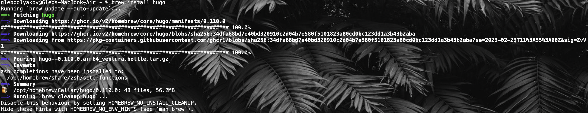
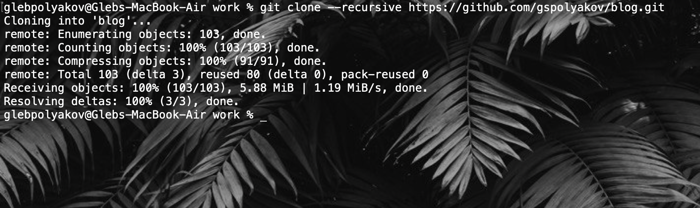
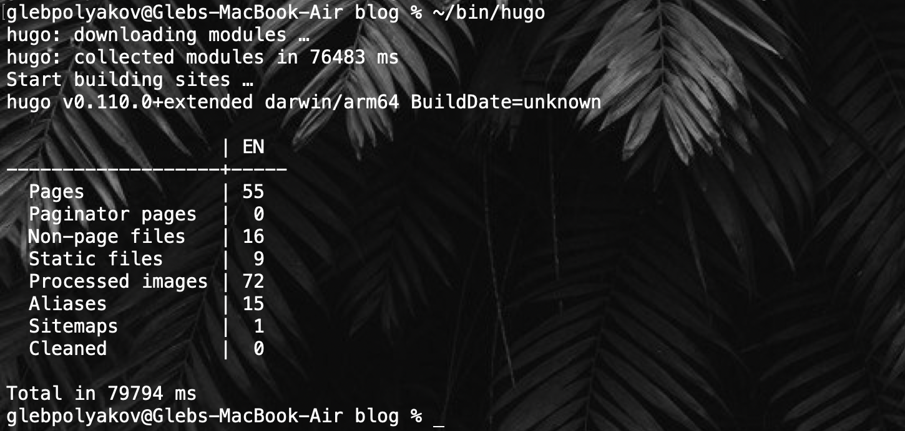

---
## Front matter
lang: ru-RU
title: Структура научной презентации
subtitle: Простейший шаблон
author: Поляков Г. С.
institute: Российский университет дружбы народов, Москва, Россия
date: 2023-02-25

## i18n babel
babel-lang: russian
babel-otherlangs: english

## Formatting pdf
toc: false
toc-title: Содержание
slide_level: 2
aspectratio: 169
section-titles: true
theme: metropolis
header-includes:
 - \metroset{progressbar=frametitle,sectionpage=progressbar,numbering=fraction}
 - '\makeatletter'
 - '\beamer@ignorenonframefalse'
 - '\makeatother'
---

# Информация

## Докладчик

:::::::::::::: {.columns align=center}
::: {.column width="70%"}

  Поляков Глеб Сергеевич
  
  НПИбд-02-22
  
  РУДН, Москва, Россия

:::
::: {.column width="30%"}

:::
::::::::::::::

## Установка Hugo с помощью Homebrew

{#fig:001 width=70%}

## Клонирование репозитория blog

{#fig:002 width=70%}

## Hugo к репозиторию.

{#fig:003 width=30%}

{#fig:004 width=30%}

## Добавление подмодуля gspolyakov.github.io

{#fig:005 width=70%}

## Коммит изменений

{#fig:006 width=70%}

## Вывод

Разместил на Github pages заготовки для персонального сайта.